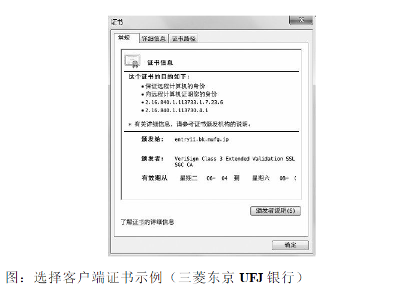

## 八、确认访问用户身份的认证

某些 Web 页面只想让特定的人浏览，或者干脆仅本人可见。为达到
这个目标，必不可少的就是认证功能。下面我们一起来学习一下认证
机制。

### 8.1 何为认证

计算机本身无法判断坐在显示器前的使用者的身份。进一步说，也无
法确认网络的那头究竟有谁。可见，为了弄清究竟是谁在访问服务
器，就得让对方的客户端自报家门。

可是，就算正在访问服务器的对方声称自己是ueno，身份是否属实这
点却也无从谈起。为确认 ueno 本人是否真的具有访问系统的权限，
就需要核对“登录者本人才知道的信息”、“登录者本人才会有的信
息”。

核对的信息通常是指以下这些。

- 密码：只有本人才会知道的字符串信息。
- 动态令牌：仅限本人持有的设备内显示的一次性密码。
- 数字证书：仅限本人（终端）持有的信息。
- 生物认证：指纹和虹膜等本人的生理信息。
- IC 卡等：仅限本人持有的信息。

但是，即便对方是假冒的用户，只要能通过用户验证，那么计算机就
会默认是出自本人的行为。因此，掌控机密信息的密码绝不能让他人
得到，更不能轻易地就被破解出来。

HTTP 使用的认证方式

HTTP/1.1 使用的认证方式如下所示。
- BASIC 认证（基本认证）
- DIGEST 认证（摘要认证）
- SSL 客户端认证
- FormBase 认证（基于表单认证）

此外，还有 Windows 统一认证（Keberos 认证、NTLM 认证），但本
书不作讲解。

### 8.2 BASIC 认证
BASIC 认证（基本认证）是从 HTTP/1.0 就定义的认证方式。即便是
现在仍有一部分的网站会使用这种认证方式。是 Web 服务器与通信
客户端之间进行的认证方式。

BASIC 认证的认证步骤：

步骤 1： 当请求的资源需要 BASIC 认证时，服务器会随状态码 401
Authorization Required，返回带 WWW-Authenticate 首部字段的响应。
该字段内包含认证的方式（BASIC） 及 Request-URI 安全域字符串
（realm）。

步骤 2： 接收到状态码 401 的客户端为了通过 BASIC 认证，需要将
用户 ID 及密码发送给服务器。发送的字符串内容是由用户 ID 和密码
构成，两者中间以冒号（:）连接后，再经过 Base64 编码处理。

假设用户 ID 为 guest，密码是 guest，连接起来就会形成 guest:guest 这
样的字符串。然后经过 Base64 编码，最后的结果即是
Z3Vlc3Q6Z3Vlc3Q=。把这串字符串写入首部字段 Authorization 后，
发送请求。

当用户代理为浏览器时，用户仅需输入用户 ID 和密码即可，之后，
浏览器会自动完成到 Base64 编码的转换工作。

步骤 3： 接收到包含首部字段 Authorization 请求的服务器，会对认证
信息的正确性进行验证。如验证通过，则返回一条包含 Request-URI
资源的响应。

BASIC 认证虽然采用 Base64 编码方式，但这不是加密处理。不需要
任何附加信息即可对其解码。换言之，由于明文解码后就是用户 ID
和密码，在 HTTP 等非加密通信的线路上进行 BASIC 认证的过程
中，如果被人窃听，被盗的可能性极高。

另外，除此之外想再进行一次 BASIC 认证时，一般的浏览器却无法
实现认证注销操作，这也是问题之一。

BASIC 认证使用上不够便捷灵活，且达不到多数 Web 网站期望的安
全性等级，因此它并不常用。

### 8.3　DIGEST 认证
为弥补 BASIC 认证存在的弱点，从 HTTP/1.1 起就有了 DIGEST 认
证。 DIGEST 认证同样使用质询 / 响应的方式
（challenge/response），但不会像 BASIC 认证那样直接发送明文密
码。

所谓质询响应方式是指，一开始一方会先发送认证要求给另一方，接
着使用从另一方那接收到的质询码计算生成响应码。最后将响应码返
回给对方进行认证的方式

因为发送给对方的只是响应摘要及由质询码产生的计算结果，所以比
起 BASIC 认证，密码泄露的可能性就降低了.

步骤 1： 请求需认证的资源时，服务器会随着状态码 401
Authorization Required，返 回带 WWW-Authenticate 首部字段的响应。
该字段内包含质问响应方式认证所需的临时质询码（随机数，
nonce）。

首部字段 WWW-Authenticate 内必须包含 realm 和 nonce 这两个字段的
信息。客户端就是依靠向服务器回送这两个值进行认证的。

nonce 是一种每次随返回的 401 响应生成的任意随机字符串。该字符
串通常推荐由 Base64 编码的十六进制数的组成形式，但实际内容依
赖服务器的具体实现。

步骤 2： 接收到 401 状态码的客户端，返回的响应中包含 DIGEST 认
证必须的首部字段 Authorization 信息。

首部字段 Authorization 内必须包含 username、realm、nonce、uri 和
response 的字段信息。其中，realm 和 nonce 就是之前从服务器接收到
的响应中的字段。

username 是 realm 限定范围内可进行认证的用户名。
uri（digest-uri）即 Request-URI 的值，但考虑到经代理转发后
Request-URI 的值可能被修改，因此事先会复制一份副本保存在 uri
内。

response 也可叫做 Request-Digest，存放经过 MD5 运算后的密码字符
串，形成响应码。

响应中其他的实体请参见第 6 章的请求首部字段 Authorization。另
外，有关 Request-Digest 的计算规则较复杂，有兴趣的读者不妨深入
学习一下 RFC2617。

步骤 3： 接收到包含首部字段 Authorization 请求的服务器，会确认认
证信息的正确性。认证通过后则返回包含 Request-URI 资源的响应。
并且这时会在首部字段 Authentication-Info 写入一些认证成功的相关信
息。

DIGEST 认证提供了高于 BASIC 认证的安全等级，但是和 HTTPS 的
客户端认证相比仍旧很弱。DIGEST 认证提供防止密码被窃听的保护
机制，但并不存在防止用户伪装的保护机制。

DIGEST 认证和 BASIC 认证一样，使用上不那么便捷灵活，且仍达不
到多数 Web 网站对高度安全等级的追求标准。因此它的适用范围也
有所受限。

### 8.4　SSL 客户端认证
从使用用户 ID 和密码的认证方式方面来讲，只要二者的内容正确，
即可认证是本人的行为。但如果用户 ID 和密码被盗，就很有可能被
第三者冒充。利用 SSL 客户端认证则可以避免该情况的发生。

SSL 客户端认证是借由 HTTPS 的客户端证书完成认证的方式。凭借
客户端证书（在 HTTPS 一章已讲解）认证，服务器可确认访问是否
来自已登录的客户端。

**SSL 客户端认证的认证步骤**

为达到 SSL 客户端认证的目的，需要事先将客户端证书分发给客户
端，且客户端必须安装此证书。

步骤 1： 接收到需要认证资源的请求，服务器会发送 Certificate
Request 报文，要求客户端提供客户端证书。

步骤 2： 用户选择将发送的客户端证书后，客户端会把客户端证书信
息以 Client Certificate 报文方式发送给服务器。

步骤 3： 服务器验证客户端证书验证通过后方可领取证书内客户端的
公开密钥，然后开始 HTTPS 加密通信。

**SSL 客户端认证采用双因素认证**

在多数情况下，SSL 客户端认证不会仅依靠证书完成认证，一般会和
基于表单认证（稍后讲解）组合形成一种双因素认证（Two-factor
authentication）来使用。所谓双因素认证就是指，认证过程中不仅需
要密码这一个因素，还需要申请认证者提供其他持有信息，从而作为
另一个因素，与其组合使用的认证方式。

换言之，第一个认证因素的 SSL 客户端证书用来认证客户端计算机，
另一个认证因素的密码则用来确定这是用户本人的行为。

通过双因素认证后，就可以确认是用户本人正在使用匹配正确的计算
机访问服务器。

**SSL 客户端认证必要的费用**

使用 SSL 客户端认证需要用到客户端证书。而客户端证书需要支付一
定费用才能使用。

这里提到的费用是指，从认证机构购买客户端证书的费用，以及服务
器运营者为保证自己搭建的认证机构安全运营所产生的费用。

每个认证机构颁发客户端证书的费用不尽相同，平摊到一张证书上，
一年费用约几万至十几万日元。服务器运营者也可以自己搭建认证机
构，但要维持安全运行就会产生相应的费用。

### 8.5　基于表单认证
基于表单的认证方法并不是在 HTTP 协议中定义的。客户端会向服务
器上的 Web 应用程序发送登录信息（Credential），按登录信息的验
证结果认证。

根据 Web 应用程序的实际安装，提供的用户界面及认证方式也各不
相同。

多数情况下，输入已事先登录的用户 ID（通常是任意字符串或邮件
地址）和密码等登录信息后，发送给 Web 应用程序，基于认证结果
来决定认证是否成功。

**8.5.1 认证多半为基于表单认证**

由于使用上的便利性及安全性问题，HTTP 协议标准提供的 BASIC 认
证和 DIGEST 认证几乎不怎么使用。另外，SSL 客户端认证虽然具有
高度的安全等级，但因为导入及维持费用等问题，还尚未普及。

比如 SSH 和 FTP 协议，服务器与客户端之间的认证是合乎标准规范
的，并且满足了最基本的功能需求上的安全使用级别，因此这些协议
的认证可以拿来直接使用。但是对于 Web 网站的认证功能，能够满
足其安全使用级别的标准规范并不存在，所以只好使用由 Web 应用
程序各自实现基于表单的认证方式。

不具备共同标准规范的表单认证，在每个 Web 网站上都会有各不相
同的实现方式。如果是全面考虑过安全性能而实现的表单认证，那么
就能够具备高度的安全等级。但在表单认证的实现中存在问题的 Web
网站也是屡见不鲜。

**8.5.2　Session 管理及 Cookie 应用**

基于表单认证的标准规范尚未有定论，一般会使用 Cookie 来管理
Session（会话）。

基于表单认证本身是通过服务器端的 Web 应用，将客户端发送过来
的用户 ID 和密码与之前登录过的信息做匹配来进行认证的。

但鉴于 HTTP 是无状态协议，之前已认证成功的用户状态无法通过协
议层面保存下来。即，无法实现状态管理，因此即使当该用户下一次
继续访问，也无法区分他与其他的用户。于是我们会使用 Cookie 来
管理 Session，以弥补 HTTP 协议中不存在的状态管理功能。

步骤 1： 客户端把用户 ID 和密码等登录信息放入报文的实体部分，
通常是以 POST 方法把请求发送给服务器。而这时，会使用 HTTPS
通信来进行 HTML 表单画面的显示和用户输入数据的发送。

步骤 2： 服务器会发放用以识别用户的 Session ID。通过验证从客户
端发送过来的登录信息进行身份认证，然后把用户的认证状态与
Session ID 绑定后记录在服务器端。

向客户端返回响应时，会在首部字段 Set-Cookie 内写入 Session
ID（如 PHPSESSID=028a8c…）。
你可以把 Session ID 想象成一种用以区分不同用户的等位号。

然而，如果 Session ID 被第三方盗走，对方就可以伪装成你的身份进
行恶意操作了。因此必须防止 Session ID 被盗，或被猜出。为了做到
这点，Session ID 应使用难以推测的字符串，且服务器端也需要进行
有效期的管理，保证其安全性。

另外，为减轻跨站脚本攻击（XSS）造成的损失，建议事先在 Cookie
内加上 httponly 属性。

步骤 3： 客户端接收到从服务器端发来的 Session ID 后，会将其作为
Cookie 保存在本地。下次向服务器发送请求时，浏览器会自动发送
Cookie，所以 Session ID 也随之发送到服务器。服务器端可通过验证
接收到的 Session ID 识别用户和其认证状态。

除了以上介绍的应用实例，还有应用其他不同方法的案例。
另外，不仅基于表单认证的登录信息及认证过程都无标准化的方法，
服务器端应如何保存用户提交的密码等登录信息等也没有标准化。

通常，一种安全的保存方法是，先利用给密码加盐（salt）1 的方式增
加额外信息，再使用散列（hash）函数计算出散列值后保存。但是我
们也经常看到直接保存明文密码的做法，而这样的做法具有导致密码
泄露的风险。
