## 六、HTTP 首部

HTTP 协议的请求和响应报文中必定包含 HTTP 首部，只是我们平时
在使用 Web 的过程中感受不到它。本章我们一起来学习 HTTP 首部
的结构，以及首部中各字段的用法。

### 1. HTTP 报文首部

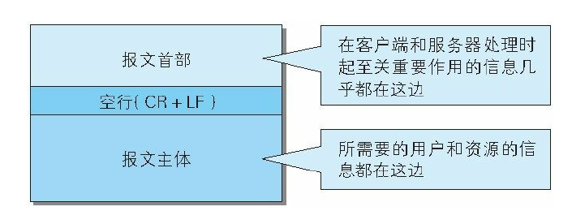

HTTP 协议的请求和响应报文中必定包含 HTTP 首部。首部内容为客
户端和服务器分别处理请求和响应提供所需要的信息。对于客户端用
户来说，这些信息中的大部分内容都无须亲自查看。

报文首部由几个字段构成。

HTTP 请求报文

在请求中，HTTP 报文由方法、URI、HTTP 版本、HTTP 首部字段等
部分构成。

HTTP 响应报文

在响应中，HTTP 报文由 HTTP 版本、状态码（数字和原因短语）、
HTTP 首部字段 3 部分构成。

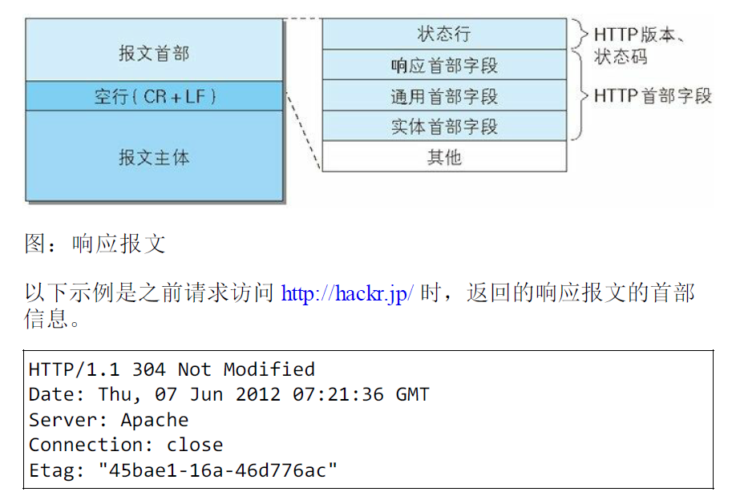

在报文众多的字段当中，HTTP 首部字段包含的信息最为丰富。首部
字段同时存在于请求和响应报文内，并涵盖 HTTP 报文相关的内容信
息。

因 HTTP 版本或扩展规范的变化，首部字段可支持的字段内容略有不
同。本书主要涉及 HTTP/1.1 及常用的首部字段。

### 2. HTTP 首部字段

**HTTP 首部字段传递重要信息**

HTTP 首部字段是构成 HTTP 报文的要素之一。在客户端与服务器之
间以 HTTP 协议进行通信的过程中，无论是请求还是响应都会使用首
部字段，它能起到传递额外重要信息的作用

使用首部字段是为了给浏览器和服务器提供报文主体大小、所使用的
语言、认证信息等内容。

**HTTP 首部字段结构**

HTTP 首部字段是由首部字段名和字段值构成的，中间用冒号“:” 分
隔。

例如，在 HTTP 首部中以 Content-Type 这个字段来表示报文主体的 对
象类型。

就以上述示例来看，首部字段名为 Content-Type，字符串 text/html 是
字段值。

另外，字段值对应单个 HTTP 首部字段可以有多个值，如下所示。

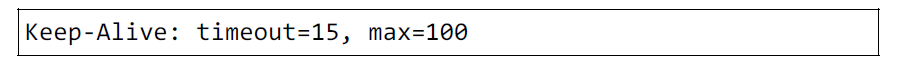

>若 HTTP 首部字段重复了会如何
当 HTTP 报文首部中出现了两个或两个以上具有相同首部字段名时
会怎么样？这种情况在规范内尚未明确，根据浏览器内部处理逻辑
的不同，结果可能并不一致。有些浏览器会优先处理第一次出现的
首部字段，而有些则会优先处理最后出现的首部字段。

**4 种 HTTP 首部字段类型**

HTTP 首部字段根据实际用途被分为以下 4 种类型。

通用首部字段（General Header Fields）

请求报文和响应报文两方都会使用的首部。

请求首部字段（Request Header Fields）

从客户端向服务器端发送请求报文时使用的首部。补充了请求的附加
内容、客户端信息、响应内容相关优先级等信息。

响应首部字段（Response Header Fields）

从服务器端向客户端返回响应报文时使用的首部。补充了响应的附加
内容，也会要求客户端附加额外的内容信息。

实体首部字段（Entity Header Fields）

针对请求报文和响应报文的实体部分使用的首部。补充了资源内容更
新时间等与实体有关的信息

**HTTP/1.1 首部字段一览**

HTTP/1.1 规范定义了如下 47 种首部字段。

通用首部字段:

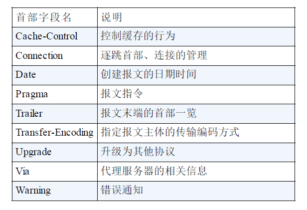

请求首部字段:

响应首部字段:

实体首部字段:

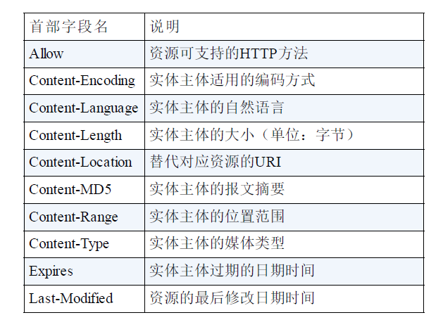

**非 HTTP/1.1 首部字段**

在 HTTP 协议通信交互中使用到的首部字段，不限于 RFC2616 中定
义的 47 种首部字段。还有 Cookie、Set-Cookie 和 Content-Disposition
等在其他 RFC 中定义的首部字段，它们的使用频率也很高。

这些非正式的首部字段统一归纳在 RFC4229 HTTP Header Field
Registrations 中。

**End-to-end 首部和 Hop-by-hop 首部**

HTTP 首部字段将定义成缓存代理和非缓存代理的行为，分成 2 种类
型。

端到端首部（End-to-end Header）

分在此类别中的首部会转发给请求 / 响应对应的最终接收目标，且必
须保存在由缓存生成的响应中，另外规定它必须被转发。

逐跳首部（Hop-by-hop Header）

分在此类别中的首部只对单次转发有效，会因通过缓存或代理而不再
转发。HTTP/1.1 和之后版本中，如果要使用 hop-by-hop 首部，需提
供 Connection 首部字段。

下面列举了 HTTP/1.1 中的逐跳首部字段。除这 8 个首部字段之外，
其他所有字段都属于端到端首部。

- Connection
- Keep-Alive
- Proxy-Authenticate
- Proxy-Authorization
- Trailer
- TE
- Transfer-Encoding
- Upgrade

### 3. HTTP/1.1 通用首部字段

通用首部字段是指，请求报文和响应报文双方都会使用的首部。

**Cache-Control**

通过指定首部字段 Cache-Control 的指令，就能操作缓存的工作机
制。

首部字段 Cache-Control 能够控制缓存的行为

指令的参数是可选的，多个指令之间通过“,”分隔。首部字段 Cache-
Control 的指令可用于请求及响应时

Cache-Control: private, max-age=0, no-cache

- Cache-Control 指令一览

可用的指令按请求和响应分类如下所示。

缓存请求指令:

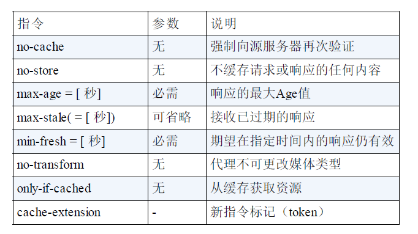

缓存响应指令:

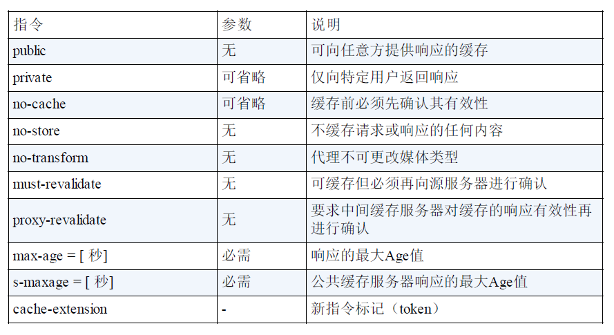

表示是否能缓存的指令

public 指令

Cache-Control: public

当指定使用 public 指令时，则明确表明其他用户也可利用缓存。

private 指令

Cache-Control: private

当指定 private 指令后，响应只以特定的用户作为对象，这与 public
指令的行为相反。

缓存服务器会对该特定用户提供资源缓存的服务，对于其他用户发送
过来的请求，代理服务器则不会返回缓存。

no-cache 指令

Cache-Control: no-cache

使用 no-cache 指令的目的是为了防止从缓存中返回过期的资源。

客户端发送的请求中如果包含 no-cache 指令，则表示客户端将不会接
收缓存过的响应。于是，“中间”的缓存服务器必须把客户端请求转发
给源服务器。

如果服务器返回的响应中包含 no-cache 指令，那么缓存服务器不能对
资源进行缓存。源服务器以后也将不再对缓存服务器请求中提出的资
源有效性进行确认，且禁止其对响应资源进行缓存操作。

Cache-Control: no-cache=Location

由服务器返回的响应中，若报文首部字段 Cache-Control 中对 no-cache
字段名具体指定参数值，那么客户端在接收到这个被指定参数值的首
部字段对应的响应报文后，就不能使用缓存。换言之，无参数值的首
部字段可以使用缓存。只能在响应指令中指定该参数

控制可执行缓存的对象的指令

no-store 指令

Cache-Control: no-store

当使用 no-store 指令时，暗示请求（和对应的响应）或响应中包含
机密信息。

>从字面意思上很容易把 no-cache 误解成为不缓存，但事实上 no-cache 代表不缓
 存过期的资源，缓存会向源服务器进行有效期确认后处理资源，也许称为 do-not-serve-
 from-cache-without-revalidation 更合适。no-store 才是真正地不进行缓存，请
 读者注意区别理解。

因此，该指令规定缓存不能在本地存储请求或响应的任一部分。

s-maxage 指令

Cache-Control: s-maxage=604800（单位 ：秒）

s-maxage 指令的功能和 max-age 指令的相同，它们的不同点是 smaxage
指令只适用于供多位用户使用的公共缓存服务器。也就是
说，对于向同一用户重复返回响应的服务器来说，这个指令没有任何
作用。

另外，当使用 s-maxage 指令后，则直接忽略对 Expires 首部字段及
max-age 指令的处理。

max-age 指令

Cache-Control: max-age=604800（单位：秒）

当客户端发送的请求中包含 max-age 指令时，如果判定缓存资源的缓
存时间数值比指定时间的数值更小，那么客户端就接收缓存的资源。
另外，当指定 max-age 值为 0，那么缓存服务器通常需要将请求转发
给源服务器。

当服务器返回的响应中包含 max-age 指令时，缓存服务器将不对资源
的有效性再作确认，而 max-age 数值代表资源保存为缓存的最长时
间。

应用 HTTP/1.1 版本的缓存服务器遇到同时存在 Expires 首部字段的情
况时，会优先处理 max-age 指令，而忽略掉 Expires 首部字段。而
HTTP/1.0 版本的缓存服务器的情况却相反，max-age 指令会被忽略
掉。

min-fresh 指令

Cache-Control: min-fresh=60（单位：秒）

min-fresh 指令要求缓存服务器返回至少还未过指定时间的缓存资源。
比如，当指定 min-fresh 为 60 秒后，过了 60 秒的资源都无法作为响
应返回了。

max-stale 指令

Cache-Control: max-stale=3600（单位：秒）

使用 max-stale 可指示缓存资源，即使过期也照常接收。

如果指令未指定参数值，那么无论经过多久，客户端都会接收响应；
如果指令中指定了具体数值，那么即使过期，只要仍处于 max-stale
指定的时间内，仍旧会被客户端接收。

only-if-cached 指令

Cache-Control: only-if-cached

使用 only-if-cached 指令表示客户端仅在缓存服务器本地缓存目标资
源的情况下才会要求其返回。换言之，该指令要求缓存服务器不重新
加载响应，也不会再次确认资源有效性。若发生请求缓存服务器的本
地缓存无响应，则返回状态码 504 Gateway Timeout。

must-revalidate 指令

Cache-Control: must-revalidate

使用 must-revalidate 指令，代理会向源服务器再次验证即将返回的响
应缓存目前是否仍然有效。

若代理无法连通源服务器再次获取有效资源的话，缓存必须给客户端
一条 504（Gateway Timeout）状态码。

另外，使用 must-revalidate 指令会忽略请求的 max-stale 指令（即使已
经在首部使用了 max-stale，也不会再有效果）。

proxy-revalidate 指令

Cache-Control: proxy-revalidate

proxy-revalidate 指令要求所有的缓存服务器在接收到客户端带有该指
令的请求返回响应之前，必须再次验证缓存的有效性。

no-transform 指令

Cache-Control: no-transform

使用 no-transform 指令规定无论是在请求还是响应中，缓存都不能改
变实体主体的媒体类型

这样做可防止缓存或代理压缩图片等类似操作。

Cache-Control 扩展

cache-extension token

Cache-Control: private, community="UCI"

通过 cache-extension 标记（token），可以扩展 Cache-Control 首部字
段内的指令。

如上例，Cache-Control首部字段本身没有community这个指令。借助
extension tokens 实现了该指令的添加。如果缓存服务器不能理解
community 这个新指令，就会直接忽略。因此，extension tokens 仅对
能理解它的缓存服务器来说是有意义的。

**Connection**

Connection 首部字段具备如下两个作用。

- 控制不再转发给代理的首部字段
- 管理持久连接
- 控制不再转发给代理的首部字段

Connection: 不再转发的首部字段名

在客户端发送请求和服务器返回响应内，使用 Connection 首部字
段，可控制不再转发给代理的首部字段（即 Hop-by-hop 首
部）。
- 管理持久连接

Connection: close

HTTP/1.1 版本的默认连接都是持久连接。为此，客户端会在持
久连接上连续发送请求。当服务器端想明确断开连接时，则指定
Connection 首部字段的值为 Close。

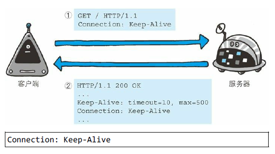

HTTP/1.1 之前的 HTTP 版本的默认连接都是非持久连接。为
此，如果想在旧版本的 HTTP 协议上维持持续连接，则需要指定
Connection 首部字段的值为 Keep-Alive。

如上图①所示，客户端发送请求给服务器时，服务器端会像上图
②那样加上首部字段 Keep-Alive 及首部字段 Connection 后返回
响应。

**Date**

首部字段 Date 表明创建 HTTP 报文的日期和时间。

HTTP/1.1 协议使用在 RFC1123 中规定的日期时间的格式，如下 示
例。

Date: Tue, 03 Jul 2012 04:40:59 GMT

之前的 HTTP 协议版本中使用在 RFC850 中定义的格式，如下所示。

Date: Tue, 03-Jul-12 04:40:59 GMT

除此之外，还有一种格式。它与 C 标准库内的 asctime() 函数的输出
格式一致。

Date: Tue Jul 03 04:40:59 2012

**Pragma**

Pragma 是 HTTP/1.1 之前版本的历史遗留字段，仅作为与 HTTP/1.0
的向后兼容而定义。

规范定义的形式唯一，如下所示。

Pragma: no-cache

该首部字段属于通用首部字段，但只用在客户端发送的请求中。客户
端会要求所有的中间服务器不返回缓存的资源。

所有的中间服务器如果都能以 HTTP/1.1 为基准，那直接采用 Cache-
Control: no-cache 指定缓存的处理方式是最为理想的。但要整体掌握
全部中间服务器使用的 HTTP 协议版本却是不现实的。因此，发送的
请求会同时含有下面两个首部字段。

Cache-Control: no-cache
Pragma: no-cache

**Trailer**

首部字段 Trailer 会事先说明在报文主体后记录了哪些首部字段。该
首部字段可应用在 HTTP/1.1 版本分块传输编码时。

以上用例中，指定首部字段 Trailer 的值为 Expires，在报文主体之后
（分块长度 0 之后）出现了首部字段 Expires

**transfer-Encoding**

首部字段 Transfer-Encoding 规定了传输报文主体时采用的编码方式。

HTTP/1.1 的传输编码方式仅对分块传输编码有效。

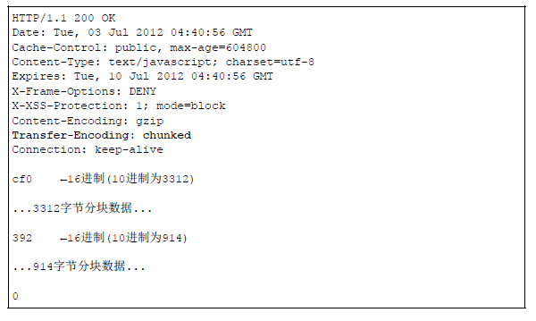

以上用例中，正如在首部字段 Transfer-Encoding 中指定的那样，有效
使用分块传输编码，且分别被分成 3312 字节和 914 字节大小的分块
数据。

**Upgrade**

首部字段 Upgrade 用于检测 HTTP 协议及其他协议是否可使用更高的
版本进行通信，其参数值可以用来指定一个完全不同的通信协议。

上图用例中，首部字段 Upgrade 指定的值为 TLS/1.0。请注意此处两
个字段首部字段的对应关系，Connection 的值被指定为 Upgrade。
Upgrade 首部字段产生作用的 Upgrade 对象仅限于客户端和邻接服务
器之间。因此，使用首部字段 Upgrade 时，还需要额外指定
Connection:Upgrade。

对于附有首部字段 Upgrade 的请求，服务器可用 101 Switching
Protocols 状态码作为响应返回。

**Via**

使用首部字段 Via 是为了追踪客户端与服务器之间的请求和响应报文
的传输路径。

报文经过代理或网关时，会先在首部字段 Via 中附加该服务器的信
息，然后再进行转发。这个做法和 traceroute 及电子邮件的 Received
首部的工作机制很类似。

首部字段 Via 不仅用于追踪报文的转发，还可避免请求回环的发生。
所以必须在经过代理时附加该首部字段内容。

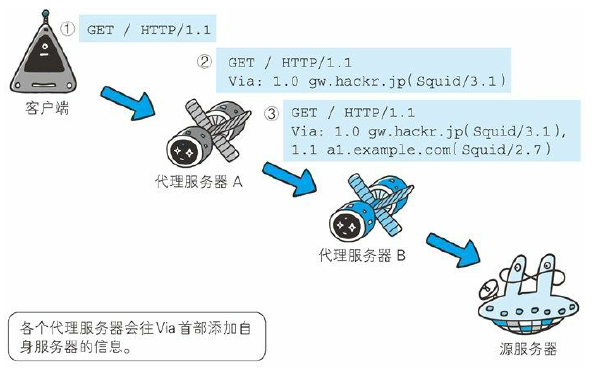

上图用例中，在经过代理服务器 A 时，Via 首部附加了“1.0
gw.hackr.jp (Squid/3.1)”这样的字符串值。行头的 1.0 是指接收请求的
服务器上应用的 HTTP 协议版本。接下来经过代理服务器 B 时亦是如
此，在 Via 首部附加服务器信息，也可增加 1 个新的 Via 首部写入服
务器信息。

Via 首部是为了追踪传输路径，所以经常会和 TRACE 方法一起使
用。比如，代理服务器接收到由 TRACE 方法发送过来的请求（其中
Max-Forwards: 0）时，代理服务器就不能再转发该请求了。这种情况
下，代理服务器会将自身的信息附加到 Via 首部后，返回该请求的响
应。

**Warning**

HTTP/1.1 的 Warning 首部是从 HTTP/1.0 的响应首部（Retry-After）演
变过来的。该首部通常会告知用户一些与缓存相关的问题的警告。

Warning: 113 gw.hackr.jp:8080 "Heuristic expiration" Tue, 03

Warning 首部的格式如下。最后的日期时间部分可省略。

Warning: [警告码][警告的主机:端口号]“[警告内容]”([日期时间])

HTTP/1.1 中定义了 7 种警告。警告码对应的警告内容仅推荐参考。
另外，警告码具备扩展性，今后有可能追加新的警告码。

HTTP/1.1 警告码:

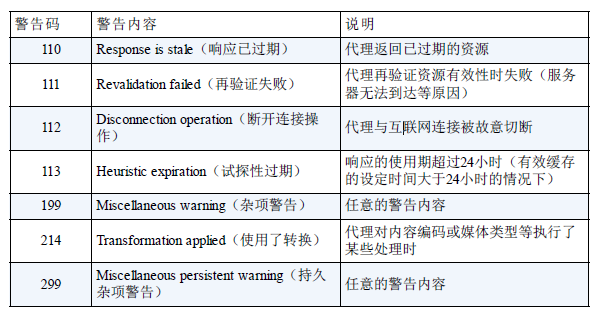

### 4. 请求首部字段

请求首部字段是从客户端往服务器端发送请求报文中所使用的字段，
用于补充请求的附加信息、客户端信息、对响应内容相关的优先级等
内容。

**Accept**

Accept: text/html,application/xhtml+xml,application/xml;q=0.9

Accept 首部字段可通知服务器，用户代理能够处理的媒体类型及媒体
类型的相对优先级。可使用 type/subtype 这种形式，一次指定多种媒
体类型。

下面我们试举几个媒体类型的例子。

- 文本文件  
text/html, text/plain, text/css ...
application/xhtml+xml, application/xml ...
- 图片文件  
image/jpeg, image/gif, image/png ...
- 视频文件  
video/mpeg, video/quicktime ...
- 应用程序使用的二进制文件
application/octet-stream, application/zip ...

比如，如果浏览器不支持 PNG 图片的显示，那 Accept 就不指定
image/png，而指定可处理的 image/gif 和 image/jpeg 等图片类型。

若想要给显示的媒体类型增加优先级，则使用 q= 来额外表示权重值
1，用分号（;）进行分隔。权重值 q 的范围是 0~1（可精确到小数点
后 3 位），且 1 为最大值。不指定权重 q 值时，默认权重为 q=1.0。

当服务器提供多种内容时，将会首先返回权重值最高的媒体类型。

**Accept-Charset**

Accept-Charset: iso-8859-5, unicode-1-1;q=0.8

Accept-Charset 首部字段可用来通知服务器用户代理支持的字符集及
字符集的相对优先顺序。另外，可一次性指定多种字符集。与首部字
段 Accept 相同的是可用权重 q 值来表示相对优先级。

该首部字段应用于内容协商机制的服务器驱动协商。

**Accept-Encoding**

Accept-Encoding: gzip, deflate

Accept-Encoding 首部字段用来告知服务器用户代理支持的内容编码及
内容编码的优先级顺序。可一次性指定多种内容编码。

下面试举出几个内容编码的例子。

- gzip  
由文件压缩程序 gzip（GNU zip）生成的编码格式
（RFC1952），采用 Lempel-Ziv 算法（LZ77）及 32 位循环冗余
校验（Cyclic Redundancy Check，通称 CRC）。
- compress  
由 UNIX 文件压缩程序 compress 生成的编码格式，采用 Lempel-
Ziv-Welch 算法（LZW）。
- deflate  
组合使用 zlib 格式（RFC1950）及由 deflate 压缩算法
（RFC1951）生成的编码格式。
- identity  
不执行压缩或不会变化的默认编码格式

采用权重 q 值来表示相对优先级，这点与首部字段 Accept 相同。另
外，也可使用星号（*）作为通配符，指定任意的编码格式。

**Accept-Language**

Accept-Language: zh-cn,zh;q=0.7,en-us,en;q=0.3

首部字段 Accept-Language 用来告知服务器用户代理能够处理的自然
语言集（指中文或英文等），以及自然语言集的相对优先级。可一次
指定多种自然语言集。

和 Accept 首部字段一样，按权重值 q 来表示相对优先级。在上述图
例中，客户端在服务器有中文版资源的情况下，会请求其返回中文版
对应的响应，没有中文版时，则请求返回英文版响应。

**Authorization**

首部字段 Authorization 是用来告知服务器，用户代理的认证信息（证
书值）。通常，想要通过服务器认证的用户代理会在接收到返回的
401 状态码响应后，把首部字段 Authorization 加入请求中。共用缓存
在接收到含有 Authorization 首部字段的请求时的操作处理会略有差
异。

有关 HTTP 访问认证及 Authorization 首部字段，稍后的章节还会详细
说明。另外，读者也可参阅 RFC2616。

**Expect**

Expect: 100-continue

客户端使用首部字段 Expect 来告知服务器，期望出现的某种特定行
为。因服务器无法理解客户端的期望作出回应而发生错误时，会返回
状态码 417 Expectation Failed。

客户端可以利用该首部字段，写明所期望的扩展。虽然 HTTP/1.1 规
范只定义了 100-continue（状态码 100 Continue 之意）。

等待状态码 100 响应的客户端在发生请求时，需要指定 Expect:100-
continue。

**From**

首部字段 From 用来告知服务器使用用户代理的用户的电子邮件地
址。通常，其使用目的就是为了显示搜索引擎等用户代理的负责人的
电子邮件联系方式。使用代理时，应尽可能包含 From 首部字段（但
可能会因代理不同，将电子邮件地址记录在 User-Agent 首部字段
内）。

**Host**

图：虚拟主机运行在同一个 IP 上，因此使用首部字段 Host 加以
区分

Host: www.hackr.jp

首部字段 Host 会告知服务器，请求的资源所处的互联网主机名和端
口号。Host 首部字段在 HTTP/1.1 规范内是唯一一个必须被包含在请
求内的首部字段。

首部字段 Host 和以单台服务器分配多个域名的虚拟主机的工作机制
有很密切的关联，这是首部字段 Host 必须存在的意义。

请求被发送至服务器时，请求中的主机名会用 IP 地址直接替换解
决。但如果这时，相同的 IP 地址下部署运行着多个域名，那么服务
器就会无法理解究竟是哪个域名对应的请求。因此，就需要使用首部
字段 Host 来明确指出请求的主机名。若服务器未设定主机名，那直
接发送一个空值即可。如下所示。

Host:

**If-Match**

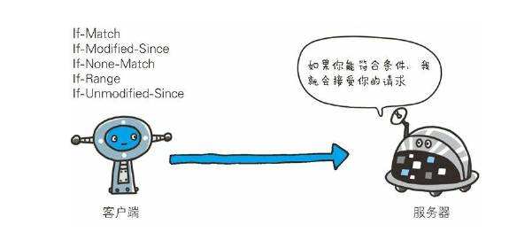

图：附带条件请求

形如 If-xxx 这种样式的请求首部字段，都可称为条件请求。服务器接
收到附带条件的请求后，只有判断指定条件为真时，才会执行请求。

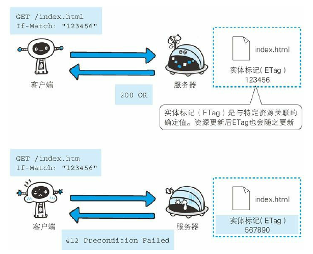

图：只有当 If-Match 的字段值跟 ETag 值匹配一致时，服务器才会
接受请求

If-Match: "123456"

首部字段 If-Match，属附带条件之一，它会告知服务器匹配资源所用
的实体标记（ETag）值。这时的服务器无法使用弱 ETag 值。（请参
照本章有关首部字段 ETag 的说明）

服务器会比对 If-Match 的字段值和资源的 ETag 值，仅当两者一致
时，才会执行请求。反之，则返回状态码 412 Precondition Failed 的响
应。

还可以使用星号（*）指定 If-Match 的字段值。针对这种情况，服务
器将会忽略 ETag 的值，只要资源存在就处理请求。

**If-Modified-Since**

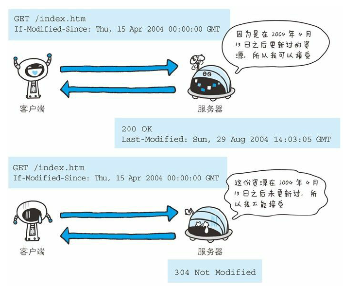

图：如果在 If-Modified-Since 字段指定的日期时间后，资源发生了
更新，服务器会接受请求.

If-Modified-Since: Thu, 15 Apr 2004 00:00:00 GMT

首部字段 If-Modified-Since，属附带条件之一，它会告知服务器若 If-
Modified-Since 字段值早于资源的更新时间，则希望能处理该请求。
而在指定 If-Modified-Since 字段值的日期时间之后，如果请求的资源
都没有过更新，则返回状态码 304 Not Modified 的响应。

If-Modified-Since 用于确认代理或客户端拥有的本地资源的有效性。
获取资源的更新日期时间，可通过确认首部字段 Last-Modified 来确
定。

**If-None-Match**

图：只有在 If-None-Match 的字段值与 ETag 值不一致时，可处理
该请求。与 If-Match 首部字段的作用相反

首部字段 If-None-Match 属于附带条件之一。它和首部字段 If-Match
作用相反。用于指定 If-None-Match 字段值的实体标记（ETag）值与
请求资源的 ETag 不一致时，它就告知服务器处理该请求。

在 GET 或 HEAD 方法中使用首部字段 If-None-Match 可获取最新的资
源。因此，这与使用首部字段 If-Modified-Since 时有些类似。

**If-Range**

首部字段 If-Range 属于附带条件之一。它告知服务器若指定的 If-
Range 字段值（ETag 值或者时间）和请求资源的 ETag 值或时间相一
致时，则作为范围请求处理。反之，则返回全体资源。

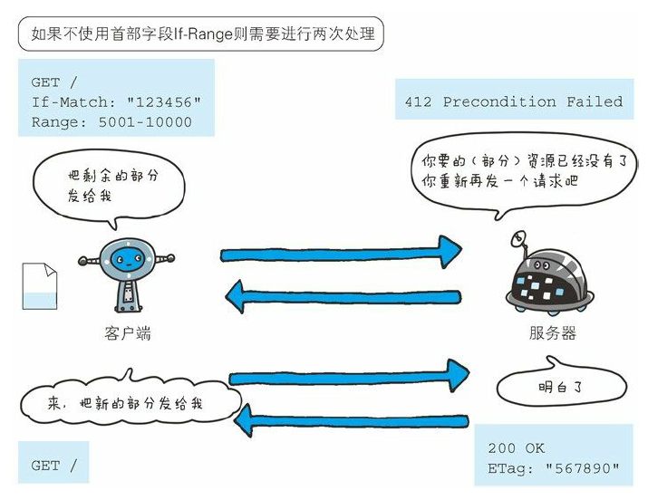

下面我们思考一下不使用首部字段 If-Range 发送请求的情况。服务器
端的资源如果更新，那客户端持有资源中的一部分也会随之无效，当
然，范围请求作为前提是无效的。这时，服务器会暂且以状态码 412
Precondition Failed 作为响应返回，其目的是催促客户端再次发送请
求。这样一来，与使用首部字段 If-Range 比起来，就需要花费两倍的
功夫。

**If-Unmodified-Since**

If-Unmodified-Since: Thu, 03 Jul 2012 00:00:00 GMT

首部字段 If-Unmodified-Since 和首部字段 If-Modified-Since 的作用相
反。它的作用的是告知服务器，指定的请求资源只有在字段值内指定
的日期时间之后，未发生更新的情况下，才能处理请求。如果在指定
日期时间后发生了更新，则以状态码 412 Precondition Failed 作为响应
返回。

**Max-Forwards**

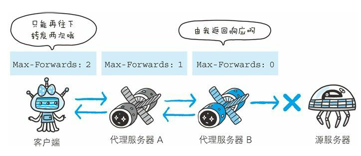

图：每次转发数值减 1。当数值变 0 时返回响应

Max-Forwards: 10

通过 TRACE 方法或 OPTIONS 方法，发送包含首部字段 Max-
Forwards 的请求时，该字段以十进制整数形式指定可经过的服务器最
大数目。服务器在往下一个服务器转发请求之前，Max-Forwards 的
值减 1 后重新赋值。当服务器接收到 Max-Forwards 值为 0 的请求
时，则不再进行转发，而是直接返回响应。

使用 HTTP 协议通信时，请求可能会经过代理等多台服务器。途中，
如果代理服务器由于某些原因导致请求转发失败，客户端也就等不到
服务器返回的响应了。对此，我们无从可知。

可以灵活使用首部字段 Max-Forwards，针对以上问题产生的原因展
开调查。由于当 Max-Forwards 字段值为 0 时，服务器就会立即返回
响应，由此我们至少可以对以那台服务器为终点的传输路径的通信状
况有所把握。

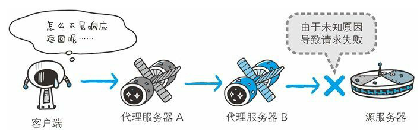

图：代理 B 到源服务器的请求失败了，但客户端不知道

图：由于未知原因，导致请求陷入代理之间的循环，但客户端不
知道

**Proxy-Authorization**

Proxy-Authorization: Basic dGlwOjkpNLAGfFY5

接收到从代理服务器发来的认证质询时，客户端会发送包含首部字段
Proxy-Authorization 的请求，以告知服务器认证所需要的信息。

这个行为是与客户端和服务器之间的 HTTP 访问认证相类似的，不同
之处在于，认证行为发生在客户端与代理之间。客户端与服务器之间
的认证，使用首部字段 Authorization 可起到相同作用。有关 HTTP 访
问认证，后面的章节会作详尽阐述。

**Range**

Range: bytes=5001-10000

对于只需获取部分资源的范围请求，包含首部字段 Range 即可告知服
务器资源的指定范围。上面的示例表示请求获取从第 5001 字节至第
10000 字节的资源。

接收到附带 Range 首部字段请求的服务器，会在处理请求之后返回状
态码为 206 Partial Content 的响应。无法处理该范围请求时，则会返
回状态码 200 OK 的响应及全部资源。

**Referer**

Referer: http://www.hackr.jp/index.htm

首****部字段 Referer 会告知服务器请求的原始资源的 URI。

客户端一般都会发送 Referer 首部字段给服务器。但当直接在浏览器
的地址栏输入 URI，或出于安全性的考虑时，也可以不发送该首部字
段。

因为原始资源的 URI 中的查询字符串可能含有 ID 和密码等保密信
息，要是写进 Referer 转发给其他服务器，则有可能导致保密信息的
泄露。

另外，Referer 的正确的拼写应该是 Referrer，但不知为何，大家一直
沿用这个错误的拼写。

**TE**

TE: gzip, deflate;q=0.5

首部字段 TE 会告知服务器客户端能够处理响应的传输编码方式及相
对优先级。它和首部字段 Accept-Encoding 的功能很相像，但是用于
传输编码。

首部字段 TE 除指定传输编码之外，还可以指定伴随 trailer 字段的分
块传输编码的方式。应用后者时，只需把 trailers 赋值给该字段值。

TE: trailers

**User-Agent**

图：User-Agent 用于传达浏览器的种类

User-Agent: Mozilla/5.0 (Windows NT 6.1; WOW64; rv:13.0) Gecko

首部字段 User-Agent 会将创建请求的浏览器和用户代理名称等信息传
达给服务器。

由网络爬虫发起请求时，有可能会在字段内添加爬虫作者的电子邮件
地址。此外，如果请求经过代理，那么中间也很可能被添加上代理服
务器的名称。

### 5. 响应首部字段

响应首部字段是由服务器端向客户端返回响应报文中所使用的字段，
用于补充响应的附加信息、服务器信息，以及对客户端的附加要求等
信息。

图：HTTP 响应报文中使用的首部字段

**Accept-Ranges**

图：当不能处理范围请求时，Accept-Ranges: none

Accept-Ranges: bytes

首部字段 Accept-Ranges 是用来告知客户端服务器是否能处理范围请
求，以指定获取服务器端某个部分的资源。

可指定的字段值有两种，可处理范围请求时指定其为bytes，反之则
指定其为none。

**Age**

首部字段 Age 能告知客户端，源服务器在多久前创建了响应。字段值
的单位为秒。

若创建该响应的服务器是缓存服务器，Age 值是指缓存后的响应再次
发起认证到认证完成的时间值。代理创建响应时必须加上首部字段
Age。

**ETag**

首部字段 ETag 能告知客户端实体标识。它是一种可将资源以字符串
形式做唯一性标识的方式。服务器会为每份资源分配对应的 ETag
值。

另外，当资源更新时，ETag 值也需要更新。生成 ETag 值时，并没有
统一的算法规则，而仅仅是由服务器来分配。

资源被缓存时，就会被分配唯一性标识。例如，当使用中文版的浏览
器访问 http://www.google.com/ 时，就会返回中文版对应的资源，而
使用英文版的浏览器访问时，则会返回英文版对应的资源。两者的
URI 是相同的，所以仅凭 URI 指定缓存的资源是相当困难的。若在下
载过程中出现连接中断、再连接的情况，都会依照 ETag 值来指定资
源。

强 ETag 值和弱 Tag 值

ETag 中有强 ETag 值和弱 ETag 值之分。

强 ETag 值

强 ETag 值，不论实体发生多么细微的变化都会改变其值。

ETag: "usagi-1234"

弱 ETag 值

弱 ETag 值只用于提示资源是否相同。只有资源发生了根本改变，产
生差异时才会改变 ETag 值。这时，会在字段值最开始处附加 W/。

ETag: W/"usagi-1234"

**Location**

使用首部字段 Location 可以将响应接收方引导至某个与请求 URI 位置
不同的资源。

基本上，该字段会配合 3xx ：Redirection 的响应，提供重定向的
URI。

几乎所有的浏览器在接收到包含首部字段 Location 的响应后，都会强
制性地尝试对已提示的重定向资源的访问。

**Proxy-Authenticate**

Proxy-Authenticate: Basic realm="Usagidesign Auth"

首部字段 Proxy-Authenticate 会把由代理服务器所要求的认证信息发送
给客户端。

它与客户端和服务器之间的 HTTP 访问认证的行为相似，不同之处在
于其认证行为是在客户端与代理之间进行的。而客户端与服务器之间
进行认证时，首部字段 WWW-Authorization 有着相同的作用。有关
HTTP 访问认证，后面的章节会再进行详尽阐述。

**Retry-After**

首部字段 Retry-After 告知客户端应该在多久之后再次发送请求。主要
配合状态码 503 Service Unavailable 响应，或 3xx Redirect 响应一起使
用。

字段值可以指定为具体的日期时间（Wed, 04 Jul 2012 06：34：24
GMT 等格式），也可以是创建响应后的秒数。

**Server**

Server: Apache/2.2.17 (Unix)

首部字段 Server 告知客户端当前服务器上安装的 HTTP 服务器应用程
序的信息。不单单会标出服务器上的软件应用名称，还有可能包括版
本号和安装时启用的可选项。

Server: Apache/2.2.6 (Unix) PHP/5.2.5

**Vary**

图：当代理服务器接收到带有 Vary 首部字段指定获取资源的请求
时，如果使用的 Accept-Language 字段的值相同，那么就直接从缓
存返回响应。反之，则需要先从源服务器端获取资源后才能作为
响应返回

首部字段 Vary 可对缓存进行控制。源服务器会向代理服务器传达关
于本地缓存使用方法的命令。

从代理服务器接收到源服务器返回包含 Vary 指定项的响应之后，若
再要进行缓存，仅对请求中含有相同 Vary 指定首部字段的请求返回
缓存。即使对相同资源发起请求，但由于 Vary 指定的首部字段不相
同，因此必须要从源服务器重新获取资源。

**WWW-Authenticate**

WWW-Authenticate: Basic realm="Usagidesign Auth"

首部字段 WWW-Authenticate 用于 HTTP 访问认证。它会告知客户端
适用于访问请求 URI 所指定资源的认证方案（Basic 或是 Digest）和
带参数提示的质询（challenge）。状态码 401 Unauthorized 响应中，
肯定带有首部字段 WWW-Authenticate。

上述示例中，realm 字段的字符串是为了辨别请求 URI 指定资源所受
到的保护策略。有关该首部，请参阅本章之后的内容。

### 6. 实体首部字段

实体首部字段是包含在请求报文和响应报文中的实体部分所使用的首
部，用于补充内容的更新时间等与实体相关的信息。

图：在请求和响应两方的 HTTP 报文中都含有与实体相关的首部

**Allow**

Allow: GET, HEAD

首部字段 Allow 用于通知客户端能够支持 Request-URI 指定资源的所
有 HTTP 方法。当服务器接收到不支持的 HTTP 方法时，会以状态码
405 Method Not Allowed 作为响应返回。与此同时，还会把所有能支
持的 HTTP 方法写入首部字段 Allow 后返回。

**Content-Encoding**

Content-Encoding: gzip

首部字段 Content-Encoding 会告知客户端服务器对实体的主体部分选
用的内容编码方式。内容编码是指在不丢失实体信息的前提下所进行
的压缩。

主要采用以下 4 种内容编码的方式。（各方式的说明请参考 6.4.3 节
Accept-Encoding 首部字段）。

- gzip
- compress
- deflate
- identity

**Content-Language**

Content-Language: zh-CN

首部字段 Content-Language 会告知客户端，实体主体使用的自然语言
（指中文或英文等语言）。

**Content-Length**

Content-Length: 15000

首部字段 Content-Length 表明了实体主体部分的大小（单位是字
节）。对实体主体进行内容编码传输时，不能再使用 Content-Length
首部字段。由于实体主体大小的计算方法略微复杂，所以在此不再展
开。读者若想一探究竟，可参考 RFC2616 的 4.4。

**Content-Location**

Content-Location: http://www.hackr.jp/index-ja.html

首部字段 Content-Location 给出与报文主体部分相对应的 URI。和首
部字段 Location 不同，Content-Location 表示的是报文主体返回资源对
应的 URI。

比如，对于使用首部字段 Accept-Language 的服务器驱动型请求，当
返回的页面内容与实际请求的对象不同时，首部字段 Content-Location
内会写明 URI。（访问 http://www.hackr.jp/ 返回的对象却是
http://www.hackr.jp/index-ja.html 等类似情况）

**Content-MD5**

图：客户端会对接收的报文主体执行相同的 MD5 算法，然后与首
部字段 Content-MD5 的字段值比较

Content-MD5: OGFkZDUwNGVhNGY3N2MxMDIwZmQ4NTBmY2IyTY==

首部字段 Content-MD5 是一串由 MD5 算法生成的值，其目的在于检
查报文主体在传输过程中是否保持完整，以及确认传输到达。

对报文主体执行 MD5 算法获得的 128 位二进制数，再通过 Base64 编
码后将结果写入 Content-MD5 字段值。由于 HTTP 首部无法记录二进
制值，所以要通过 Base64 编码处理。为确保报文的有效性，作为接
收方的客户端会对报文主体再执行一次相同的 MD5 算法。计算出的
值与字段值作比较后，即可判断出报文主体的准确性。

采用这种方法，对内容上的偶发性改变是无从查证的，也无法检测出
恶意篡改。其中一个原因在于，内容如果能够被篡改，那么同时意味
着 Content-MD5 也可重新计算然后被篡改。所以处在接收阶段的客户
端是无法意识到报文主体以及首部字段 Content-MD5 是已经被篡改过
的。

**Content-Range**

Content-Range: bytes 5001-10000/10000

针对范围请求，返回响应时使用的首部字段 Content-Range，能告知客
户端作为响应返回的实体的哪个部分符合范围请求。字段值以字节为
单位，表示当前发送部分及整个实体大小。

**Content-Type**

Content-Type: text/html; charset=UTF-8

首部字段 Content-Type 说明了实体主体内对象的媒体类型。和首部字
段 Accept 一样，字段值用 type/subtype 形式赋值。

参数 charset 使用 iso-8859-1 或 euc-jp 等字符集进行赋值。

**Expires**

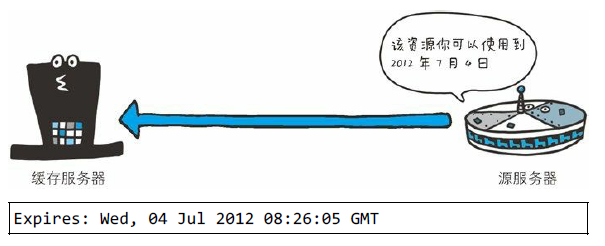

首部字段 Expires 会将资源失效的日期告知客户端。缓存服务器在接
收到含有首部字段 Expires 的响应后，会以缓存来应答请求，在
Expires 字段值指定的时间之前，响应的副本会一直被保存。当超过
指定的时间后，缓存服务器在请求发送过来时，会转向源服务器请求
资源。

源服务器不希望缓存服务器对资源缓存时，最好在 Expires 字段内写
入与首部字段 Date 相同的时间值。

但是，当首部字段 Cache-Control 有指定 max-age 指令时，比起首部字
段 Expires，会优先处理 max-age 指令。

**Last-Modified**

Last-Modified: Wed, 23 May 2012 09:59:55 GMT

首部字段 Last-Modified 指明资源最终修改的时间。一般来说，这个
值就是 Request-URI 指定资源被修改的时间。但类似使用 CGI 脚本进
行动态数据处理时，该值有可能会变成数据最终修改时的时间。

### 7. 为 Cookie 服务的首部字段

管理服务器与客户端之间状态的 Cookie，虽然没有被编入标准化
HTTP/1.1 的 RFC2616 中，但在 Web 网站方面得到了广泛的应用。

Cookie 的工作机制是用户识别及状态管理。Web 网站为了管理用户的
状态会通过 Web 浏览器，把一些数据临时写入用户的计算机内。接
着当用户访问该Web网站时，可通过通信方式取回之前发放的
Cookie。

调用 Cookie 时，由于可校验 Cookie 的有效期，以及发送方的域、路
径、协议等信息，所以正规发布的 Cookie 内的数据不会因来自其他
Web 站点和攻击者的攻击而泄露。

至 2013 年 5 月，Cookie 的规格标准文档有以下 4 种。

由网景公司颁布的规格标准

网景通信公司设计并开发了 Cookie，并制定相关的规格标准。1994
年前后，Cookie 正式应用在网景浏览器中。目前最为普及的 Cookie
方式也是以此为基准的。

RFC2109
某企业尝试以独立技术对 Cookie 规格进行标准化统筹。原本的意图
是想和网景公司制定的标准交互应用，可惜发生了微妙的差异。现在
该标准已淡出了人们的视线。

RFC2965
为终结 Internet Explorer 浏览器与 Netscape Navigator 的标准差异而导
致的浏览器战争，RFC2965 内定义了新的 HTTP 首部 Set-Cookie2 和
Cookie2。可事实上，它们几乎没怎么投入使用。

RFC6265
将网景公司制定的标准作为业界事实标准（De facto standard），重新
定义 Cookie 标准后的产物。
目前使用最广泛的 Cookie 标准却不是 RFC 中定义的任何一个。而是
在网景公司制定的标准上进行扩展后的产物。
本节接下来就对目前使用最为广泛普及的标准进行说明。

表 6-8：为 Cookie 服务的首部字段

**Set-Cookie**

Set-Cookie: status=enable; expires=Tue, 05 Jul 2011 07:26:31 GMT

当服务器准备开始管理客户端的状态时，会事先告知各种信息。

下面的表格列举了 Set-Cookie 的字段值。

expires 属性

Cookie 的 expires 属性指定浏览器可发送 Cookie 的有效期。
当省略 expires 属性时，其有效期仅限于维持浏览器会话（Session）
时间段内。这通常限于浏览器应用程序被关闭之前。
另外，一旦 Cookie 从服务器端发送至客户端，服务器端就不存在可
以显式删除 Cookie 的方法。但可通过覆盖已过期的 Cookie，实现对
客户端 Cookie 的实质性删除操作。

path 属性

Cookie 的 path 属性可用于限制指定 Cookie 的发送范围的文件目录。
不过另有办法可避开这项限制，看来对其作为安全机制的效果不能抱
有期待。

domain 属性

通过 Cookie 的 domain 属性指定的域名可做到与结尾匹配一致。比
如，当指定 example.com 后，除 example.com 以外，www.example.com
或 www2.example.com 等都可以发送 Cookie。
因此，除了针对具体指定的多个域名发送 Cookie 之 外，不指定
domain 属性显得更安全。

secure 属性

Cookie 的 secure 属性用于限制 Web 页面仅在 HTTPS 安全连接时，才
可以发送 Cookie。
发送 Cookie 时，指定 secure 属性的方法如下所示。
Set-Cookie: name=value; secure
以上例子仅当在 https://www.example.com/（HTTPS）安全连接的情况
下才会进行 Cookie 的回收。也就是说，即使域名相同，
http://www.example.com/（HTTP）也不会发生 Cookie 回收行为。
当省略 secure 属性时，不论 HTTP 还是 HTTPS，都会对 Cookie 进行
回收。

**HttpOnly 属性**

Cookie 的 HttpOnly 属性是 Cookie 的扩展功能，它使 JavaScript 脚本
无法获得 Cookie。其主要目的为防止跨站脚本攻击（Cross-site
scripting，XSS）对 Cookie 的信息窃取。

发送指定 HttpOnly 属性的 Cookie 的方法如下所示。
Set-Cookie: name=value; HttpOnly

通过上述设置，通常从 Web 页面内还可以对 Cookie 进行读取操作。
但使用 JavaScript 的 document.cookie 就无法读取附加 HttpOnly 属性后
的 Cookie 的内容了。因此，也就无法在 XSS 中利用 JavaScript 劫持
Cookie 了。

虽然是独立的扩展功能，但 Internet Explorer 6 SP1 以上版本等当下的
主流浏览器都已经支持该扩展了。另外顺带一提，该扩展并非是为了
防止 XSS 而开发的。

**Cookie**

Cookie: status=enable

首部字段 Cookie 会告知服务器，当客户端想获得 HTTP 状态管理支
持时，就会在请求中包含从服务器接收到的 Cookie。接收到多个
Cookie 时，同样可以以多个 Cookie 形式发送。

### 8. 其他首部字段

HTTP 首部字段是可以自行扩展的。所以在 Web 服务器和浏览器的应
用上，会出现各种非标准的首部字段。

接下来，我们就一些最为常用的首部字段进行说明。

- X-Frame-Options
- X-XSS-Protection
- DNT
- P3P

**X-Frame-Options**

X-Frame-Options: DENY

首部字段 X-Frame-Options 属于 HTTP 响应首部，用于控制网站内容
在其他 Web 网站的 Frame 标签内的显示问题。其主要目的是为了防
止点击劫持（clickjacking）攻击。

首部字段 X-Frame-Options 有以下两个可指定的字段值。
- DENY ：拒绝
- SAMEORIGIN ：仅同源域名下的页面（Top-level-browsingcontext）
  匹配时许可。（比如，当指定 http://hackr.jp/sample.html
  页面为 SAMEORIGIN 时，那么 hackr.jp 上所有页面的 frame 都被
  允许可加载该页面，而 example.com 等其他域名的页面就不行
  了）

支持该首部字段的浏览器有：Internet Explorer 8、Firefox 3.6.9+、
Chrome 4.1.249.1042+、Safari 4+ 和 Opera 10.50+ 等。现在主流的浏览
器都已经支持。

能在所有的 Web 服务器端预先设定好 X-Frame-Options 字段值是最理
想的状态。

对 apache2.conf 的配置实例

<IfModule mod_headers.c>
Header append X-FRAME-OPTIONS "SAMEORIGIN"
</IfModule>

**X-XSS-Protection**

X-XSS-Protection: 1

首部字段 X-XSS-Protection 属于 HTTP 响应首部，它是针对跨站脚本
攻击（XSS）的一种对策，用于控制浏览器 XSS 防护机制的开关。

首部字段 X-XSS-Protection 可指定的字段值如下。

- 0 ：将 XSS 过滤设置成无效状态
- 1 ：将 XSS 过滤设置成有效状态

**DNT**

DNT: 1

首部字段 DNT 属于 HTTP 请求首部，其中 DNT 是 Do Not Track 的简
称，意为拒绝个人信息被收集，是表示拒绝被精准广告追踪的一种方
法。

首部字段 DNT 可指定的字段值如下。

- 0 ：同意被追踪
- 1 ：拒绝被追踪

由于首部字段 DNT 的功能具备有效性，所以 Web 服务器需要对 DNT
做对应的支持

**P3P**

P3P: CP="CAO DSP LAW CURa ADMa DEVa TAIa PSAa PSDa IVAa IVDa

首部字段 P3P 属于 HTTP 相应首部，通过利用 P3P（The Platform for
Privacy Preferences，在线隐私偏好平台）技术，可以让 Web 网站上
的个人隐私变成一种仅供程序可理解的形式，以达到保护用户隐私的
目的。

>协议中对 X- 前缀的废除
 在 HTTP 等多种协议中，通过给非标准参数加上前缀 X-，来区别
 于标准参数，并使那些非标准的参数作为扩展变成可能。但是这种
 简单粗暴的做法有百害而无一益，因此在“RFC 6648 - Deprecating
 the "X-" Prefix and Similar Constructs in Application Protocols”中提议
 停止该做法。
 然而，对已经在使用中的 X- 前缀来说，不应该要求其变更。
