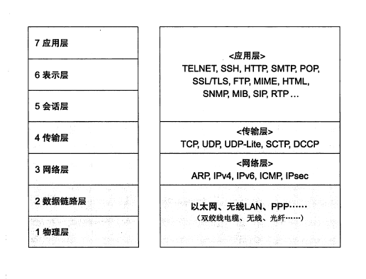

## TCP/IP之基础知识

### 1. TCP/IP出现的背景及其历史
#### 1.1 从军用技术应用谈起
#### 1.2 ARPANET的诞生
#### 1.3 TCP/IP的诞生
#### 1.4 Unix系统的普及及互联网的扩张
#### 1.5 商用互联网的启蒙
### 2. TCP/IP的标准化
#### 2.1 TCP/IP的具体含义
有时也成TCP/IP协议族

#### 2.2 TCP/IP的标准化的精髓
#### 2.3 TCP/IP规范-RFC
#### 2.4 TCP/IP的标准化流程
### 3. 互联网基础知识
#### 3.1 互联网的定义
#### 3.2 互联网和TCP/IP的关系
#### 3.3 IPS和局域网
### 4. TCP/IP协议分层模型
#### 4.1 TCP/IP和OSI模型

#### 4.2 硬件（物理层）

#### 4.3 网络接口层（数据链路层）

#### 4.4 互联网层（网络层）

#### 4.5 传输层

#### 4.6 应用层（会话层以上的）
1. HTTP协议
2. SMTP协议（邮箱）
3. FTP协议（文件传输）
4. SNMP(网络管理)
### 5. TCP/IP分层模型与通信示例

