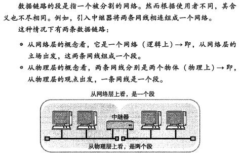
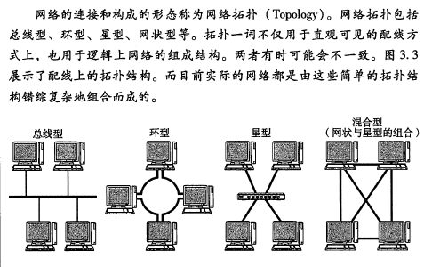
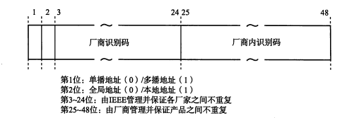
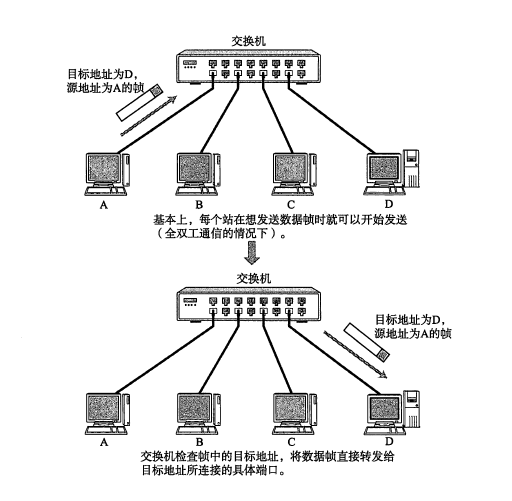
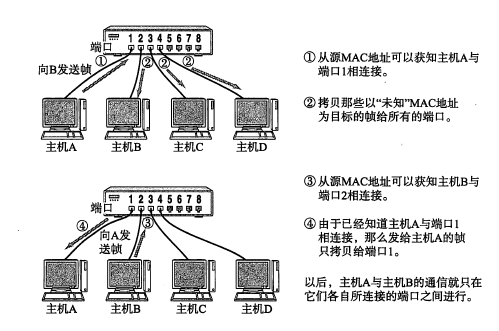
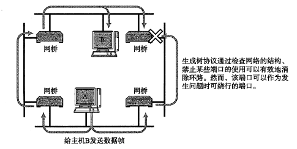
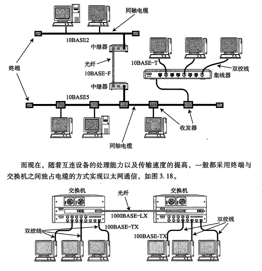
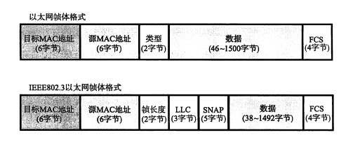
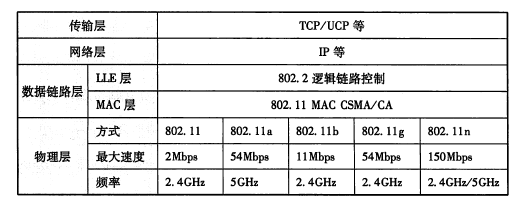

## 三、数据链路层

### 1. 数据链路层的作用
1. 数据链路层协议定义了通过通信媒介互联的设备之间的传输规范。通信媒介包括双绞线电缆、同轴电联、光纤等
2. 数据链路的段

   
3. 网络拓扑图

   
### 2. 数据链路层的相关技术
1. MAC地址
   - 作用
     > MAC地址用于识别数据链路层中互联的节点。
   - 构成
     
     
   - 特定
     - 全球唯一，不会重复（虚拟网卡的MAC地址除外）
     - 厂商识别码->网络分析器。分析出局域网中包是由那个厂商发出的。
2. 共享介质型网络
   - 争用方式
   - 令牌模式
3. 非共享介质型网络
   - 图解

     

   - 全双工和半双工通信
     >半双工指的是只发送或只接受的通信方式。全双工则是运行同一时间即可以发送数据也可以接受数据
     > 。
4. 根据MAC地址转发
   - 交换机的自学原理

     
   - 转发方式
     - 存储转发：检查帧最后的FCS位再进行转发，避免了错误帧。
     - 直通转发：不需要将整个帧下载下来再进行转发，只需要得知目标地址就可以进行转发。但是不可避免错误帧。
5. 环路检测技术
   - 生成树方式
     >该方法定义，每个网桥必须在1-10秒内互相交互BPDU包。从而判断哪些端口不使用，以便消除环路。一旦发生故障，从而进行自动线路切换。
     
     
   - 源路由法
     >RIF.根据RIF进行转发的确认。
6. VLAN
   
### 3. 以太网
   - 以太网的连接形式
     
     
     
   - 以太网的分类
   - 以太网的历史
   - 以太网帧格式
       
      
      
      >一个帧的范围是46-1500字节。帧尾是FCS(帧序列校验)4个字节。用于检查帧是否出现损坏。
### 4. 无线通信
   - 无限通信的种类
   - IEEE 802.11
   - 图解
     
     
   - 蓝牙
### 5. PPP
   - PPP定义
     >点对点，即一对一计算机协议。属于OSI第二层数据链路层。纯粹的数据链路层的东西，和物理层没有任何关联。
   - LCP和NCP
     >LCP:link control protocol.NCP:network control protocol
     >LCP:负责建立和断开连接、设置最大接受单元、设置验证协议（PAP、CHAP）
   - PPP的帧格式
   - PPPoE
### 6. 其他数据链路
   - ATM协议
   - POS
   - FDDI
   - Token Ring(令牌环网)
   - 100VG-AnyLAN
   - 光纤通道
   - HIPPI
   - IEEE1394
   - HDMI
   - ISCSI
   - InfiniBand
   - DOCSIS
   - 高速PLC
### 7. 公共网络
略

