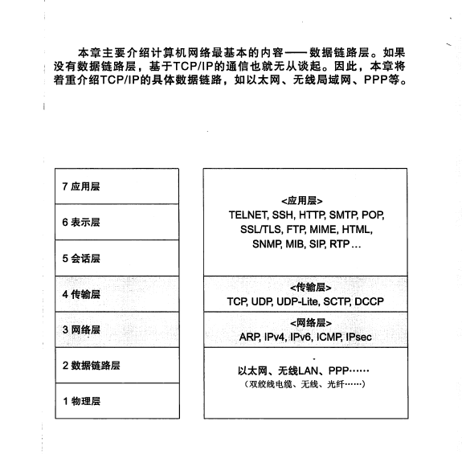

## 三、数据链路层

### 1. 数据链路层的作用
1. 数据链路层协议定义了通过通信媒介互联的设备之间的传输规范。通信媒介包括双绞线电缆、同轴电联、光纤等
2. 数据链路的段

   
3. 网络拓扑图

   
### 2. 数据链路层的相关技术
1. MAC地址
### 3. 以太网
### 4. 无线通信
### 5. PPP
### 6. 其他数据链路
### 7. 公共网络

